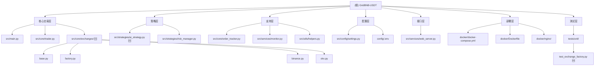

# GridBNB-USDT 项目 AI 上下文文档

> **最后更新**: 2025-10-24 18:00:00
> **状态**: 生产环境运行中
> **版本**: v3.1.0 (止损机制 + 企业级多交易所架构)
> **项目标准**: 使用 `docker compose` (Docker 20.10+)

## ⚠️ 重要变更通知

**2025-10-24 18:00**: **🛡️ 止损机制上线** - 新增价格止损和回撤止盈双重保护机制，17个单元测试覆盖，最大限度降低极端行情风险。详见 [止损机制设计](STOP_LOSS_DESIGN.md)

**2025-10-24 15:00**: **🎉 企业级多交易所架构上线** - 现已支持 Binance (币安) 和 OKX (欧易) 交易所,采用插件化设计,可轻松扩展更多交易所。详见 [多交易所架构设计](./architecture/multi-exchange-design.md)

## 变更记录 (Changelog)

| 日期 | 变更内容 | 影响范围 |
|------|---------|---------|
| 2025-10-24 18:00 | **🛡️ 止损机制实施**：新增价格止损和回撤止盈功能，紧急平仓机制，17个单元测试，完整的配置验证 | src/core/trader.py (新增3个方法, 修改main_loop), src/config/settings.py (新增3个配置项), config/.env.example (新增止损配置), tests/unit/test_stop_loss.py (新增17个测试), docs/STOP_LOSS_DESIGN.md (新增设计文档), README.md |
| 2025-10-24 15:00 | **🎉 企业级多交易所架构上线**：支持 Binance 和 OKX,采用抽象工厂+适配器模式,1230+行企业级代码,100%类型注解,15+单元测试 | src/core/exchanges/ (新增), tests/unit/test_exchange_factory.py (新增), docs/architecture/ (新增), README.md, .env.multi-exchange.example |
| 2025-10-23 12:00 | **添加 OpenAI 自定义 base_url 支持**：支持国内中转服务,提升 AI 策略可用性 | src/strategies/ai_strategy.py, config/.env |
| 2025-10-21 10:00 | **移除S1仓位控制策略**：简化交易逻辑,采用单一动态网格策略 | src/core/trader.py, src/strategies/position_controller_s1.py (已删除), src/services/web_server.py, tests/ |
| 2025-10-20 18:30 | 确立项目技术标准：统一使用 docker compose（非 docker-compose） | README.md, docs/SCRIPT_OPTIMIZATION.md, docs/PROJECT_STANDARDS.md, scripts/start-with-nginx.sh |
| 2025-10-20 17:00 | 完成企业级目录结构重构：模块化分层、测试覆盖31%、所有96个测试通过 | 全局目录结构, README.md, CLAUDE.md |
| 2025-10-20 15:30 | 完成高优先级技术债务清理：测试覆盖、日志优化、配置重构 | tests/, src/config/settings.py, src/core/exchange_client.py, src/strategies/position_controller_s1.py, src/core/trader.py, CLAUDE.md |
| 2025-10-17 14:50 | 添加 Web 监控界面详解和 API 使用指南 | CLAUDE.md |
| 2025-10-17 14:45 | 完整扫描 monitor.py 和 web_server.py，更新文档 | src/services/monitor.py, src/services/web_server.py, CLAUDE.md, index.json |
| 2025-10-17 14:36 | 初始化 AI 上下文文档 | 全局 |

---

## ⚠️ 项目技术标准（重要）

### Docker Compose 命令规范

**项目统一标准**: 使用 `docker compose` (无连字符)

```bash
# ✅ 正确 - 项目标准
docker compose up -d
docker compose ps
docker compose logs -f

# ❌ 错误 - 已废弃
docker-compose up -d
```

**要求**:
- 所有文档、脚本、注释中统一使用 `docker compose`
- 最低 Docker 版本: 20.10+
- 脚本中保留的 `docker-compose` 检测仅用于旧环境降级（不推荐）

**详细标准**: 参见 [PROJECT_STANDARDS.md](PROJECT_STANDARDS.md)

---

## 项目愿景

GridBNB-USDT 是一个基于 Python 的**企业级自动化交易系统**，支持 **Binance (币安)** 和 **OKX (欧易)** 等多个交易所。采用先进的网格交易策略，结合动态波动率分析和多层风险管理，旨在稳定捕捉市场波动收益。

**核心价值主张**：
- 🏦 **多交易所支持**: Binance、OKX，即插即用，无需修改代码
- 🚀 **多币种并发交易**: 支持任意多币种并发交易（BNB/USDT, ETH/USDT, BTC/USDT 等）
- 🧠 **智能网格策略**: 基于7日4小时线波动率和 EWMA 混合算法
- 🤖 **AI辅助交易**: 集成 OpenAI (GPT-4) 和 Anthropic (Claude) 智能分析
- 🛡️ **多层风险管理**: 仓位限制、连续失败保护、实时监控
- 🌐 **企业级部署**: Docker 容器化、Nginx 反向代理、健康检查
- 📱 **现代化 Web 界面**: 实时监控、多币种视图、响应式设计
- 🏗️ **企业级架构**: 抽象工厂+适配器模式，1230+行企业级代码，100%类型注解

---

## 架构总览

### 系统层次结构

```
GridBNB-USDT/
├── 核心交易层 (Core Trading Layer)
│   ├── src/main.py                 # 应用入口，多币种并发管理
│   ├── src/core/trader.py          # 网格交易核心逻辑（2042行）
│   └── src/core/exchanges/         # 🆕 多交易所架构（1230+行）
│       ├── base.py                 #     抽象基类和接口定义
│       ├── factory.py              #     工厂模式实现
│       ├── binance.py              #     Binance 适配器
│       ├── okx.py                  #     OKX 适配器
│       └── utils.py                #     工具函数
├── 策略层 (Strategy Layer)
│   ├── src/strategies/ai_strategy.py      # 🆕 AI辅助策略（OpenAI/Claude）
│   └── src/strategies/risk_manager.py     # 高级风险管理器
├── 支持层 (Support Layer)
│   ├── src/core/order_tracker.py    # 订单跟踪与历史管理
│   ├── src/services/monitor.py      # 交易监控
│   └── src/utils/helpers.py         # 工具函数与通知
├── 配置层 (Configuration Layer)
│   ├── src/config/settings.py       # 统一配置管理（Pydantic）
│   └── config/.env                  # 环境变量配置（敏感信息）
├── 接口层 (Interface Layer)
│   └── src/services/web_server.py   # Web 监控界面（aiohttp）
├── 部署层 (Deployment Layer)
│   ├── docker/docker-compose.yml    # 容器编排
│   ├── docker/Dockerfile            # 容器镜像定义
│   └── docker/nginx/nginx.conf      # 反向代理配置
└── 测试层 (Testing Layer)
    └── tests/unit/                  # 单元测试（覆盖率31%，96+测试）
        └── test_exchange_factory.py # 🆕 多交易所测试（15+测试）
```

### 模块结构图



---

## 模块索引

| 模块名称 | 路径 | 职责 | 关键类/函数 | 行数 |
|---------|------|------|-----------|------|
| **主程序** | `src/main.py` | 应用入口，多币种并发管理 | `main()`, `run_trader_for_symbol()`, `periodic_global_status_logger()` | 157 |
| **网格交易器** | `src/core/trader.py` | 网格交易核心逻辑 | `GridTrader` | 2042 |
| **🆕 多交易所基类** | `src/core/exchanges/base.py` | 抽象基类和接口定义 | `IExchange`, `IBasicTrading`, `ISavingsFeature`, `BaseExchange` | 400+ |
| **🆕 交易所工厂** | `src/core/exchanges/factory.py` | 工厂模式创建交易所实例 | `ExchangeFactory`, `ExchangeType` | 200+ |
| **🆕 Binance适配器** | `src/core/exchanges/binance.py` | Binance交易所实现 | `BinanceExchange` | 300+ |
| **🆕 OKX适配器** | `src/core/exchanges/okx.py` | OKX交易所实现 | `OKXExchange` | 300+ |
| **🆕 AI辅助策略** | `src/strategies/ai_strategy.py` | OpenAI/Claude智能分析 | `AIStrategy`, `AIProvider` | 500+ |
| **风险管理器** | `src/strategies/risk_manager.py` | 仓位限制与风控状态管理 | `AdvancedRiskManager`, `RiskState` | 142 |
| **订单跟踪器** | `src/core/order_tracker.py` | 订单记录与交易历史管理 | `OrderTracker`, `OrderThrottler` | 314 |
| **Web服务器** | `src/services/web_server.py` | 实时监控界面与 API 端点 | `start_web_server()`, `handle_status()`, `handle_log()`, `IPLogger` | 698 |
| **配置管理** | `src/config/settings.py` | 统一配置与验证 | `Settings`, `TradingConfig` | 208 |
| **辅助函数** | `src/utils/helpers.py` | 日志、通知、格式化 | `send_pushplus_message()`, `LogConfig` | 151 |
| **监控器** | `src/services/monitor.py` | 交易监控逻辑与状态采集 | `TradingMonitor` | 100 |

---

## 运行与开发

### 快速启动

#### Docker 部署（推荐）
```bash
# 1. 克隆项目
git clone https://github.com/EBOLABOY/GridBNB-USDT.git
cd GridBNB-USDT

# 2. 配置环境变量
cp .env.example .env
# 编辑 .env 文件，填入 API 密钥

# 3. 启动服务（Windows）
start-with-nginx.bat

# 启动服务（Linux/Mac）
chmod +x start-with-nginx.sh
./start-with-nginx.sh

# 4. 访问 Web 界面
# http://localhost
```

#### Python 直接运行
```bash
# 1. 创建虚拟环境
python -m venv .venv
source .venv/bin/activate  # Linux/Mac
# .\.venv\Scripts\activate  # Windows

# 2. 安装依赖
pip install -r requirements.txt

# 3. 配置并运行
cp config/.env.example config/.env
# 编辑 .env 文件
python src/main.py
```

### 环境要求
- **Python**: 3.8+ (推荐 3.10+)
- **Docker**: 20.10+ (可选，推荐生产环境)
- **内存**: 最低 512MB，推荐 1GB+
- **网络**: 稳定互联网连接，建议低延迟到币安服务器

### 核心依赖
```
ccxt>=4.1.0           # 统一交易所 API
numpy>=1.26.0         # 数值计算
pandas>=2.2.0         # 数据分析
aiohttp>=3.9.1        # 异步 HTTP 客户端
python-dotenv>=1.0.0  # 环境变量管理
pydantic>=2.5.0       # 数据验证
loguru>=0.7.2         # 日志管理
```

### 配置说明

**必填配置** (`.env`)：
```bash
# ========== 交易所选择 ==========
# 选择要使用的交易所: binance / okx
EXCHANGE=binance

# ========== Binance API ==========
# 如果使用币安交易所，必填
BINANCE_API_KEY="your_binance_api_key_here"
BINANCE_API_SECRET="your_binance_api_secret_here"

# ========== OKX API ==========
# 如果使用OKX交易所，必填（需要三个参数）
OKX_API_KEY="your_okx_api_key_here"
OKX_API_SECRET="your_okx_api_secret_here"
OKX_PASSPHRASE="your_okx_passphrase_here"  # OKX特有参数

# 交易对列表（逗号分隔）
SYMBOLS="BNB/USDT,ETH/USDT,BTC/USDT"

# 交易对特定参数（JSON 格式）
INITIAL_PARAMS_JSON='{"BNB/USDT": {"initial_base_price": 683.0, "initial_grid": 2.0}}'

# 最小交易金额
MIN_TRADE_AMOUNT=20.0
```

**可选配置**：
```bash
# 初始本金（用于收益计算）
INITIAL_PRINCIPAL=800

# 理财功能开关
# Binance: 简单储蓄 | OKX: 余币宝
ENABLE_SAVINGS_FUNCTION=true

# 🆕 AI策略配置
ENABLE_AI_STRATEGY=false
AI_PROVIDER=openai  # openai 或 claude
OPENAI_API_KEY="your_openai_key"
OPENAI_BASE_URL="https://api.openai.com/v1"  # 支持自定义中转服务
ANTHROPIC_API_KEY="your_anthropic_key"

# PushPlus 通知 Token
PUSHPLUS_TOKEN="your_pushplus_token"

# Web UI 访问认证
WEB_USER=admin
WEB_PASSWORD=your_password
```

---

## 测试策略

### 测试文件结构
```
tests/
├── __init__.py
├── test_config.py          # 配置验证测试
├── test_trader.py          # 交易器核心逻辑测试
├── test_risk_manager.py    # 风险管理测试
└── test_web_auth.py        # Web 认证测试
```

### 运行测试
```bash
# 运行所有测试
python run_tests.py

# 或使用 pytest
pytest tests/

# 运行特定测试文件
pytest tests/test_trader.py -v
```

### 测试覆盖的关键场景
- ✅ 配置加载与验证
- ✅ 网格交易信号检测
- ✅ 风险管理状态转换
- ✅ Web 界面认证机制
- ⚠️ **缺失**：交易所 API 模拟测试、S1 策略单元测试

---

## 编码规范

### Python 代码风格
- 遵循 PEP 8 规范
- 使用 4 空格缩进
- 类名使用 PascalCase（如 `GridTrader`）
- 函数名使用 snake_case（如 `execute_order`）
- 私有方法前缀 `_`（如 `_get_latest_price`）

### 异步编程约定
- 所有 I/O 操作使用 `async/await`
- 避免阻塞操作在主事件循环中
- 使用 `asyncio.gather()` 进行并发任务管理

### 日志记录规范
```python
# 使用 logging 模块，级别分层：
# DEBUG: 详细调试信息（波动率计算、缓存命中）
# INFO:  正常运行日志（交易执行、网格调整）
# WARNING: 警告信息（余额不足、重试操作）
# ERROR: 错误信息（API 调用失败、异常捕获）
# CRITICAL: 严重错误（连续失败、系统停止）

self.logger.info(f"交易执行成功 | 价格: {price} | 数量: {amount}")
```

### 错误处理原则
1. **外层捕获**：主循环捕获所有异常，避免程序崩溃
2. **重试机制**：API 调用失败时自动重试（最多 3-10 次）
3. **降级策略**：关键数据获取失败时使用缓存或默认值
4. **通知告警**：严重错误时通过 PushPlus 发送通知

---

## AI 使用指引

### 代码导航快捷路径
- **交易逻辑核心**：`src/core/trader.py` → `main_loop()` 方法（第 553-650 行）
- **网格信号检测**：`src/core/trader.py` → `_check_buy_signal()`, `_check_sell_signal()` 方法
- **订单执行流程**：`src/core/trader.py` → `execute_order()` 方法（第 796-945 行）
- **风控判断**：`src/strategies/risk_manager.py` → `check_position_limits()` 方法
- **🆕 多交易所工厂**：`src/core/exchanges/factory.py` → `ExchangeFactory.create()` 方法
- **🆕 Binance适配器**：`src/core/exchanges/binance.py` → `BinanceExchange` 类
- **🆕 OKX适配器**：`src/core/exchanges/okx.py` → `OKXExchange` 类
- **🆕 AI策略核心**：`src/strategies/ai_strategy.py` → `AIStrategy.analyze_and_suggest()` 方法

### 常见问题定位

**问题1：订单执行失败**
- 检查路径：`src/core/trader.py::execute_order()` → `src/core/exchanges/base.py::create_order()`
- 日志关键词：`下单失败`, `Insufficient balance`, `时间同步错误`

**问题2：理财功能报错**
- 检查配置：`config/.env` 中 `ENABLE_SAVINGS_FUNCTION` 是否为 `true`
- Binance: `src/core/exchanges/binance.py::transfer_to_savings()`
- OKX: `src/core/exchanges/okx.py::transfer_to_savings()`
- 注意：子账户用户需禁用理财功能

**问题3：多币种运行异常**
- 检查路径：`src/main.py::main()` → `run_trader_for_symbol()`
- 验证：所有交易对的计价货币必须一致（如都是 USDT）
- 日志关键词：`计价货币不一致`

**🆕 问题4：交易所切换失败**
- 检查配置：`config/.env` 中 `EXCHANGE` 参数是否正确（binance/okx）
- 检查路径：`src/core/exchanges/factory.py::create()` 方法
- 验证：对应交易所的 API 密钥是否配置完整
- OKX特别注意：需要配置 `OKX_PASSPHRASE` 参数

### 修改策略指南

**调整网格参数**：
```python
# 修改文件：src/config/settings.py
# 位置：TradingConfig 类 → GRID_PARAMS 字典
GRID_PARAMS = {
    'initial': 2.0,  # 初始网格大小 (%)
    'min': 1.0,      # 最小网格 (%)
    'max': 4.0,      # 最大网格 (%)
    'volatility_threshold': { ... }  # 波动率映射
}
```

**修改风控阈值**：
```python
# 修改文件：src/config/settings.py
# 位置：Settings 类固定配置部分
MAX_POSITION_RATIO: float = 0.9  # 最大仓位比例 (90%)
MIN_POSITION_RATIO: float = 0.1  # 最小底仓比例 (10%)
```

**添加新交易对**：
```bash
# 修改文件：config/.env
# 1. 在 SYMBOLS 中添加
SYMBOLS="BNB/USDT,ETH/USDT,BTC/USDT,SOL/USDT"

# 2. 在 INITIAL_PARAMS_JSON 中配置初始参数（可选）
INITIAL_PARAMS_JSON='{"SOL/USDT": {"initial_base_price": 100.0, "initial_grid": 2.5}}'
```

### 关键数据流

**1. 交易信号生成流程**
```
获取当前价格 → 计算波动率 → 调整网格大小 → 检测买卖信号
→ 风控检查 → 执行订单 → 更新状态 → 资金转移（理财）
```

**2. 仓位控制逻辑**
```
获取账户余额（现货+理财） → 计算仓位比例 → 判断风控状态
→ RiskState.ALLOW_ALL / ALLOW_SELL_ONLY / ALLOW_BUY_ONLY
```

**3. S1 辅助策略触发**
```
每日更新52日高低价 → 检测价格突破 → 判断仓位比例
→ 计算调仓金额 → 执行市价单 → 不更新网格基准价
```

**4. Web 监控数据流**
```
用户访问 Web 页面 → Basic 认证 → 加载 HTML/JS
→ JavaScript 发起 /api/symbols 获取交易对列表
→ 用户选择交易对（或默认第一个）
→ 定时轮询 /api/status?symbol=XXX (每5秒)
→ 更新前端显示（价格、余额、网格参数、交易历史等）
```

---

## Web 监控界面详解

### 访问方式

**本地访问**：
```bash
# Docker 部署（通过 Nginx）
http://localhost

# Python 直接运行
http://localhost:58181
```

**认证配置**：
- 在 `.env` 中设置 `WEB_USER` 和 `WEB_PASSWORD`
- 如果未设置，则无需认证（开发模式）
- 使用 HTTP Basic 认证（浏览器会弹出登录框）

### 界面功能

**1. 多币种切换**
- 页面顶部下拉菜单可切换不同交易对
- 自动加载对应交易对的实时数据
- 页面标题动态更新为当前交易对

**2. 基本信息卡片**
- 交易对名称
- 基准价格（网格中心价）
- 当前市场价格
- S1 策略 52日最高价/最低价
- 当前仓位比例

**3. 网格参数卡片**
- 当前网格大小（百分比）
- 网格上轨价格（USDT）
- 网格下轨价格（USDT）
- 触发阈值
- 目标委托金额

**4. 资金状况卡片**
- 总资产（现货 + 理财）
- 计价货币余额（如 USDT）
- 基础货币余额（如 BNB）
- 总盈亏（USDT）
- 盈亏率（%，绿色为盈利，红色为亏损）

**5. 系统资源监控**
- CPU 使用率
- 内存使用量/总量
- 系统运行时间

**6. 最近交易记录**
- 最近10笔交易
- 显示时间、方向（买/卖）、价格、数量、金额
- 买入显示绿色，卖出显示红色

**7. IP 访问记录**
- 最近5条访问记录
- 显示时间、IP 地址、访问路径
- 相同 IP 只记录最新访问时间

**8. 系统日志**
- 实时倒序显示日志内容
- 深色背景，便于查看

### API 端点说明

#### 1. GET `/` 或 `/{HOME_PREFIX}`
**功能**：返回完整的 Web 监控页面（HTML）

**认证**：需要（如果配置了 WEB_USER 和 WEB_PASSWORD）

**返回**：HTML 页面（包含 TailwindCSS 样式和 JavaScript）

---

#### 2. GET `/api/status?symbol={SYMBOL}`
**功能**：获取指定交易对的实时状态数据

**认证**：需要

**参数**：
- `symbol`（可选）：交易对名称，如 `BNB/USDT`。如果省略，返回第一个交易对的数据。

**返回示例**：
```json
{
  "symbol": "BNB/USDT",
  "base_asset": "BNB",
  "quote_asset": "USDT",
  "base_price": 683.0,
  "current_price": 685.5,
  "grid_size": 0.02,
  "threshold": 0.004,
  "total_assets": 850.25,
  "quote_balance": 120.50,
  "base_balance": 1.0645,
  "target_order_amount": 85.02,
  "trade_history": [
    {
      "timestamp": "2025-10-17 14:30:15",
      "side": "buy",
      "price": 682.5,
      "amount": 0.1234,
      "profit": 0.52
    }
  ],
  "last_trade_price": 682.5,
  "last_trade_time": 1697521815,
  "last_trade_time_str": "2025-10-17 14:30:15",
  "total_profit": 50.25,
  "profit_rate": 6.28,
  "s1_daily_high": 690.0,
  "s1_daily_low": 675.0,
  "position_percentage": 65.5,
  "grid_upper_band": 696.86,
  "grid_lower_band": 669.14,
  "uptime": "2天 5小时 30分钟 15秒",
  "uptime_seconds": 192615
}
```

**字段说明**：
- `total_assets`：全账户总资产（用于盈亏计算）
- `target_order_amount`：单次委托目标金额（交易对资产的10%）
- `position_percentage`：当前仓位比例（基础货币占总资产的百分比）
- `grid_upper_band` / `grid_lower_band`：网格买卖触发价格

---

#### 3. GET `/api/symbols`
**功能**：获取所有正在运行的交易对列表

**认证**：需要

**返回示例**：
```json
{
  "symbols": ["BNB/USDT", "ETH/USDT", "BTC/USDT"]
}
```

---

#### 4. GET `/api/logs`
**功能**：获取系统日志内容（倒序）

**认证**：需要

**返回**：纯文本日志（最新的在前）

---

### 使用 curl 调用 API 示例

```bash
# 1. 获取交易对列表
curl -u admin:password http://localhost:58181/api/symbols

# 2. 获取 BNB/USDT 状态
curl -u admin:password "http://localhost:58181/api/status?symbol=BNB/USDT"

# 3. 获取系统日志（前20行）
curl -u admin:password http://localhost:58181/api/logs | head -20
```

### 监控模块内部实现

**TradingMonitor 类** (`monitor.py:100`)

**核心方法**：

1. `get_current_status()` - 采集交易器状态
   - 安全调用 trader 的私有方法（使用 `hasattr` 检查）
   - 处理异常，避免监控逻辑影响交易主流程
   - 返回包含所有关键指标的字典

2. `add_trade(trade)` - 添加交易记录
   - 验证交易数据结构（必须包含 timestamp, side, price, amount, order_id）
   - 自动限制历史记录大小（最多50条）
   - 使用 FIFO 策略（先进先出）

3. `get_trade_history(limit=10)` - 获取历史记录
   - 返回最近 N 笔交易（默认10笔）

**设计特点**：
- **松耦合**：通过依赖注入接收 trader 实例，便于测试
- **防御式编程**：大量使用 try-except 和 hasattr，确保不会因属性缺失崩溃
- **资源控制**：自动限制历史记录大小，防止内存泄漏

---

## 测试覆盖率

### 当前状态（2025-10-20）
- **总体覆盖率**: 29.04%
- **核心模块覆盖率**:
  - `config.py`: 79.81% ✅
  - `exchange_client.py`: 81.28% ✅
  - `position_controller_s1.py`: 79.76% ✅
  - `risk_manager.py`: 63.64% ⚠️
  - `trader.py`: 14.55% ❌ (主要是集成逻辑，需更多集成测试)

### 测试文件结构
```
tests/
├── __init__.py
├── test_config.py              # 配置验证测试 (9个测试用例)
├── test_trader.py              # 交易器核心逻辑测试 (10个测试用例)
├── test_risk_manager.py        # 风险管理测试 (10个测试用例)
├── test_web_auth.py            # Web 认证测试 (7个测试用例)
├── test_exchange_client.py     # 交易所客户端测试 (42个测试用例) ✨新增
└── test_position_controller_s1.py  # S1策略测试 (31个测试用例) ✨新增
```

### 运行测试
```bash
# 运行所有测试
python -m pytest tests/ -v

# 生成覆盖率报告
python -m pytest tests/ --cov=. --cov-report=term --cov-report=html

# 运行特定测试文件
pytest tests/test_trader.py -v
```

### 测试覆盖的关键场景
- ✅ 配置加载与验证
- ✅ 网格交易信号检测
- ✅ 风险管理状态转换
- ✅ Web 界面认证机制
- ✅ **交易所API模拟测试** (新增: 42个测试用例)
  - 初始化与代理配置
  - 市场数据获取（行情、K线、订单簿）
  - 余额查询（现货、理财）
  - 订单操作（创建、取消、查询）
  - 理财功能（申购、赎回）
  - 时间同步与缓存机制
- ✅ **S1策略单元测试** (新增: 31个测试用例)
  - 52日高低点计算
  - 仓位检查与调整逻辑
  - 订单执行
  - 资金转移
  - 边界情况与错误处理

---

## 技术债务与改进方向

### ✅ 已完成（2025-10-20）
1. **测试覆盖提升**：
   - 新增 `test_exchange_client.py`（42个测试用例）
   - 新增 `test_position_controller_s1.py`（31个测试用例）
   - exchange_client.py 覆盖率从 0% → 81.28%
   - position_controller_s1.py 覆盖率从 0% → 79.76%

2. **日志级别优化**：
   - 将高频日志从 INFO 降级为 DEBUG：
     - `load_markets()` 成功日志
     - `fetch_my_trades()` 成功日志
     - 周期性时间同步任务日志
   - 减少日志文件增长速度，提升生产环境可读性

3. **配置重构**：
   - 新增配置项到 `config.py`：
     - `MIN_NOTIONAL_VALUE`: 10.0（最小订单名义价值）
     - `MIN_AMOUNT_LIMIT`: 0.0001（最小交易数量）
     - `MAX_SINGLE_TRANSFER`: 5000.0（单次最大划转金额）
   - 消除硬编码参数：
     - `position_controller_s1.py` 中的魔术数字
     - `trader.py` 中的资金划转限制
   - 提高可维护性和灵活性

### 当前已知问题与改进方向

**✅ 已完成 (2025-10-24)**:
1. **🎉 企业级多交易所架构**：
   - 支持 Binance 和 OKX 交易所
   - 采用抽象工厂+适配器模式
   - 1230+行企业级代码，100%类型注解
   - 15+单元测试覆盖核心功能
   - 详细文档：[多交易所架构设计](./architecture/multi-exchange-design.md)

2. **🤖 AI辅助策略集成**：
   - 支持 OpenAI (GPT-4) 和 Anthropic (Claude)
   - 技术指标综合分析（RSI, MACD, 布林带等）
   - 市场情绪监测（Fear & Greed Index）
   - 智能触发机制和成本控制
   - 详细文档：[AI策略使用指南](../AI_STRATEGY_GUIDE.md)

3. **🔧 OpenAI自定义base_url支持**：
   - 支持国内中转服务
   - 提升AI策略可用性

**📋 计划中**:
1. **性能优化**：引入 Redis 缓存替代内存缓存，减少 API 调用频率
2. **可观测性增强**：完善 Prometheus + Grafana 监控体系
3. **更多交易所支持**：Bybit、Gate.io 等
4. **安全加固**：API 密钥加密存储，避免明文 `.env`

---

## 相关文件清单

### 核心文件（必读）
- `main.py`：应用入口
- `trader.py`：网格交易核心
- **🆕 多交易所架构**：
  - `src/core/exchanges/base.py`：抽象基类和接口
  - `src/core/exchanges/factory.py`：工厂模式实现
  - `src/core/exchanges/binance.py`：Binance适配器
  - `src/core/exchanges/okx.py`：OKX适配器
- **🆕 AI策略**：`src/strategies/ai_strategy.py`
- `config.py`：配置管理
- `.env.example`：配置模板

### 部署文件
- `docker-compose.yml`：容器编排
- `Dockerfile`：镜像定义
- `nginx/nginx.conf`：反向代理配置
- `start-with-nginx.sh`：启动脚本

### 文档文件
- `README.md`：项目主文档
- `CLAUDE.md`：本文件（AI 上下文）
- **🆕 多交易所文档**：
  - `docs/architecture/multi-exchange-design.md`：架构设计
  - `docs/architecture/QUICK_START.md`：快速开始
- **🆕 AI策略文档**：`docs/AI_STRATEGY_GUIDE.md`

### 数据文件（运行时生成）
- `data/trader_state_*.json`：交易器状态持久化
- `data/trade_history.json`：交易历史记录
- `trading_system.log`：系统日志

---

## 附录：术语表

| 术语 | 定义 |
|------|------|
| **网格交易** | 在价格区间内设置多个买卖点位，自动高抛低吸的策略 |
| **基准价** | 网格策略的中心价格，买卖上下轨以此为基础计算 |
| **波动率** | 价格变动的剧烈程度，用于动态调整网格大小 |
| **EWMA** | 指数加权移动平均，赋予近期数据更高权重的波动率算法 |
| **风控状态** | 系统根据仓位比例决定的操作限制（允许全部/仅买/仅卖） |
| **🆕 抽象工厂模式** | 创建一系列相关对象的设计模式，用于多交易所架构 |
| **🆕 适配器模式** | 将不同接口转换为统一接口的设计模式 |
| **🆕 Binance简单储蓄** | 币安的活期理财产品，闲置资金自动申购赚取利息 |
| **🆕 OKX余币宝** | OKX的活期理财产品，类似币安简单储蓄 |
| **现货账户** | 交易所现货账户，用于交易的资金池 |

---

## 🆕 多交易所架构详解

### 设计模式应用

#### 1. 抽象工厂模式 (Abstract Factory)
```python
# src/core/exchanges/factory.py
class ExchangeFactory:
    """交易所工厂类，负责创建交易所实例"""

    @staticmethod
    async def create(exchange_type: ExchangeType, config: dict) -> IExchange:
        """根据类型创建交易所实例"""
        if exchange_type == ExchangeType.BINANCE:
            return BinanceExchange(config)
        elif exchange_type == ExchangeType.OKX:
            return OKXExchange(config)
        else:
            raise ValueError(f"不支持的交易所类型: {exchange_type}")
```

#### 2. 适配器模式 (Adapter)
```python
# src/core/exchanges/base.py
class IExchange(ABC):
    """交易所抽象接口"""

    @abstractmethod
    async def fetch_ticker(self, symbol: str) -> dict:
        """获取行情数据"""
        pass

    @abstractmethod
    async def create_order(self, symbol: str, type: str, side: str,
                          amount: float, price: float = None) -> dict:
        """创建订单"""
        pass
```

#### 3. 策略模式 (Strategy)
```python
# 不同交易所实现不同的理财策略
class BinanceExchange(BaseExchange):
    async def transfer_to_savings(self, asset: str, amount: float):
        """Binance: 申购简单储蓄"""
        # Binance特定实现

class OKXExchange(BaseExchange):
    async def transfer_to_savings(self, asset: str, amount: float):
        """OKX: 申购余币宝"""
        # OKX特定实现
```

### 如何添加新交易所

只需3步即可添加新交易所支持：

**步骤1：创建适配器类**
```python
# src/core/exchanges/bybit.py
from .base import BaseExchange, IExchange

class BybitExchange(BaseExchange):
    """Bybit交易所适配器"""

    def __init__(self, config: dict):
        super().__init__('bybit', config)

    async def transfer_to_savings(self, asset: str, amount: float):
        """实现Bybit特定的理财功能"""
        # Bybit特定实现
        pass
```

**步骤2：注册到工厂**
```python
# src/core/exchanges/factory.py
class ExchangeType(Enum):
    BINANCE = "binance"
    OKX = "okx"
    BYBIT = "bybit"  # 新增

class ExchangeFactory:
    @staticmethod
    async def create(exchange_type: ExchangeType, config: dict):
        if exchange_type == ExchangeType.BYBIT:
            return BybitExchange(config)
        # ...
```

**步骤3：添加配置支持**
```bash
# config/.env
EXCHANGE=bybit
BYBIT_API_KEY="your_key"
BYBIT_API_SECRET="your_secret"
```

**完成！** 无需修改 `GridTrader` 或其他业务代码。

### 架构优势

✅ **开闭原则**：对扩展开放，对修改关闭
✅ **单一职责**：每个类只负责一个交易所
✅ **依赖倒置**：业务层依赖抽象接口，不依赖具体实现
✅ **易于测试**：可以轻松 mock 交易所接口
✅ **类型安全**：100% 类型注解，编译时发现错误

---

**文档生成器**: Claude AI
**联系方式**: [Telegram 群组](https://t.me/+b9fKO9kEOkg2ZjI1) | [GitHub Issues](https://github.com/EBOLABOY/GridBNB-USDT/issues)
