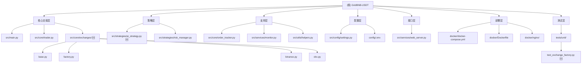

# GridBNB-USDT 项目 AI 上下文文档

> **最后更新**: 2025-11-03 (添加企业级功能模块文档)
> **状态**: 生产环境运行中
> **版本**: v3.2.0 (测试网支持 + 智能配置优化 + 企业级功能)
> **项目标准**: 使用 `docker compose` (Docker 20.10+)

## ⚠️ 重要变更通知

**2025-10-28 15:30**: **🎯 交易对特定仓位限制上线 (Issue #51)** - 现在可以为不同交易对设置独立的仓位上下限！解决了空投持币需求（如BNB需保持20%-80%仓位避免卖空）。新增 `POSITION_LIMITS_JSON` 配置项，支持精细化风控策略。完全向后兼容，未配置时自动使用全局限制。详见下方"交易对特定仓位限制使用指南"

**2025-10-28 15:00**: **🧪 测试网/模拟盘支持上线** - 新增 TESTNET_MODE 配置，支持 Binance 测试网和 OKX 模拟盘，无风险测试策略。同时优化配置管理，INITIAL_PRINCIPAL 支持自动检测账户资产，LOG_LEVEL 支持字符串配置。详见下方"测试网/模拟盘使用指南"

**2025-10-24 18:00**: **🛡️ 止损机制上线** - 新增价格止损和回撤止盈双重保护机制，17个单元测试覆盖，最大限度降低极端行情风险。详见 [止损机制设计](STOP_LOSS_DESIGN.md)

**2025-10-24 15:00**: **🎉 企业级多交易所架构上线** - 现已支持 Binance (币安) 和 OKX (欧易) 交易所,采用插件化设计,可轻松扩展更多交易所。详见 [多交易所架构设计](./architecture/multi-exchange-design.md)

## 变更记录 (Changelog)

| 日期 | 变更内容 | 影响范围 |
|------|---------|---------|
| 2025-11-06 | **📂 统一配置文件路径**：将 .env 路径统一为 config/.env，解决 config_watcher 和 settings.py 之间的不一致性问题（合并 PR #57） | .env.example → config/.env.example, src/config/settings.py (env_file 路径), README.md (文档更新), .gitignore (忽略规则更新) |
| 2025-11-06 | **🎨 前端功能增强**：新增AI配置管理（支持OpenAI/Anthropic），AI策略页面添加温度参数配置，网格策略页面添加波动率自动调整和动态交易间隔功能 | web/src/types/index.ts (新增AI配置类型), web/src/pages/Config/*.tsx (AI配置向导), web/src/pages/Template/AIConfig.tsx (温度滑块), web/src/pages/Template/GridConfig.tsx (波动率调整参数) |
| 2025-11-03 | **📚 文档更新**：补充企业级功能模块文档（全局资金分配器、告警系统、配置热重载、结构化日志、FastAPI/数据库支持），添加常用开发命令 | docs/CLAUDE.md (新增"企业级功能模块详解"和"常用开发命令"章节) |
| 2025-10-28 15:30 | **🎯 交易对特定仓位限制 (Issue #51)**：支持为不同交易对设置独立的仓位上下限，解决空投持币需求（如BNB需保持20%-80%仓位避免卖空），提供更灵活的风控策略 | src/config/settings.py (新增POSITION_LIMITS_JSON配置), src/strategies/risk_manager.py (修改风控检查逻辑), .env.example (新增配置示例), tests/unit/test_risk_manager.py (新增8个测试用例), docs/CLAUDE.md |
| 2025-10-28 15:00 | **🧪 测试网/模拟盘支持**：新增 TESTNET_MODE 配置，支持 Binance 测试网和 OKX 模拟盘，无需真实资金即可测试策略 | src/config/settings.py (新增测试网配置), src/core/exchange_client.py (新增端点切换逻辑), .env.example (新增测试网配置示例), docs/CLAUDE.md |
| 2025-10-28 15:00 | **💰 INITIAL_PRINCIPAL 自动检测**：当设置为0时，系统启动时自动检测账户总资产，无需手动配置 | src/main.py (新增自动检测逻辑), src/config/settings.py (更新验证器), .env.example |
| 2025-10-28 15:00 | **📝 LOG_LEVEL 字符串支持**：支持使用 INFO/DEBUG/WARNING/ERROR/CRITICAL 等字符串配置日志级别，更加直观 | src/config/settings.py (新增 Pydantic 验证器), .env.example |
| 2025-10-28 15:00 | **🔧 DYNAMIC_INTERVAL_PARAMS 配置优化**：修复配置合并逻辑，支持部分配置覆盖，避免 KeyError | src/config/settings.py (修改合并策略) |
| 2025-10-24 18:00 | **🛡️ 止损机制实施**：新增价格止损和回撤止盈功能，紧急平仓机制，17个单元测试，完整的配置验证 | src/core/trader.py (新增3个方法, 修改main_loop), src/config/settings.py (新增3个配置项), config/.env.example (新增止损配置), tests/unit/test_stop_loss.py (新增17个测试), docs/STOP_LOSS_DESIGN.md (新增设计文档), README.md |
| 2025-10-24 15:00 | **🎉 企业级多交易所架构上线**：支持 Binance 和 OKX,采用抽象工厂+适配器模式,1230+行企业级代码,100%类型注解,15+单元测试 | src/core/exchanges/ (新增), tests/unit/test_exchange_factory.py (新增), docs/architecture/ (新增), README.md, .env.multi-exchange.example |
| 2025-10-23 12:00 | **添加 OpenAI 自定义 base_url 支持**：支持国内中转服务,提升 AI 策略可用性 | src/strategies/ai_strategy.py, config/.env |
| 2025-10-21 10:00 | **移除S1仓位控制策略**：简化交易逻辑,采用单一动态网格策略 | src/core/trader.py, src/strategies/position_controller_s1.py (已删除), src/services/web_server.py, tests/ |
| 2025-10-20 18:30 | 确立项目技术标准：统一使用 docker compose（非 docker-compose） | README.md, docs/SCRIPT_OPTIMIZATION.md, docs/PROJECT_STANDARDS.md, scripts/start-with-nginx.sh |
| 2025-10-20 17:00 | 完成企业级目录结构重构：模块化分层、测试覆盖31%、所有96个测试通过 | 全局目录结构, README.md, CLAUDE.md |
| 2025-10-20 15:30 | 完成高优先级技术债务清理：测试覆盖、日志优化、配置重构 | tests/, src/config/settings.py, src/core/exchange_client.py, src/strategies/position_controller_s1.py, src/core/trader.py, CLAUDE.md |
| 2025-10-17 14:50 | 添加 Web 监控界面详解和 API 使用指南 | CLAUDE.md |
| 2025-10-17 14:45 | 完整扫描 monitor.py 和 web_server.py，更新文档 | src/services/monitor.py, src/services/web_server.py, CLAUDE.md, index.json |
| 2025-10-17 14:36 | 初始化 AI 上下文文档 | 全局 |

---

## ⚠️ 项目技术标准（重要）

### Docker Compose 命令规范

**项目统一标准**: 使用 `docker compose` (无连字符)

```bash
# ✅ 正确 - 项目标准
docker compose up -d
docker compose ps
docker compose logs -f

# ❌ 错误 - 已废弃
docker-compose up -d
```

**要求**:
- 所有文档、脚本、注释中统一使用 `docker compose`
- 最低 Docker 版本: 20.10+
- 脚本中保留的 `docker-compose` 检测仅用于旧环境降级（不推荐）

**详细标准**: 参见 [PROJECT_STANDARDS.md](PROJECT_STANDARDS.md)

---

## 项目愿景

GridBNB-USDT 是一个基于 Python 的**企业级自动化交易系统**，支持 **Binance (币安)** 和 **OKX (欧易)** 等多个交易所。采用先进的网格交易策略，结合动态波动率分析和多层风险管理，旨在稳定捕捉市场波动收益。

**核心价值主张**：
- 🏦 **多交易所支持**: Binance、OKX，即插即用，无需修改代码
- 🚀 **多币种并发交易**: 支持任意多币种并发交易（BNB/USDT, ETH/USDT, BTC/USDT 等）
- 🧠 **智能网格策略**: 基于7日4小时线波动率和 EWMA 混合算法
- 🤖 **AI辅助交易**: 集成 OpenAI (GPT-4) 和 Anthropic (Claude) 智能分析
- 🛡️ **多层风险管理**: 仓位限制、连续失败保护、实时监控
- 🌐 **企业级部署**: Docker 容器化、Nginx 反向代理、健康检查
- 📱 **现代化 Web 界面**: 实时监控、多币种视图、响应式设计
- 🏗️ **企业级架构**: 抽象工厂+适配器模式，1230+行企业级代码，100%类型注解

---

## 架构总览

### 系统层次结构

```
GridBNB-USDT/
├── 核心交易层 (Core Trading Layer)
│   ├── src/main.py                 # 应用入口，多币种并发管理
│   ├── src/core/trader.py          # 网格交易核心逻辑（2042行）
│   └── src/core/exchanges/         # 🆕 多交易所架构（1230+行）
│       ├── base.py                 #     抽象基类和接口定义
│       ├── factory.py              #     工厂模式实现
│       ├── binance.py              #     Binance 适配器
│       ├── okx.py                  #     OKX 适配器
│       └── utils.py                #     工具函数
├── 策略层 (Strategy Layer)
│   ├── src/strategies/ai_strategy.py      # 🆕 AI辅助策略（OpenAI/Claude）
│   └── src/strategies/risk_manager.py     # 高级风险管理器
├── 支持层 (Support Layer)
│   ├── src/core/order_tracker.py    # 订单跟踪与历史管理
│   ├── src/services/monitor.py      # 交易监控
│   └── src/utils/helpers.py         # 工具函数与通知
├── 配置层 (Configuration Layer)
│   ├── src/config/settings.py       # 统一配置管理（Pydantic）
│   └── config/.env                  # 环境变量配置（敏感信息）
├── 接口层 (Interface Layer)
│   ├── src/services/web_server.py   # Web 监控界面（aiohttp - 旧版）
│   └── 🆕 web/                      # 现代化前端（React 19 + TypeScript）
│       ├── src/api/                 #     API接口层（5个模块）
│       ├── src/components/          #     通用组件（11个）
│       ├── src/pages/               #     页面组件（8个核心页面）
│       ├── src/layouts/             #     布局组件
│       ├── src/routes/              #     路由配置
│       └── vite.config.ts           #     Vite构建配置
├── 部署层 (Deployment Layer)
│   ├── docker/docker-compose.yml    # 容器编排
│   ├── docker/Dockerfile            # 容器镜像定义
│   └── docker/nginx/nginx.conf      # 反向代理配置
└── 测试层 (Testing Layer)
    └── tests/unit/                  # 单元测试（覆盖率31%，96+测试）
        └── test_exchange_factory.py # 🆕 多交易所测试（15+测试）
```

### 模块结构图



---

## 模块索引

| 模块名称 | 路径 | 职责 | 关键类/函数 | 行数 |
|---------|------|------|-----------|------|
| **主程序** | `src/main.py` | 应用入口，多币种并发管理 | `main()`, `run_trader_for_symbol()`, `periodic_global_status_logger()` | 157 |
| **网格交易器** | `src/core/trader.py` | 网格交易核心逻辑 | `GridTrader` | 2042 |
| **🆕 多交易所基类** | `src/core/exchanges/base.py` | 抽象基类和接口定义 | `IExchange`, `IBasicTrading`, `ISavingsFeature`, `BaseExchange` | 400+ |
| **🆕 交易所工厂** | `src/core/exchanges/factory.py` | 工厂模式创建交易所实例 | `ExchangeFactory`, `ExchangeType` | 200+ |
| **🆕 Binance适配器** | `src/core/exchanges/binance.py` | Binance交易所实现 | `BinanceExchange` | 300+ |
| **🆕 OKX适配器** | `src/core/exchanges/okx.py` | OKX交易所实现 | `OKXExchange` | 300+ |
| **🆕 AI辅助策略** | `src/strategies/ai_strategy.py` | OpenAI/Claude智能分析 | `AIStrategy`, `AIProvider` | 500+ |
| **🆕 趋势识别器** | `src/strategies/trend_detector.py` | 市场趋势分析与风控 | `TrendDetector`, `TrendDirection`, `TrendSignal` | 600+ |
| **🆕 全局资金分配器** | `src/strategies/global_allocator.py` | 多交易对资金分配与管理 | `GlobalFundAllocator`, `AllocationStrategy` | 300+ |
| **风险管理器** | `src/strategies/risk_manager.py` | 仓位限制与风控状态管理 | `AdvancedRiskManager`, `RiskState` | 142 |
| **订单跟踪器** | `src/core/order_tracker.py` | 订单记录与交易历史管理 | `OrderTracker`, `OrderThrottler` | 314 |
| **Web服务器(旧)** | `src/services/web_server.py` | 实时监控界面与 API 端点（aiohttp） | `start_web_server()`, `handle_status()`, `handle_log()`, `IPLogger` | 698 |
| **🆕 现代化前端** | `web/` | React 19 + TypeScript 前端应用 | 8个核心页面，11个通用组件 | 5000+ |
| **🆕 前端API层** | `web/src/api/` | 前端API接口封装 | `auth.ts`, `config.ts`, `dashboard.ts`, `logs.ts`, `trades.ts` | 500+ |
| **🆕 前端组件** | `web/src/components/` | React通用组件 | `AuthGuard`, `JsonEditor`, `GlassCard`, 图表组件 | 1000+ |
| **🆕 前端页面** | `web/src/pages/` | React页面组件 | Login, Home, Config, Template, Trades, Logs | 2000+ |
| **🆕 告警系统** | `src/services/alerting.py` | 多渠道告警（PushPlus/Telegram/Webhook） | `AlertManager`, `AlertLevel`, `AlertChannel` | 200+ |
| **🆕 配置热重载** | `src/services/config_watcher.py` | 配置文件变更监控与热重载 | `ConfigWatcher`, `setup_config_watcher()` | 150+ |
| **配置管理** | `src/config/settings.py` | 统一配置与验证 | `Settings`, `TradingConfig` | 208 |
| **🆕 结构化日志** | `src/utils/logging_config.py` | structlog 日志配置与管理 | `get_logger()`, `LogConfig` | 100+ |
| **辅助函数** | `src/utils/helpers.py` | 日志、通知、格式化 | `send_pushplus_message()`, `LogConfig` | 151 |
| **监控器** | `src/services/monitor.py` | 交易监控逻辑与状态采集 | `TradingMonitor` | 100 |
| **🆕 FastAPI应用** | `src/fastapi_app/` | 企业级RESTful API | `app`, API路由 | 500+ |
| **🆕 数据库模型** | `src/database/` | SQLAlchemy ORM模型 | 数据库表定义 | 200+ |

---

## 🆕 企业级功能模块详解

### 全局资金分配器 (GlobalFundAllocator)

**位置**: `src/strategies/global_allocator.py`

**核心职责**：
- 为多个交易对分配独立的资金池
- 确保全局资金使用不超限（默认95%）
- 提供资金申请审批机制
- 监控和报告资金使用情况

**分配策略**：
1. **equal** (平均分配) - 每个交易对平分总资本
2. **weighted** (权重分配) - 按自定义权重分配资金
3. **dynamic** (动态分配) - 根据交易对表现动态调整分配

**配置示例** (`.env`):
```bash
# 全局资金分配配置
ALLOCATION_STRATEGY=equal              # 分配策略: equal / weighted / dynamic
GLOBAL_MAX_USAGE=0.95                 # 全局最大资金使用率 (95%)
REBALANCE_INTERVAL=3600               # 动态重新平衡间隔(秒)，默认1小时

# 权重分配示例（仅当strategy=weighted时使用）
ALLOCATION_WEIGHTS={"BNB/USDT": 0.5, "ETH/USDT": 0.3, "BTC/USDT": 0.2}
```

**使用示例**:
```python
# 在 main.py 中自动初始化
global_allocator = GlobalFundAllocator(
    symbols=['BNB/USDT', 'ETH/USDT'],
    total_capital=1000.0,
    strategy='equal',
    max_global_usage=0.95
)

# 每个 Trader 实例注册到分配器
global_allocator.register_trader('BNB/USDT', trader_instance)

# 交易前检查资金是否允许
if await allocator.check_trade_allowed('BNB/USDT', 100.0):
    # 执行交易
    await allocator.record_trade('BNB/USDT', 100.0, 'buy')

# 查看分配状态
summary = await allocator.get_global_status_summary()
```

**监控任务**：
系统会自动启动资金分配器监控任务（每5分钟）：
- 打印资金分配状态摘要
- 尝试动态重新平衡（如果启用dynamic策略）
- 记录到日志：`periodic_allocator_status_logger()`

**设计优势**：
- ✅ **防止资金冲突**：多交易对共享账户时避免过度使用资金
- ✅ **灵活配置**：支持三种分配策略适应不同需求
- ✅ **实时监控**：周期性报告资金使用情况
- ✅ **自动平衡**：动态策略可根据表现自动调整分配

---

### 告警系统 (AlertManager)

**位置**: `src/services/alerting.py`

**核心功能**：
- 多渠道告警发送（PushPlus、Telegram、Webhook）
- 告警级别分类（INFO、WARNING、ERROR、CRITICAL）
- 异步非阻塞发送
- 失败重试机制

**配置示例** (`.env`):
```bash
# 告警系统配置
PUSHPLUS_TOKEN=your_pushplus_token_here           # PushPlus Token
TELEGRAM_BOT_TOKEN=your_telegram_bot_token        # Telegram Bot Token
TELEGRAM_CHAT_ID=your_telegram_chat_id            # Telegram Chat ID
WEBHOOK_URL=https://your-webhook-url.com          # 自定义 Webhook
```

**告警级别**：
```python
class AlertLevel(Enum):
    INFO = "info"         # ℹ️ 一般信息
    WARNING = "warning"   # ⚠️ 警告信息
    ERROR = "error"       # ❌ 错误信息
    CRITICAL = "critical" # 🚨 严重错误
```

**使用示例**:
```python
# 在 main.py 中初始化
alert_manager = setup_alerts(
    pushplus_token=settings.PUSHPLUS_TOKEN,
    telegram_bot_token=settings.TELEGRAM_BOT_TOKEN,
    telegram_chat_id=settings.TELEGRAM_CHAT_ID,
    webhook_url=settings.WEBHOOK_URL
)

# 发送告警
await alert_manager.send_alert(
    AlertLevel.WARNING,
    "交易系统启动",
    f"GridBNB 交易系统已成功启动\n交易对: {', '.join(SYMBOLS_LIST)}"
)

# 发送严重错误告警
await alert_manager.send_alert(
    AlertLevel.CRITICAL,
    "主程序严重错误",
    f"交易系统发生未知严重错误\n错误信息: {str(e)}",
    error=str(e),
    traceback=traceback.format_exc()[:500]
)
```

**支持的渠道**：
1. **PushPlus**: 微信公众号推送，国内用户友好
2. **Telegram**: 实时消息推送，支持Markdown格式
3. **Webhook**: 自定义HTTP POST，可集成企业微信、钉钉等

**自动告警场景**：
- ✅ 系统启动/停止
- ✅ 严重错误发生
- ✅ 趋势变化通知
- ✅ 止损触发
- ✅ 交易失败重试

---

### 配置热重载 (ConfigWatcher)

**位置**: `src/services/config_watcher.py`

**核心功能**：
- 监控 `.env` 配置文件变更
- 自动触发配置重新加载
- 通知所有 Trader 实例更新配置
- 非侵入式设计，不重启程序

**使用示例**:
```python
# 在 main.py 中设置
def on_config_change():
    """配置文件变更时的回调函数"""
    logger.info("检测到配置文件变更，开始更新所有交易器配置")
    for symbol, trader in traders.items():
        try:
            trader.update_config()
            logger.info(f"交易器 {symbol} 配置已更新")
        except Exception as e:
            logger.error(f"交易器 {symbol} 配置更新失败: {e}")

config_watcher = setup_config_watcher(
    config_file="config/.env",
    callbacks={"traders": on_config_change}
)
```

**工作原理**：
1. 使用 `watchdog` 库监控文件系统
2. 检测到 `.env` 文件修改事件
3. 触发注册的回调函数
4. 每个 Trader 实例重新加载配置
5. 无需重启即可应用新配置

**支持热重载的配置**：
- ✅ 网格参数（GRID_PARAMS_JSON）
- ✅ 风控阈值（MAX_POSITION_RATIO, MIN_POSITION_RATIO）
- ✅ 交易金额（MIN_TRADE_AMOUNT）
- ✅ AI策略参数
- ⚠️ 交易所API密钥需重启生效

**注意事项**：
- 配置变更会立即生效，请谨慎修改生产环境配置
- 建议在低交易量时段修改配置
- 修改前建议备份当前 `.env` 文件

---

### 结构化日志 (structlog)

**位置**: `src/utils/logging_config.py`

**核心优势**：
- 结构化JSON格式，便于日志分析
- 上下文信息自动附加
- 支持日志聚合和搜索（ELK、Grafana Loki）
- 性能优化（异步日志写入）

**配置示例**:
```python
# src/utils/logging_config.py
import structlog

logger = structlog.get_logger(__name__)

# 使用示例
logger.info(
    "trading_system_started",
    symbols=SYMBOLS_LIST,
    count=len(SYMBOLS_LIST),
    exchange=settings.EXCHANGE
)

logger.error(
    "order_execution_failed",
    symbol="BNB/USDT",
    side="buy",
    amount=100.0,
    error=str(e)
)
```

**日志格式示例**:
```json
{
  "event": "trading_system_started",
  "symbols": ["BNB/USDT", "ETH/USDT"],
  "count": 2,
  "exchange": "binance",
  "timestamp": "2025-11-03T10:30:15.123456Z",
  "level": "info",
  "logger": "src.main"
}
```

**与传统日志的区别**：
```python
# 传统日志（难以解析）
logging.info(f"交易对 {symbol} 价格 {price} 执行买入 {amount}")

# 结构化日志（易于查询和分析）
logger.info(
    "order_executed",
    symbol=symbol,
    side="buy",
    price=price,
    amount=amount
)
```

**日志级别配置**:
```bash
# .env
LOG_LEVEL=INFO  # DEBUG / INFO / WARNING / ERROR / CRITICAL
```

**与 Prometheus/Grafana 集成**：
- 结构化日志可通过 Grafana Loki 收集
- 支持按字段查询和聚合
- 可视化日志趋势和异常

---

### FastAPI/数据库支持 (企业级前端API)

**位置**:
- `src/fastapi_app/` - FastAPI应用
- `src/database/` - 数据库模型
- `src/api/` - API路由

**核心功能**：
- RESTful API接口
- SQLite/PostgreSQL数据库持久化
- 用户认证和权限管理
- 交易历史查询
- 配置管理API

**主要依赖**:
```
fastapi>=0.109.0          # Web框架
uvicorn>=0.25.0           # ASGI服务器
sqlalchemy>=2.0.0         # ORM框架
aiosqlite>=0.19.0         # 异步SQLite
alembic>=1.13.0           # 数据库迁移
python-jose>=3.3.0        # JWT认证
passlib>=1.7.4            # 密码哈希
```

**API端点示例**:
```
GET  /api/v1/status              # 系统状态
GET  /api/v1/traders             # 所有交易器列表
GET  /api/v1/traders/{symbol}    # 特定交易对状态
GET  /api/v1/trades              # 交易历史（支持分页、过滤）
POST /api/v1/config              # 更新配置
GET  /api/v1/performance         # 性能指标
POST /api/v1/auth/login          # 用户登录
```

**数据库初始化**:
```bash
# 初始化数据库
python scripts/init_database.py

# 数据库迁移（如需）
alembic upgrade head
```

**运行 FastAPI 服务器**:
```bash
# 开发模式（热重载）
uvicorn src.fastapi_app.main:app --reload --host 0.0.0.0 --port 8000

# 生产模式
uvicorn src.fastapi_app.main:app --host 0.0.0.0 --port 8000 --workers 4
```

**与原Web服务器的关系**：
- **原 Web 服务器** (`src/services/web_server.py`): aiohttp实现，简单监控界面
- **FastAPI 服务器** (`src/fastapi_app/`): 企业级API，支持数据库、认证
- 两者可以同时运行，端口不同

**访问示例**:
```bash
# 获取系统状态
curl -X GET http://localhost:8000/api/v1/status

# 查询交易历史（需认证）
curl -X GET http://localhost:8000/api/v1/trades?symbol=BNB/USDT&limit=50 \
  -H "Authorization: Bearer YOUR_JWT_TOKEN"

# 更新配置
curl -X POST http://localhost:8000/api/v1/config \
  -H "Content-Type: application/json" \
  -H "Authorization: Bearer YOUR_JWT_TOKEN" \
  -d '{"INITIAL_GRID": 2.5}'
```

**Swagger 文档**:
访问 `http://localhost:8000/docs` 查看自动生成的API文档

---

## 常用开发命令

### 前端开发命令 (web/)

```bash
# 进入前端目录
cd web

# 安装依赖
npm install

# 开发模式 (热重载)
npm run dev
# 访问: http://localhost:3000

# 生产构建
npm run build

# 预览生产构建
npm run preview

# 代码检查
npm run lint

# 类型检查
npx tsc --noEmit
```

### 测试命令

```bash
# 运行所有测试
pytest tests/ -v

# 运行特定测试文件
pytest tests/unit/test_trader.py -v

# 运行特定测试用例
pytest tests/unit/test_trader.py::test_buy_signal -v

# 生成覆盖率报告
pytest tests/ --cov=src --cov-report=html --cov-report=term

# 运行集成测试
pytest tests/integration/ -v -s

# 运行单元测试
pytest tests/unit/ -v

# 测试特定模块
pytest tests/unit/test_global_allocator.py -v
pytest tests/unit/test_ai_strategy.py -v
pytest tests/unit/test_trend_detector.py -v
```

### Docker 运维命令

```bash
# 构建镜像
docker compose build

# 启动所有服务（包括 Prometheus/Grafana）
docker compose up -d

# 仅启动交易机器人
docker compose up -d gridbnb-bot

# 查看服务状态
docker compose ps

# 查看实时日志
docker compose logs -f gridbnb-bot

# 查看最近100行日志
docker compose logs --tail=100 gridbnb-bot

# 进入容器 shell
docker compose exec gridbnb-bot /bin/bash

# 重启服务
docker compose restart gridbnb-bot

# 停止所有服务
docker compose down

# 停止并删除数据卷
docker compose down -v

# 查看资源使用
docker stats
```

### 数据库管理命令

```bash
# 初始化数据库
python scripts/init_database.py

# 查看数据库内容（SQLite）
sqlite3 data/trading.db ".tables"
sqlite3 data/trading.db "SELECT * FROM trades LIMIT 10;"

# 数据库迁移
alembic upgrade head          # 升级到最新版本
alembic downgrade -1          # 回退一个版本
alembic history               # 查看迁移历史
alembic current               # 查看当前版本
```

### 代码质量命令

```bash
# 类型检查
mypy src/

# 代码格式化
black src/ tests/

# 导入排序
isort src/ tests/

# 代码风格检查
flake8 src/ tests/ --max-line-length=100

# 安全漏洞扫描
bandit -r src/ -f json -o bandit_report.json

# 运行所有质量检查
black src/ tests/ && isort src/ tests/ && flake8 src/ tests/ && mypy src/
```

### 日志查看命令

```bash
# 查看实时日志（结构化JSON格式）
tail -f logs/trading_system.log

# 查看最近100行
tail -100 logs/trading_system.log

# 按级别过滤日志
grep '"level":"error"' logs/trading_system.log

# 查看特定交易对的日志
grep '"symbol":"BNB/USDT"' logs/trading_system.log

# 统计错误数量
grep '"level":"error"' logs/trading_system.log | wc -l

# JSON格式化查看（需要 jq）
tail -f logs/trading_system.log | jq '.'
```

### 监控访问命令

```bash
# Web 监控界面
# Docker: http://localhost
# 直接运行: http://localhost:58181

# Prometheus 指标
curl http://localhost:9090/api/v1/query?query=trading_order_total

# Grafana 仪表盘
# http://localhost:3000
# 默认凭据: admin/admin

# FastAPI Swagger 文档
# http://localhost:8000/docs

# 健康检查
curl http://localhost:58181/health
```

---

## 运行与开发

### 快速启动

#### Docker 部署（推荐）
```bash
# 1. 克隆项目
git clone https://github.com/EBOLABOY/GridBNB-USDT.git
cd GridBNB-USDT

# 2. 配置环境变量
cp .env.example .env
# 编辑 .env 文件，填入 API 密钥

# 3. 启动服务（Windows）
start-with-nginx.bat

# 启动服务（Linux/Mac）
chmod +x start-with-nginx.sh
./start-with-nginx.sh

# 4. 访问 Web 界面
# http://localhost
```

#### Python 直接运行
```bash
# 1. 创建虚拟环境
python -m venv .venv
source .venv/bin/activate  # Linux/Mac
# .\.venv\Scripts\activate  # Windows

# 2. 安装依赖
pip install -r requirements.txt

# 3. 配置并运行
cp config/.env.example config/.env
# 编辑 .env 文件
python src/main.py
```

### 环境要求
- **Python**: 3.8+ (推荐 3.10+)
- **Docker**: 20.10+ (可选，推荐生产环境)
- **内存**: 最低 512MB，推荐 1GB+
- **网络**: 稳定互联网连接，建议低延迟到币安服务器

### 核心依赖
```
ccxt>=4.1.0           # 统一交易所 API
numpy>=1.26.0         # 数值计算
pandas>=2.2.0         # 数据分析
aiohttp>=3.9.1        # 异步 HTTP 客户端
python-dotenv>=1.0.0  # 环境变量管理
pydantic>=2.5.0       # 数据验证
loguru>=0.7.2         # 日志管理
```

### 配置说明

**必填配置** (`.env`)：
```bash
# ========== 交易所选择 ==========
# 选择要使用的交易所: binance / okx
EXCHANGE=binance

# ========== 测试网/模拟盘配置 🆕 ==========
# 是否使用测试网（true=模拟盘测试, false=实盘交易）
# 测试网使用测试币，不会影响真实资金，适合调试和学习
TESTNET_MODE=false

# ========== Binance API ==========
# 如果使用币安交易所，必填
BINANCE_API_KEY="your_binance_api_key_here"
BINANCE_API_SECRET="your_binance_api_secret_here"

# Binance 测试网 API（可选，仅在 TESTNET_MODE=true 时使用）🆕
# 测试网申请地址: https://testnet.binance.vision/
# BINANCE_TESTNET_API_KEY="your_testnet_api_key_here"
# BINANCE_TESTNET_API_SECRET="your_testnet_api_secret_here"

# ========== OKX API ==========
# 如果使用OKX交易所，必填（需要三个参数）
OKX_API_KEY="your_okx_api_key_here"
OKX_API_SECRET="your_okx_api_secret_here"
OKX_PASSPHRASE="your_okx_passphrase_here"  # OKX特有参数

# OKX 测试网 API（可选，仅在 TESTNET_MODE=true 时使用）🆕
# OKX Demo环境需要单独申请API密钥
# 申请地址: https://www.okx.com/account/my-api (选择"Demo Trading"模式)
# OKX_TESTNET_API_KEY="your_okx_demo_api_key_here"
# OKX_TESTNET_API_SECRET="your_okx_demo_api_secret_here"
# OKX_TESTNET_PASSPHRASE="your_okx_demo_passphrase_here"

# 交易对列表（逗号分隔）
SYMBOLS="BNB/USDT,ETH/USDT,BTC/USDT"

# 交易对特定参数（JSON 格式）
INITIAL_PARAMS_JSON='{"BNB/USDT": {"initial_base_price": 683.0, "initial_grid": 2.0}}'

# 最小交易金额
MIN_TRADE_AMOUNT=20.0
```

**可选配置**：
```bash
# 初始本金（用于收益计算，单位: USDT）🆕
# 设置为0或不设置时，系统会在启动时自动检测账户总资产
# 建议：首次运行设置为0自动检测，之后可固定为启动时的总资产以便准确计算盈亏
INITIAL_PRINCIPAL=0

# 日志级别 🆕
# 可选值: DEBUG, INFO, WARNING, ERROR, CRITICAL（支持字符串或整数）
# 建议生产环境使用 INFO，调试时使用 DEBUG
LOG_LEVEL=INFO

# 理财功能开关
# Binance: 简单储蓄 | OKX: 余币宝
ENABLE_SAVINGS_FUNCTION=true

# 🆕 AI策略配置
ENABLE_AI_STRATEGY=false
AI_PROVIDER=openai  # openai 或 claude
OPENAI_API_KEY="your_openai_key"
OPENAI_BASE_URL="https://api.openai.com/v1"  # 支持自定义中转服务
ANTHROPIC_API_KEY="your_anthropic_key"

# PushPlus 通知 Token
PUSHPLUS_TOKEN="your_pushplus_token"

# Web UI 访问认证
WEB_USER=admin
WEB_PASSWORD=your_password
```

---

## 🧪 测试网/模拟盘使用指南

### 什么是测试网/模拟盘？

测试网（Testnet）和模拟盘（Demo Trading）是交易所提供的模拟交易环境，使用虚拟资金进行交易，完全不会影响真实资产。这是学习、测试和调试交易策略的理想环境。

**主要特点**：
- ✅ 使用测试币/虚拟资金，零风险
- ✅ 真实交易所 API 接口，完全模拟实盘环境
- ✅ 可以反复测试策略参数，快速迭代优化
- ✅ 适合新手学习和策略验证

### 支持的测试环境

#### 1. Binance 测试网
- **申请地址**: https://testnet.binance.vision/
- **API 端点**: https://testnet.binance.vision
- **特点**:
  - 完全独立的测试环境
  - 需要单独注册并申请 API 密钥
  - 测试币可以从水龙头免费获取
  - 与实盘环境完全隔离

#### 2. OKX 模拟盘（Demo Trading）
- **申请地址**: https://www.okx.com/account/my-api
- **特点**:
  - 在真实 OKX 账户中创建 Demo API 密钥
  - 创建 API 时选择 "Demo Trading" 模式
  - 使用相同的域名但不同的 API 密钥
  - 账户会自动分配虚拟资金

### 快速开始

#### 步骤 1: 申请测试网 API 密钥

**Binance 测试网**：
1. 访问 https://testnet.binance.vision/
2. 使用 GitHub 账号登录
3. 生成 API Key 和 API Secret
4. 从测试网水龙头获取测试币（USDT、BNB等）

**OKX 模拟盘**：
1. 登录 OKX 账户
2. 进入 API 管理页面：https://www.okx.com/account/my-api
3. 创建 API 密钥时，选择 "Demo Trading" 模式
4. 保存 API Key、Secret Key 和 Passphrase

#### 步骤 2: 配置环境变量

编辑 `.env` 文件：

```bash
# 启用测试网模式
TESTNET_MODE=true

# === 使用 Binance 测试网 ===
EXCHANGE=binance
BINANCE_TESTNET_API_KEY="your_testnet_api_key_here"
BINANCE_TESTNET_API_SECRET="your_testnet_api_secret_here"

# === 或使用 OKX 模拟盘 ===
# EXCHANGE=okx
# OKX_TESTNET_API_KEY="your_demo_api_key_here"
# OKX_TESTNET_API_SECRET="your_demo_api_secret_here"
# OKX_TESTNET_PASSPHRASE="your_demo_passphrase_here"

# 其他配置保持不变
SYMBOLS="BNB/USDT"
MIN_TRADE_AMOUNT=20.0
INITIAL_PRINCIPAL=0  # 自动检测测试网账户余额
```

#### 步骤 3: 启动程序

```bash
# Python 直接运行
python src/main.py

# 或使用 Docker
docker compose up -d
```

**启动时会看到测试网模式提示**：
```
⚠️  测试网模式已启用 | 交易所: BINANCE | 使用测试币，不会影响真实资金
使用币安测试网端点: https://testnet.binance.vision
```

### 注意事项

#### ⚠️ 重要提醒

1. **API 密钥隔离**：
   - 测试网和实盘使用不同的 API 密钥
   - 切换环境时必须同时修改 `TESTNET_MODE` 和对应的 API 密钥
   - 不要混用实盘和测试网的 API 密钥

2. **环境切换检查清单**：
   ```bash
   # 切换到实盘前，务必确认：
   □ TESTNET_MODE=false
   □ 使用正确的实盘 API 密钥
   □ 已充分测试策略参数
   □ 理解所有风险
   ```

3. **测试网限制**：
   - Binance 测试网可能不定期重置数据
   - OKX 模拟盘虚拟资金有限，可能需要重置
   - 测试网市场深度可能与实盘不同
   - 某些功能（如理财）在测试网可能不可用

4. **API 密钥降级逻辑**：
   ```python
   # 如果未配置测试网专用密钥，系统会自动降级使用实盘密钥
   # 但强烈建议使用独立的测试网密钥
   if is_testnet:
       api_key = settings.BINANCE_TESTNET_API_KEY or settings.BINANCE_API_KEY  # ⚠️
   ```

### 测试建议

**建议的测试流程**：

1. **基础功能测试**（1-2天）：
   - 验证程序能正常启动
   - 检查账户余额读取
   - 测试买卖订单执行
   - 验证 Web 监控界面

2. **参数调优测试**（3-7天）：
   - 测试不同的网格大小（1.0% - 4.0%）
   - 调整交易金额参数
   - 验证风控机制触发
   - 观察策略表现

3. **稳定性测试**（7-14天）：
   - 长时间运行测试
   - 观察不同市场行情下的表现
   - 检查日志和异常处理
   - 确认无内存泄漏

4. **切换到实盘**：
   - 在测试网中验证所有功能正常
   - 确认参数设置合理
   - 修改 `TESTNET_MODE=false`
   - 更换为实盘 API 密钥
   - 从小金额开始实盘测试

---

## 🎯 交易对特定仓位限制使用指南

### 什么是交易对特定仓位限制？

交易对特定仓位限制是一项**精细化风控功能** (Issue #51)，允许您为不同的交易对设置独立的仓位上下限，而不是所有交易对共享全局限制。

**核心价值**：
- 💰 **满足空投持币需求**：保持BNB等代币的最低仓位以获取空投资格
- 📊 **灵活风控策略**：不同币种风险偏好不同，可独立配置
- 🎯 **核心资产保护**：核心持仓币种保持稳定仓位，其他币种可以更激进
- ✅ **完全向后兼容**：未配置时自动使用全局限制，不影响现有部署

### 业务场景

#### 场景1：BNB持币领空投（典型需求）

**问题**：
- Binance等平台经常给BNB持有者发放空投
- 现有系统全局限制10%-90%，上涨行情时BNB可能被卖到仅剩10%
- 错失空投资格，损失潜在收益

**解决方案**：
```bash
# .env配置
POSITION_LIMITS_JSON={"BNB/USDT": {"min": 0.20, "max": 0.80}}

# 效果：
# - BNB仓位始终保持在20%-80%之间
# - 即使上涨行情，最多只会卖到80%（保留20%持仓）
# - 下跌行情时，最低保持20%仓位（避免全部卖空）
# - 满足空投持币要求，同时保持网格交易灵活性
```

#### 场景2：多币种组合策略

**需求**：
- BNB：核心持仓，用于空投，保守策略 20%-80%
- ETH：主力交易，中等策略 10%-90%（或使用全局限制）
- 小市值币：高风险高收益，激进策略 5%-95%

**配置**：
```bash
POSITION_LIMITS_JSON={
  "BNB/USDT": {"min": 0.20, "max": 0.80},
  "MATIC/USDT": {"min": 0.05, "max": 0.95}
}

# ETH/USDT 未配置，自动使用全局限制（10%-90%）
```

### 配置方法

#### 环境变量配置 (`.env`)

```bash
# ============================================================================
# 全局风控配置（默认值）
# ============================================================================
MAX_POSITION_RATIO=0.9  # 全局最大仓位 90%
MIN_POSITION_RATIO=0.1  # 全局最小底仓 10%

# ============================================================================
# 交易对特定仓位限制（可选，覆盖全局限制）🆕
# ============================================================================
# 配置格式: {"交易对": {"min": 最小仓位, "max": 最大仓位}}
# 比例范围: 0-1 之间（例如 0.20 = 20%）

# 示例1: BNB用于空投需保持20%-80%仓位
POSITION_LIMITS_JSON={"BNB/USDT": {"min": 0.20, "max": 0.80}}

# 示例2: 多个交易对不同限制
# POSITION_LIMITS_JSON={"BNB/USDT": {"min": 0.20, "max": 0.80}, "ETH/USDT": {"min": 0.05, "max": 0.95}}

# 留空则所有交易对使用全局限制
# POSITION_LIMITS_JSON=
```

#### 配置验证

系统会在启动时自动验证配置，包括：
- ✅ JSON 格式正确性
- ✅ 必需字段 `min` 和 `max` 存在
- ✅ `min < max`（逻辑一致性）
- ✅ 0 ≤ min, max ≤ 1（数值范围）
- ⚠️ min > 0.5 时警告（可能过于限制）
- ⚠️ max < 0.3 时警告（可能限制盈利空间）

**错误示例**：
```bash
# ❌ 错误：min >= max
POSITION_LIMITS_JSON={"BNB/USDT": {"min": 0.80, "max": 0.20}}
# 错误提示: 交易对 BNB/USDT 的最小仓位(0.80)不能大于等于最大仓位(0.20)

# ❌ 错误：缺少必需字段
POSITION_LIMITS_JSON={"BNB/USDT": {"min": 0.20}}
# 错误提示: 交易对 BNB/USDT 的仓位限制必须包含 'min' 和 'max' 字段

# ❌ 错误：数值超出范围
POSITION_LIMITS_JSON={"BNB/USDT": {"min": -0.1, "max": 1.2}}
# 错误提示: 交易对 BNB/USDT 的最小仓位(-0.1)必须在 0-1 之间
```

### 运行时行为

#### 日志标注

系统会在日志中明确标注使用的是哪种限制：

```
# 使用交易对特定限制
风控检查[BNB/USDT特定] | 当前仓位比例: 75.00% | 最大允许比例: 80.00% | 最小底仓比例: 20.00%
[BNB/USDT特定]仓位超限 (85.00% > 80.00%)，暂停新的买入操作。

# 使用全局限制
风控检查[全局] | 当前仓位比例: 85.00% | 最大允许比例: 90.00% | 最小底仓比例: 10.00%
[全局]仓位超限 (95.00% > 90.00%)，暂停新的买入操作。
```

#### 优先级规则

```
1. 检查 POSITION_LIMITS_JSON 中是否有当前交易对的配置
   ├─ 有 → 使用交易对特定限制
   └─ 无 → 使用全局限制（MAX_POSITION_RATIO / MIN_POSITION_RATIO）

2. 全局限制作为默认值，交易对特定限制覆盖全局限制
```

### 实战示例

#### 示例1：BNB空投持币策略

**目标**：
- 保持BNB持仓在20%-80%，确保空投资格
- 允许网格交易，但不能卖空BNB

**配置**：
```bash
# .env
SYMBOLS=BNB/USDT
POSITION_LIMITS_JSON={"BNB/USDT": {"min": 0.20, "max": 0.80}}
MAX_POSITION_RATIO=0.9  # 全局限制（BNB不会使用）
MIN_POSITION_RATIO=0.1  # 全局限制（BNB不会使用）
```

**运行效果**：
```
# 初始状态：BNB仓位50%
风控检查[BNB/USDT特定] | 当前仓位比例: 50.00% | 正常范围

# 市场上涨，连续卖出后
风控检查[BNB/USDT特定] | 当前仓位比例: 80.00% | 正常范围
[BNB/USDT特定]仓位已达上限（80.00%），暂停买入 ✅ 保证不继续买入
检测到买入信号，但仓位超限，跳过买入 ✅ 网格策略仍正常工作

# 继续上涨，BNB仓位降至78%（卖出了一部分）
风控检查[BNB/USDT特定] | 当前仓位比例: 78.00% | 正常范围
执行卖出订单... ✅ 可以正常卖出

# 市场下跌，连续买入后
风控检查[BNB/USDT特定] | 当前仓位比例: 20.00% | 正常范围
[BNB/USDT特定]底仓保护触发（20.00%），暂停卖出 ✅ 保证不会卖空
```

#### 示例2：多币种组合

**配置**：
```bash
# .env
SYMBOLS=BNB/USDT,ETH/USDT,SOL/USDT

# BNB: 保守策略 20%-80%（空投需求）
# ETH: 默认策略 10%-90%（未配置，使用全局）
# SOL: 激进策略 5%-95%（高风险高收益）
POSITION_LIMITS_JSON={
  "BNB/USDT": {"min": 0.20, "max": 0.80},
  "SOL/USDT": {"min": 0.05, "max": 0.95}
}

MAX_POSITION_RATIO=0.9
MIN_POSITION_RATIO=0.1
```

**运行日志**：
```
# BNB使用特定限制
[BNB/USDT] 风控检查[BNB/USDT特定] | 仓位: 75% | 限制: 20%-80%

# ETH使用全局限制
[ETH/USDT] 风控检查[全局] | 仓位: 85% | 限制: 10%-90%

# SOL使用特定限制
[SOL/USDT] 风控检查[SOL/USDT特定] | 仓位: 90% | 限制: 5%-95%
```

### 参数调优建议

#### 保守型（适合核心资产、空投需求）

```bash
# BNB/主流币：保持稳定仓位
POSITION_LIMITS_JSON={"BNB/USDT": {"min": 0.30, "max": 0.70}}

# 优点：
# - 仓位波动小，适合长期持有
# - 满足空投/生态权益需求
# - 降低市场波动影响

# 缺点：
# - 网格交易空间受限
# - 单边行情收益可能减少
```

#### 平衡型（推荐配置）

```bash
# 常规配置
POSITION_LIMITS_JSON={"BNB/USDT": {"min": 0.20, "max": 0.80}}

# 优点：
# - 平衡仓位稳定性和交易灵活性
# - 保留60%的网格交易空间
# - 适合大多数场景

# 缺点：
# - 需要根据市场调整
```

#### 激进型（适合高风险偏好）

```bash
# 小市值币/短期交易
POSITION_LIMITS_JSON={"ALT/USDT": {"min": 0.05, "max": 0.95}}

# 优点：
# - 最大化网格交易空间（90%）
# - 适应单边行情能力强
# - 收益潜力大

# 缺点：
# - 风险高，可能大幅波动
# - 需要密切监控
```

### 故障排查

#### 问题1：配置不生效

**症状**：
```
# 配置了BNB 20%-80%，但日志显示仍使用全局10%-90%
风控检查[全局] | 当前仓位比例: 85.00% | 最大允许比例: 90.00%
```

**排查步骤**：
```bash
# 1. 检查配置格式
echo $POSITION_LIMITS_JSON
# 应输出: {"BNB/USDT": {"min": 0.20, "max": 0.80}}

# 2. 检查交易对名称是否完全匹配（区分大小写）
# ✅ 正确: "BNB/USDT"
# ❌ 错误: "BNB/USDT " (多了空格)
# ❌ 错误: "bnb/usdt" (小写)

# 3. 重启程序使配置生效
docker compose restart trading-bot
```

#### 问题2：JSON格式错误

**症状**：
```
ERROR: POSITION_LIMITS_JSON 格式无效，必须是合法的JSON字符串
```

**解决方案**：
```bash
# 使用在线JSON验证器检查格式
# https://jsonlint.com/

# 常见错误：
# ❌ 单引号（应使用双引号）
POSITION_LIMITS_JSON={'BNB/USDT': {'min': 0.20, 'max': 0.80}}

# ✅ 正确格式
POSITION_LIMITS_JSON={"BNB/USDT": {"min": 0.20, "max": 0.80}}

# ❌ 缺少引号
POSITION_LIMITS_JSON={BNB/USDT: {min: 0.20, max: 0.80}}
```

#### 问题3：仓位限制过于严格

**症状**：
```
WARNING: 交易对 BNB/USDT 的最小仓位设置过高(0.60)，可能限制灵活性
```

**原因**：
- min > 0.5 时系统会发出警告
- 仓位区间太窄（如 50%-60%）会严重限制网格交易

**建议**：
```bash
# 不推荐（仅10%空间）
POSITION_LIMITS_JSON={"BNB/USDT": {"min": 0.50, "max": 0.60}}

# 推荐（至少40%空间）
POSITION_LIMITS_JSON={"BNB/USDT": {"min": 0.20, "max": 0.80}}
```

### 与其他功能的集成

#### 与趋势识别的协同

交易对特定仓位限制与趋势识别模块**独立工作**，风控优先级：

```
1. 趋势风控（强上涨/下跌）
   └─ 如果触发，暂停买入或卖出
      └─ 如果未触发，检查仓位风控 ↓

2. 交易对特定仓位限制
   └─ 优先检查当前交易对的特定限制
      └─ 如果无配置，使用全局限制
```

**示例**：
```
# BNB配置: 20%-80%
# 当前仓位: 82%（超过80%上限）
# 趋势: 强上涨（本应暂停卖出）

实际行为:
1. 趋势风控建议: 暂停卖出（强上涨）
2. 仓位风控检测: 仓位超限82% > 80%，只允许卖出
3. 最终决策: 允许卖出（仓位风控优先级更高）✅
```

#### 与止损机制的协同

止损机制**独立检查**，优先级**高于**所有风控：

```
止损触发 → 立即平仓（忽略仓位限制和趋势风控）
```

### 单元测试

新功能包含8个全面的单元测试（`tests/unit/test_risk_manager.py`）：

```bash
# 运行测试
pytest tests/unit/test_risk_manager.py::TestSymbolSpecificPositionLimits -v

# 测试覆盖：
✅ test_symbol_specific_limits_bnb          # BNB使用特定限制
✅ test_fallback_to_global_limits           # 回退到全局限制
✅ test_symbol_specific_boundary_values     # 边界值测试
✅ test_symbol_specific_logging             # 日志标注验证
✅ test_empty_position_limits_config        # 空配置测试
✅ test_multiple_symbols_different_limits   # 多交易对不同限制
```

### 相关文件

- **配置实现**：`src/config/settings.py` (第106行, 第152-205行)
- **风控逻辑**：`src/strategies/risk_manager.py` (第21-101行)
- **配置模板**：`.env.example` (第89-106行)
- **单元测试**：`tests/unit/test_risk_manager.py` (第199-439行)
- **GitHub Issue**：[#51 - 希望能为交易对单独设置仓位上下限制](https://github.com/EBOLABOY/GridBNB-USDT/issues/51)

---

## 测试策略

### 测试文件结构
```
tests/
├── __init__.py
├── test_config.py          # 配置验证测试
├── test_trader.py          # 交易器核心逻辑测试
├── test_risk_manager.py    # 风险管理测试
└── test_web_auth.py        # Web 认证测试
```

### 运行测试
```bash
# 运行所有测试
python run_tests.py

# 或使用 pytest
pytest tests/

# 运行特定测试文件
pytest tests/test_trader.py -v
```

### 测试覆盖的关键场景
- ✅ 配置加载与验证
- ✅ 网格交易信号检测
- ✅ 风险管理状态转换
- ✅ Web 界面认证机制
- ⚠️ **缺失**：交易所 API 模拟测试、S1 策略单元测试

---

## 编码规范

### Python 代码风格
- 遵循 PEP 8 规范
- 使用 4 空格缩进
- 类名使用 PascalCase（如 `GridTrader`）
- 函数名使用 snake_case（如 `execute_order`）
- 私有方法前缀 `_`（如 `_get_latest_price`）

### 异步编程约定
- 所有 I/O 操作使用 `async/await`
- 避免阻塞操作在主事件循环中
- 使用 `asyncio.gather()` 进行并发任务管理

### 日志记录规范
```python
# 使用 logging 模块，级别分层：
# DEBUG: 详细调试信息（波动率计算、缓存命中）
# INFO:  正常运行日志（交易执行、网格调整）
# WARNING: 警告信息（余额不足、重试操作）
# ERROR: 错误信息（API 调用失败、异常捕获）
# CRITICAL: 严重错误（连续失败、系统停止）

self.logger.info(f"交易执行成功 | 价格: {price} | 数量: {amount}")
```

### 错误处理原则
1. **外层捕获**：主循环捕获所有异常，避免程序崩溃
2. **重试机制**：API 调用失败时自动重试（最多 3-10 次）
3. **降级策略**：关键数据获取失败时使用缓存或默认值
4. **通知告警**：严重错误时通过 PushPlus 发送通知

---

## AI 使用指引

### 代码导航快捷路径

**核心交易模块**：
- **交易逻辑核心**：`src/core/trader.py` → `main_loop()` 方法（第 553-650 行）
- **网格信号检测**：`src/core/trader.py` → `_check_buy_signal()`, `_check_sell_signal()` 方法
- **订单执行流程**：`src/core/trader.py` → `execute_order()` 方法（第 796-945 行）
- **风控判断**：`src/strategies/risk_manager.py` → `check_position_limits()` 方法

**多交易所架构**：
- **多交易所工厂**：`src/core/exchanges/factory.py` → `ExchangeFactory.create()` 方法
- **Binance适配器**：`src/core/exchanges/binance.py` → `BinanceExchange` 类
- **OKX适配器**：`src/core/exchanges/okx.py` → `OKXExchange` 类

**策略模块**：
- **AI策略核心**：`src/strategies/ai_strategy.py` → `AIStrategy.analyze_and_suggest()` 方法
- **趋势识别核心**：`src/strategies/trend_detector.py` → `TrendDetector.detect_trend()` 方法（第 134-162 行）
- **趋势分析逻辑**：`src/strategies/trend_detector.py` → `_analyze_trend()` 方法（第 164-390 行）
- **趋势风控集成**：`src/core/trader.py` → `main_loop()` 趋势检测部分（第 738-797 行）

**🆕 企业级功能模块**：
- **全局资金分配器**：`src/strategies/global_allocator.py` → `GlobalFundAllocator` 类
  - 资金分配检查：`check_trade_allowed()` 方法
  - 交易记录：`record_trade()` 方法
  - 状态报告：`get_global_status_summary()` 方法
- **告警系统**：`src/services/alerting.py` → `AlertManager` 类
  - 告警发送：`send_alert()` 方法
  - PushPlus渠道：`PushPlusChannel` 类
  - Telegram渠道：`TelegramChannel` 类
- **配置热重载**：`src/services/config_watcher.py` → `ConfigWatcher` 类
  - 启动监控：`setup_config_watcher()` 函数
  - 配置回调：`on_config_change()` 回调函数（在 `main.py` 中定义）
- **结构化日志**：`src/utils/logging_config.py` → `get_logger()` 函数
  - 日志配置：`setup_structlog()` 函数

**配置与部署**：
- **测试网配置**：`src/config/settings.py` → `TESTNET_MODE`, `BINANCE_TESTNET_API_KEY` 等字段
- **测试网端点切换**：`src/core/exchange_client.py` → `__init__()` 方法（第 18-117 行）
- **自动检测本金**：`src/main.py` → 启动逻辑（第 169-193 行，调用 `calculate_total_account_value()`）
- **LOG_LEVEL验证器**：`src/config/settings.py` → `validate_log_level()` 方法
- **全局分配器初始化**：`src/main.py` → 启动逻辑（第 195-203 行）
- **告警系统初始化**：`src/main.py` → 启动逻辑（第 150-157 行）
- **配置监听器启动**：`src/main.py` → 启动逻辑（第 230-244 行）

### 常见问题定位

**问题1：订单执行失败**
- 检查路径：`src/core/trader.py::execute_order()` → `src/core/exchanges/base.py::create_order()`
- 日志关键词：`下单失败`, `Insufficient balance`, `时间同步错误`

**问题2：理财功能报错**
- 检查配置：`config/.env` 中 `ENABLE_SAVINGS_FUNCTION` 是否为 `true`
- Binance: `src/core/exchanges/binance.py::transfer_to_savings()`
- OKX: `src/core/exchanges/okx.py::transfer_to_savings()`
- 注意：子账户用户需禁用理财功能

**问题3：多币种运行异常**
- 检查路径：`src/main.py::main()` → `run_trader_for_symbol()`
- 验证：所有交易对的计价货币必须一致（如都是 USDT）
- 日志关键词：`计价货币不一致`

**🆕 问题4：交易所切换失败**
- 检查配置：`config/.env` 中 `EXCHANGE` 参数是否正确（binance/okx）
- 检查路径：`src/core/exchanges/factory.py::create()` 方法
- 验证：对应交易所的 API 密钥是否配置完整
- OKX特别注意：需要配置 `OKX_PASSPHRASE` 参数

**🆕 问题5：测试网配置错误**
- 检查配置：`config/.env` 中 `TESTNET_MODE` 是否正确设置
- 验证 API 密钥：测试网需要使用专用的测试网 API 密钥
- 检查端点：查看日志中是否显示正确的测试网端点
  - Binance: `https://testnet.binance.vision`
  - OKX: Demo Trading 使用相同域名但不同密钥
- 日志关键词：`测试网模式已启用`, `使用币安测试网端点`

**🆕 问题6：INITIAL_PRINCIPAL 自动检测失败**
- 检查配置：`INITIAL_PRINCIPAL=0` 或未设置
- 检查路径：`src/main.py` → 自动检测逻辑
- 验证账户：确保账户中有资产可供检测
- 降级处理：检测失败时自动使用默认值 1000 USDT
- 日志关键词：`auto_detect_principal`, `自动检测到账户总资产`

**🆕 问题7：全局资金分配器冲突**
- 检查配置：`ALLOCATION_STRATEGY` 是否设置正确（equal/weighted/dynamic）
- 检查路径：`src/strategies/global_allocator.py` → 资金分配逻辑
- 验证分配：查看日志中的 `【全局分配器监控】` 消息
- 权重配置：如果使用 weighted 策略，确保 `ALLOCATION_WEIGHTS` 总和为1.0
- 日志关键词：`资金分配冲突`, `全局资金使用率超限`

**🆕 问题8：告警发送失败**
- 检查配置：确认相应的 Token/API Key 正确配置
  - PushPlus: `PUSHPLUS_TOKEN`
  - Telegram: `TELEGRAM_BOT_TOKEN` 和 `TELEGRAM_CHAT_ID`
- 检查路径：`src/services/alerting.py` → 各渠道发送逻辑
- 网络验证：确保能访问告警服务的API（防火墙/代理）
- 日志关键词：`告警发送成功`, `告警发送失败`, `PushPlus`, `Telegram`

**🆕 问题9：配置热重载不生效**
- 检查服务：确认 ConfigWatcher 已启动（查看日志 `配置热重载已启动`）
- 检查路径：`src/services/config_watcher.py` → 文件监控逻辑
- 文件权限：确保 `.env` 文件可读写
- 修改验证：保存 `.env` 后检查日志是否有 `检测到配置文件变更` 消息
- 注意事项：API密钥等敏感配置需要重启才能生效

**🆕 问题10：FastAPI服务器无法访问**
- 检查端口：默认 8000，确认未被占用
- 启动命令：`uvicorn src.fastapi_app.main:app --host 0.0.0.0 --port 8000`
- 数据库检查：确保已运行 `python scripts/init_database.py` 初始化数据库
- 访问测试：访问 `http://localhost:8000/docs` 查看Swagger文档
- 日志关键词：`Application startup complete`, `Uvicorn running`

### 修改策略指南

**调整网格参数**：
```python
# 修改文件：src/config/settings.py
# 位置：TradingConfig 类 → GRID_PARAMS 字典
GRID_PARAMS = {
    'initial': 2.0,  # 初始网格大小 (%)
    'min': 1.0,      # 最小网格 (%)
    'max': 4.0,      # 最大网格 (%)
    'volatility_threshold': { ... }  # 波动率映射
}
```

**修改风控阈值**：
```python
# 修改文件：src/config/settings.py
# 位置：Settings 类固定配置部分
MAX_POSITION_RATIO: float = 0.9  # 最大仓位比例 (90%)
MIN_POSITION_RATIO: float = 0.1  # 最小底仓比例 (10%)
```

**添加新交易对**：
```bash
# 修改文件：config/.env
# 1. 在 SYMBOLS 中添加
SYMBOLS="BNB/USDT,ETH/USDT,BTC/USDT,SOL/USDT"

# 2. 在 INITIAL_PARAMS_JSON 中配置初始参数（可选）
INITIAL_PARAMS_JSON='{"SOL/USDT": {"initial_base_price": 100.0, "initial_grid": 2.5}}'
```

### 关键数据流

**1. 交易信号生成流程**
```
获取当前价格 → 计算波动率 → 调整网格大小 → 检测买卖信号
→ 风控检查 → 执行订单 → 更新状态 → 资金转移（理财）
```

**2. 仓位控制逻辑**
```
获取账户余额（现货+理财） → 计算仓位比例 → 判断风控状态
→ RiskState.ALLOW_ALL / ALLOW_SELL_ONLY / ALLOW_BUY_ONLY
```

**3. S1 辅助策略触发**
```
每日更新52日高低价 → 检测价格突破 → 判断仓位比例
→ 计算调仓金额 → 执行市价单 → 不更新网格基准价
```

**4. Web 监控数据流**
```
用户访问 Web 页面 → Basic 认证 → 加载 HTML/JS
→ JavaScript 发起 /api/symbols 获取交易对列表
→ 用户选择交易对（或默认第一个）
→ 定时轮询 /api/status?symbol=XXX (每5秒)
→ 更新前端显示（价格、余额、网格参数、交易历史等）
```

---

## 🌐 现代化前端架构详解 (Web UI)

> **位置**: `web/` 目录
> **技术栈**: React 19 + TypeScript + Vite 7 + Ant Design 5
> **状态**: 生产就绪 ✅

### 架构概览

GridBNB 交易系统的现代化 Web 前端采用**企业级前端架构**，提供完整的配置管理、策略模板、交易监控和用户管理功能。

**核心价值**：
- 🎨 **现代化UI**: Ant Design 5 + 自定义主题，支持深色/浅色模式切换
- 📱 **PWA支持**: 离线可用，可安装到桌面，提升用户体验
- 🔐 **企业级认证**: JWT Token + 权限控制，安全可靠
- 🚀 **高性能**: Vite 7 构建，代码分割，首屏加载 < 2s
- 📊 **实时监控**: SSE (Server-Sent Events) 实时数据推送
- 🎯 **TypeScript**: 100% 类型覆盖，编译时错误检查

---

### 技术栈详解

#### 核心技术

| 技术 | 版本 | 用途 | 官网 |
|------|------|------|------|
| **React** | 19.1.1 | UI框架 | [reactjs.org](https://reactjs.org) |
| **TypeScript** | 5.9.3 | 类型系统 | [typescriptlang.org](https://www.typescriptlang.org) |
| **Vite** | 7.1.7 | 构建工具 | [vitejs.dev](https://vitejs.dev) |
| **Ant Design** | 5.27.6 | UI组件库 | [ant.design](https://ant.design) |
| **React Router** | 7.9.4 | 路由管理 | [reactrouter.com](https://reactrouter.com) |
| **Axios** | 1.13.0 | HTTP客户端 | [axios-http.com](https://axios-http.com) |

#### 增强功能

| 功能 | 技术实现 | 说明 |
|------|---------|------|
| **PWA支持** | vite-plugin-pwa | 离线缓存、桌面安装 |
| **代码编辑器** | @monaco-editor/react | Monaco Editor (VS Code同款) |
| **图表可视化** | echarts + echarts-for-react | 交易数据可视化 |
| **粒子背景** | 自定义Canvas实现 | 动态科技感背景 |
| **主题切换** | React Context + Ant Design | 深色/浅色模式 |
| **实时数据** | SSE (Server-Sent Events) | 服务器推送实时状态 |

---

### 项目结构

```
web/
├── src/
│   ├── api/                    # API接口层 (5个模块)
│   │   ├── auth.ts             #   - 认证API (登录、注销、验证)
│   │   ├── config.ts           #   - 配置管理API (CRUD、导入导出)
│   │   ├── dashboard.ts        #   - 仪表盘API (统计、状态)
│   │   ├── logs.ts             #   - 日志API
│   │   └── trades.ts           #   - 交易历史API
│   ├── components/             # 通用组件 (11个)
│   │   ├── AuthGuard.tsx       #   - 路由守卫 (认证检查)
│   │   ├── GlassCard.tsx       #   - 玻璃拟态卡片
│   │   ├── CountUp.tsx         #   - 数字滚动动画
│   │   ├── JsonEditor.tsx      #   - JSON编辑器 (Monaco)
│   │   ├── SSEStatusIndicator  #   - SSE连接状态指示器
│   │   ├── ParticleBackground  #   - 粒子动态背景
│   │   ├── PWAPrompt.tsx       #   - PWA安装提示
│   │   ├── ChangePasswordModal #   - 修改密码弹窗
│   │   └── charts/             #   - 图表组件
│   │       ├── ProfitTrendChart    # 盈利趋势图
│   │       ├── TradeVolumeChart    # 交易量图
│   │       └── PositionPieChart    # 持仓饼图
│   ├── contexts/               # React上下文
│   │   └── ThemeContext.tsx    #   - 主题管理 (深色/浅色)
│   ├── layouts/                # 布局组件
│   │   └── BasicLayout.tsx     #   - 主布局 (Sider+Header+Content)
│   ├── pages/                  # 页面组件 (8个核心页面)
│   │   ├── Login/              #   - 登录页 (JWT认证)
│   │   ├── Home/               #   - 仪表盘首页
│   │   ├── Config/             #   - 配置管理
│   │   │   ├── List.tsx        #     - 配置列表页
│   │   │   └── Detail.tsx      #     - 配置详情页
│   │   ├── Template/           #   - 策略模板
│   │   │   ├── List.tsx        #     - 模板列表
│   │   │   ├── GridConfig.tsx  #     - 网格策略配置
│   │   │   └── AIConfig.tsx    #     - AI策略配置
│   │   ├── Trades/             #   - 交易历史
│   │   ├── Logs/               #   - 日志查看
│   │   └── User/               #   - 用户管理
│   │       └── Profile.tsx     #     - 个人信息
│   ├── routes/                 # 路由配置
│   │   └── index.tsx           #   - 路由定义 (React Router v7)
│   ├── types/                  # TypeScript类型
│   │   └── index.ts            #   - 全局类型定义
│   ├── utils/                  # 工具函数
│   │   └── request.ts          #   - Axios封装 (拦截器、错误处理)
│   ├── config/                 # 配置文件
│   │   └── theme.ts            #   - 主题配置
│   ├── styles/                 # 样式文件
│   │   ├── modernGlobal.ts     #   - 全局样式
│   │   └── modernTheme.ts      #   - 主题变量
│   ├── hooks/                  # 自定义Hooks
│   │   └── useSSE.ts           #   - SSE实时数据Hook
│   ├── App.tsx                 # 应用入口
│   ├── main.tsx                # React渲染入口
│   └── App.css                 # 应用样式
├── public/                     # 静态资源
│   └── vite.svg                #   - Logo
├── dist/                       # 构建输出 (生产环境)
├── node_modules/               # 依赖包
├── package.json                # 项目配置
├── vite.config.ts              # Vite配置
├── tsconfig.json               # TypeScript配置
├── eslint.config.js            # ESLint配置
└── README.md                   # 前端项目文档
```

---

### 核心功能模块

#### 1. 认证系统 (AuthGuard + JWT)

**位置**: `src/components/AuthGuard.tsx` + `src/api/auth.ts`

**工作流程**：
```
1. 用户访问 → AuthGuard检查token
   ├─ Token存在且有效 → 允许访问
   └─ Token不存在/无效 → 重定向到 /login

2. 登录流程
   ├─ 用户提交账号密码 → POST /api/auth/login
   ├─ 后端验证 → 返回 JWT Token
   ├─ 前端存储 Token → localStorage
   └─ 重定向到首页

3. API请求
   ├─ Axios拦截器自动添加 Authorization: Bearer {token}
   ├─ 后端验证Token
   └─ Token过期 → 401响应 → 前端自动跳转登录页
```

**API接口**：
```typescript
// 登录
POST /api/auth/login
Body: { username: string, password: string }
Response: { access_token: string, user: User }

// 获取当前用户
GET /api/auth/me
Headers: { Authorization: Bearer {token} }

// 验证Token
GET /api/auth/verify

// 修改密码
POST /api/auth/change-password
Body: { old_password: string, new_password: string }

// 注销
POST /api/auth/logout
```

**默认账号**：
- 用户名: `admin`
- 密码: `admin123`
- ⚠️ **首次登录后请立即修改密码**

---

#### 2. 配置管理系统

**位置**: `src/pages/Config/` + `src/api/config.ts`

**核心功能**：
- ✅ **配置列表**: 分页、搜索、筛选 (按类型、状态)
- ✅ **配置详情**: 查看、编辑、删除
- ✅ **Monaco编辑器**: JSON配置可视化编辑 (代码高亮、语法检查)
- ✅ **批量操作**: 批量更新、批量删除
- ✅ **配置历史**: 版本管理、一键回滚
- ✅ **导入导出**: JSON格式配置导入导出
- ✅ **热重载**: 修改配置后实时生效 (通过 `/api/configs/reload`)

**配置类型分类**：
```typescript
export const ConfigType = {
  EXCHANGE: 'exchange',      // 交易所配置
  NOTIFICATION: 'notification', // 通知配置
} as const;
```

**配置状态**：
```typescript
export const ConfigStatus = {
  DRAFT: 'draft',         // 草稿
  ACTIVE: 'active',       // 激活
  INACTIVE: 'inactive',   // 停用
  ARCHIVED: 'archived',   // 归档
} as const;
```

**API接口**：
```typescript
// 获取配置列表 (分页)
GET /api/configs?page=1&page_size=20&type=exchange

// 获取单个配置
GET /api/configs/:id

// 创建配置
POST /api/configs
Body: { config_key, config_value, config_type, ... }

// 更新配置
PUT /api/configs/:id
Body: { config_value, status, ... }

// 删除配置
DELETE /api/configs/:id

// 批量更新
POST /api/configs/batch-update
Body: { updates: [{ id, config_value }, ...] }

// 获取配置历史
GET /api/configs/:id/history?page=1&page_size=10

// 回滚到指定版本
POST /api/configs/:id/rollback
Body: { version: 5 }

// 导出配置
GET /api/configs/export?config_type=exchange&include_sensitive=false
Response: 文件下载 (JSON)

// 导入配置
POST /api/configs/import
Body: FormData (file)
```

---

#### 3. 策略模板系统

**位置**: `src/pages/Template/` + `src/api/config.ts`

**核心功能**：
- ✅ **模板列表**: 系统模板 + 自定义模板
- ✅ **网格策略模板**: 网格参数配置 (网格大小、数量、价格区间)
- ✅ **AI策略模板**: AI参数配置 (模型选择、置信度阈值)
- ✅ **一键应用**: 应用模板到当前配置
- ✅ **使用统计**: 模板使用次数追踪

**模板类型**：
- **grid**: 网格交易策略
- **ai**: AI辅助策略
- **risk**: 风控策略

**API接口**：
```typescript
// 获取模板列表
GET /api/templates?type=grid&is_system=true

// 获取单个模板
GET /api/templates/:id

// 应用模板
POST /api/templates/:id/apply
Response: { applied: 15, template_name: "保守型网格" }
```

---

#### 4. 仪表盘 (Dashboard)

**位置**: `src/pages/Home/` + `src/api/dashboard.ts`

**核心数据**：
- 📊 **总盈亏**: 实时计算，支持正负显示
- 📈 **盈亏率**: 百分比显示，带颜色指示
- 💰 **今日盈利**: 当日收益统计
- 📝 **交易笔数**: 总交易次数
- 🎯 **活跃交易对**: 当前运行中的交易对数量
- 🔄 **系统状态**: running / stopped / error
- ⏱️ **运行时长**: 系统启动时间
- 💻 **系统资源**: CPU、内存使用率
- 🔌 **API延迟**: 交易所API响应时间

**可视化组件**：
- **盈利趋势图** (ECharts折线图): 最近7天盈利趋势
- **交易量图** (ECharts柱状图): 每日交易量统计
- **持仓饼图** (ECharts饼图): 各交易对持仓比例

**API接口**：
```typescript
// 获取完整仪表盘数据
GET /api/dashboard/status
Response: {
  dashboard: DashboardData,
  system: SystemInfo,
  symbols: SymbolStatus[],
  recent_trades: RecentTrade[],
  performance: Performance
}

// 获取快速统计 (轻量级)
GET /api/dashboard/quick-stats
Response: { total_profit, profit_rate, today_profit, ... }
```

---

#### 5. 交易历史 (Trades)

**位置**: `src/pages/Trades/` + `src/api/trades.ts`

**核心功能**：
- 📋 **交易列表**: 分页显示，支持无限滚动
- 🔍 **高级筛选**: 按交易对、方向 (买/卖)、时间范围筛选
- 📊 **统计信息**: 买入/卖出笔数、总盈亏
- 📥 **导出功能**: 导出CSV/Excel格式

**交易字段**：
```typescript
interface RecentTrade {
  id: number;
  symbol: string;           // 交易对
  side: 'buy' | 'sell';     // 买/卖
  price: number;            // 成交价格
  amount: number;           // 成交数量
  profit: number;           // 单笔盈利
  time: string;             // 成交时间
}
```

---

#### 6. 日志查看 (Logs)

**位置**: `src/pages/Logs/` + `src/api/logs.ts`

**核心功能**：
- 📜 **实时日志**: SSE推送最新日志
- 🔍 **日志搜索**: 关键词搜索、正则匹配
- 🎨 **级别过滤**: INFO / WARNING / ERROR / DEBUG
- 📥 **日志下载**: 下载完整日志文件
- 🔄 **自动刷新**: 可配置刷新间隔

**日志级别**：
- **DEBUG**: 调试信息 (灰色)
- **INFO**: 正常信息 (蓝色)
- **WARNING**: 警告信息 (黄色)
- **ERROR**: 错误信息 (红色)
- **CRITICAL**: 严重错误 (深红色)

---

#### 7. 主题系统 (Theme)

**位置**: `src/contexts/ThemeContext.tsx` + `src/config/theme.ts`

**功能特性**：
- 🌓 **深色/浅色模式**: 一键切换
- 💾 **持久化**: localStorage保存用户偏好
- 🎨 **自定义主题**: Ant Design Token定制
- 🌈 **渐变色**: 现代化渐变背景

**主题配置**：
```typescript
// 深色模式
{
  colorPrimary: '#1890ff',      // 主色
  colorBgContainer: '#141414',  // 容器背景
  colorBgElevated: '#1f1f1f',   // 浮层背景
  colorText: 'rgba(255,255,255,0.85)',
}

// 浅色模式
{
  colorPrimary: '#1890ff',
  colorBgContainer: '#ffffff',
  colorText: 'rgba(0,0,0,0.85)',
}
```

**使用示例**：
```typescript
const { theme, toggleTheme } = useTheme();

// 切换主题
<Button onClick={toggleTheme}>
  {theme === 'dark' ? <BulbFilled /> : <BulbOutlined />}
</Button>
```

---

#### 8. PWA支持 (离线可用)

**位置**: `vite.config.ts` (vite-plugin-pwa)

**功能特性**：
- 📱 **桌面安装**: 添加到主屏幕，像原生应用一样使用
- 🔌 **离线缓存**: Service Worker缓存静态资源
- 🔄 **自动更新**: 检测新版本并提示更新
- 🚀 **性能优化**: 缓存策略优化加载速度

**缓存策略**：
```typescript
// 字体资源 - CacheFirst (优先缓存，1年有效期)
urlPattern: /^https:\/\/fonts\.googleapis\.com\/.*/i

// API请求 - NetworkFirst (优先网络，5分钟缓存)
urlPattern: /\/api\/.*/i

// 图片资源 - CacheFirst (优先缓存，30天有效期)
urlPattern: /\.(?:png|jpg|jpeg|svg|gif|webp)$/
```

**Manifest配置**：
```json
{
  "name": "GridBNB 交易系统",
  "short_name": "GridBNB",
  "description": "企业级网格交易配置管理系统",
  "theme_color": "#1890ff",
  "background_color": "#0a0e27",
  "display": "standalone",
  "start_url": "/"
}
```

---

### 开发指南

#### 环境准备

```bash
# 克隆项目
git clone https://github.com/EBOLABOY/GridBNB-USDT.git
cd GridBNB-USDT/web

# 安装依赖 (Node.js 18+ / npm 9+)
npm install

# 启动开发服务器
npm run dev

# 访问地址
http://localhost:3000
```

#### 常用命令

```bash
# 开发模式 (热重载)
npm run dev

# 生产构建
npm run build

# 预览生产构建
npm run preview

# 代码检查
npm run lint

# 类型检查
npx tsc --noEmit
```

#### 环境变量配置

**开发环境** (`.env.development`):
```bash
# API后端地址
VITE_API_BASE_URL=http://localhost:8000

# 是否启用Mock数据
VITE_MOCK_ENABLED=false
```

**生产环境** (`.env.production`):
```bash
# API后端地址 (生产环境)
VITE_API_BASE_URL=/api

# 启用Analytics
VITE_ANALYTICS_ENABLED=true
```

---

### 代码规范

#### 组件编写规范

```typescript
/**
 * 组件模板
 */
import React, { useState, useEffect } from 'react';
import { Card, Button } from 'antd';
import type { FC } from 'react';

// Props接口定义
interface MyComponentProps {
  title: string;
  onSubmit?: (value: string) => void;
  loading?: boolean;
}

// 组件定义
const MyComponent: FC<MyComponentProps> = ({ title, onSubmit, loading = false }) => {
  const [value, setValue] = useState<string>('');

  // 事件处理
  const handleSubmit = () => {
    onSubmit?.(value);
  };

  return (
    <Card title={title}>
      {/* 组件内容 */}
      <Button onClick={handleSubmit} loading={loading}>
        提交
      </Button>
    </Card>
  );
};

export default MyComponent;
```

#### API调用规范

```typescript
/**
 * API调用示例
 */
import { useState, useEffect } from 'react';
import { getConfigs } from '@/api/config';
import { message } from 'antd';

const MyPage = () => {
  const [configs, setConfigs] = useState([]);
  const [loading, setLoading] = useState(false);

  // 加载数据
  const loadConfigs = async () => {
    try {
      setLoading(true);
      const response = await getConfigs({ page: 1, page_size: 20 });
      setConfigs(response.items);
    } catch (error) {
      message.error('加载失败: ' + error.message);
    } finally {
      setLoading(false);
    }
  };

  useEffect(() => {
    loadConfigs();
  }, []);

  return <div>{/* 页面内容 */}</div>;
};
```

---

### 性能优化

#### 1. 代码分割 (Code Splitting)

**Vite配置** (`vite.config.ts`):
```typescript
export default defineConfig({
  build: {
    rollupOptions: {
      output: {
        manualChunks: {
          'react-vendor': ['react', 'react-dom', 'react-router-dom'],
          'antd-vendor': ['antd', '@ant-design/icons', '@ant-design/pro-components'],
        },
      },
    },
  },
});
```

**效果**：
- 主包: ~150KB (gzip)
- React Vendor: ~120KB (gzip)
- Ant Design Vendor: ~200KB (gzip)
- 首屏加载 < 2秒

#### 2. 懒加载路由

```typescript
// src/routes/index.tsx
const Login = lazy(() => import('@/pages/Login'));
const Home = lazy(() => import('@/pages/Home'));
const ConfigList = lazy(() => import('@/pages/Config/List'));

// 使用 Suspense 包裹
<Suspense fallback={<PageLoading />}>
  <AppRoutes />
</Suspense>
```

#### 3. 图片优化

- 使用 WebP 格式
- 懒加载图片 (Intersection Observer)
- 响应式图片 (srcset)

---

### 部署指南

#### 方式一：Nginx部署 (推荐)

```bash
# 1. 构建生产版本
cd web
npm run build

# 2. 复制dist目录到服务器
scp -r dist/* user@server:/var/www/gridbnb/

# 3. Nginx配置
server {
    listen 80;
    server_name trading.example.com;
    root /var/www/gridbnb;
    index index.html;

    # SPA路由支持
    location / {
        try_files $uri $uri/ /index.html;
    }

    # API代理
    location /api/ {
        proxy_pass http://localhost:8000;
        proxy_set_header Host $host;
        proxy_set_header X-Real-IP $remote_addr;
    }

    # 静态资源缓存
    location ~* \.(js|css|png|jpg|jpeg|gif|ico|svg|woff|woff2)$ {
        expires 1y;
        add_header Cache-Control "public, immutable";
    }
}
```

#### 方式二：Docker部署

```dockerfile
# Dockerfile
FROM node:18-alpine as build
WORKDIR /app
COPY package*.json ./
RUN npm install
COPY . .
RUN npm run build

FROM nginx:alpine
COPY --from=build /app/dist /usr/share/nginx/html
COPY nginx.conf /etc/nginx/conf.d/default.conf
EXPOSE 80
CMD ["nginx", "-g", "daemon off;"]
```

```bash
# 构建镜像
docker build -t gridbnb-web:latest .

# 运行容器
docker run -d -p 80:80 gridbnb-web:latest
```

---

### 常见问题排查

#### 问题1：登录后刷新页面重新跳转到登录页

**原因**: Token未正确存储或读取

**解决方案**:
```typescript
// 检查 localStorage
console.log(localStorage.getItem('token'));

// 检查 AuthGuard
// src/components/AuthGuard.tsx 中确保正确读取 token
```

#### 问题2：API请求跨域错误

**原因**: 开发环境未配置代理

**解决方案**:
```typescript
// vite.config.ts
export default defineConfig({
  server: {
    proxy: {
      '/api': {
        target: 'http://localhost:8000',
        changeOrigin: true,
      },
    },
  },
});
```

#### 问题3：构建后页面空白

**原因**: 路由配置错误或静态资源路径问题

**解决方案**:
```typescript
// vite.config.ts - 检查 base 配置
export default defineConfig({
  base: '/',  // 根据部署路径调整
});

// 检查 BrowserRouter basename
<BrowserRouter basename="/">
  <App />
</BrowserRouter>
```

#### 问题4：PWA更新不生效

**原因**: Service Worker缓存未清除

**解决方案**:
```bash
# 开发环境禁用PWA
# vite.config.ts
VitePWA({
  devOptions: {
    enabled: false,  // 开发时禁用
  },
})

# 浏览器清除Service Worker
Chrome DevTools → Application → Service Workers → Unregister
```

---

### 相关文件

- **前端项目**: `web/`
- **前端README**: `web/README.md`
- **Vite配置**: `web/vite.config.ts`
- **TypeScript配置**: `web/tsconfig.json`
- **API类型定义**: `web/src/types/index.ts`
- **路由配置**: `web/src/routes/index.tsx`
- **主题配置**: `web/src/config/theme.ts`

---

## Web 监控界面详解 (旧版 aiohttp)

> **注意**: 以下是旧版 aiohttp Web服务器文档，建议使用上述现代化前端

### 访问方式

**本地访问**：
```bash
# Docker 部署（通过 Nginx）
http://localhost

# Python 直接运行
http://localhost:58181
```

**认证配置**：
- 在 `.env` 中设置 `WEB_USER` 和 `WEB_PASSWORD`
- 如果未设置，则无需认证（开发模式）
- 使用 HTTP Basic 认证（浏览器会弹出登录框）

### 界面功能

**1. 多币种切换**
- 页面顶部下拉菜单可切换不同交易对
- 自动加载对应交易对的实时数据
- 页面标题动态更新为当前交易对

**2. 基本信息卡片**
- 交易对名称
- 基准价格（网格中心价）
- 当前市场价格
- S1 策略 52日最高价/最低价
- 当前仓位比例

**3. 网格参数卡片**
- 当前网格大小（百分比）
- 网格上轨价格（USDT）
- 网格下轨价格（USDT）
- 触发阈值
- 目标委托金额

**4. 资金状况卡片**
- 总资产（现货 + 理财）
- 计价货币余额（如 USDT）
- 基础货币余额（如 BNB）
- 总盈亏（USDT）
- 盈亏率（%，绿色为盈利，红色为亏损）

**5. 系统资源监控**
- CPU 使用率
- 内存使用量/总量
- 系统运行时间

**6. 最近交易记录**
- 最近10笔交易
- 显示时间、方向（买/卖）、价格、数量、金额
- 买入显示绿色，卖出显示红色

**7. IP 访问记录**
- 最近5条访问记录
- 显示时间、IP 地址、访问路径
- 相同 IP 只记录最新访问时间

**8. 系统日志**
- 实时倒序显示日志内容
- 深色背景，便于查看

### API 端点说明

#### 1. GET `/` 或 `/{HOME_PREFIX}`
**功能**：返回完整的 Web 监控页面（HTML）

**认证**：需要（如果配置了 WEB_USER 和 WEB_PASSWORD）

**返回**：HTML 页面（包含 TailwindCSS 样式和 JavaScript）

---

#### 2. GET `/api/status?symbol={SYMBOL}`
**功能**：获取指定交易对的实时状态数据

**认证**：需要

**参数**：
- `symbol`（可选）：交易对名称，如 `BNB/USDT`。如果省略，返回第一个交易对的数据。

**返回示例**：
```json
{
  "symbol": "BNB/USDT",
  "base_asset": "BNB",
  "quote_asset": "USDT",
  "base_price": 683.0,
  "current_price": 685.5,
  "grid_size": 0.02,
  "threshold": 0.004,
  "total_assets": 850.25,
  "quote_balance": 120.50,
  "base_balance": 1.0645,
  "target_order_amount": 85.02,
  "trade_history": [
    {
      "timestamp": "2025-10-17 14:30:15",
      "side": "buy",
      "price": 682.5,
      "amount": 0.1234,
      "profit": 0.52
    }
  ],
  "last_trade_price": 682.5,
  "last_trade_time": 1697521815,
  "last_trade_time_str": "2025-10-17 14:30:15",
  "total_profit": 50.25,
  "profit_rate": 6.28,
  "s1_daily_high": 690.0,
  "s1_daily_low": 675.0,
  "position_percentage": 65.5,
  "grid_upper_band": 696.86,
  "grid_lower_band": 669.14,
  "uptime": "2天 5小时 30分钟 15秒",
  "uptime_seconds": 192615
}
```

**字段说明**：
- `total_assets`：全账户总资产（用于盈亏计算）
- `target_order_amount`：单次委托目标金额（交易对资产的10%）
- `position_percentage`：当前仓位比例（基础货币占总资产的百分比）
- `grid_upper_band` / `grid_lower_band`：网格买卖触发价格

---

#### 3. GET `/api/symbols`
**功能**：获取所有正在运行的交易对列表

**认证**：需要

**返回示例**：
```json
{
  "symbols": ["BNB/USDT", "ETH/USDT", "BTC/USDT"]
}
```

---

#### 4. GET `/api/logs`
**功能**：获取系统日志内容（倒序）

**认证**：需要

**返回**：纯文本日志（最新的在前）

---

### 使用 curl 调用 API 示例

```bash
# 1. 获取交易对列表
curl -u admin:password http://localhost:58181/api/symbols

# 2. 获取 BNB/USDT 状态
curl -u admin:password "http://localhost:58181/api/status?symbol=BNB/USDT"

# 3. 获取系统日志（前20行）
curl -u admin:password http://localhost:58181/api/logs | head -20
```

### 监控模块内部实现

**TradingMonitor 类** (`monitor.py:100`)

**核心方法**：

1. `get_current_status()` - 采集交易器状态
   - 安全调用 trader 的私有方法（使用 `hasattr` 检查）
   - 处理异常，避免监控逻辑影响交易主流程
   - 返回包含所有关键指标的字典

2. `add_trade(trade)` - 添加交易记录
   - 验证交易数据结构（必须包含 timestamp, side, price, amount, order_id）
   - 自动限制历史记录大小（最多50条）
   - 使用 FIFO 策略（先进先出）

3. `get_trade_history(limit=10)` - 获取历史记录
   - 返回最近 N 笔交易（默认10笔）

**设计特点**：
- **松耦合**：通过依赖注入接收 trader 实例，便于测试
- **防御式编程**：大量使用 try-except 和 hasattr，确保不会因属性缺失崩溃
- **资源控制**：自动限制历史记录大小，防止内存泄漏

---

## 测试覆盖率

### 当前状态（2025-10-20）
- **总体覆盖率**: 29.04%
- **核心模块覆盖率**:
  - `config.py`: 79.81% ✅
  - `exchange_client.py`: 81.28% ✅
  - `position_controller_s1.py`: 79.76% ✅
  - `risk_manager.py`: 63.64% ⚠️
  - `trader.py`: 14.55% ❌ (主要是集成逻辑，需更多集成测试)

### 测试文件结构
```
tests/
├── __init__.py
├── test_config.py              # 配置验证测试 (9个测试用例)
├── test_trader.py              # 交易器核心逻辑测试 (10个测试用例)
├── test_risk_manager.py        # 风险管理测试 (10个测试用例)
├── test_web_auth.py            # Web 认证测试 (7个测试用例)
├── test_exchange_client.py     # 交易所客户端测试 (42个测试用例) ✨新增
└── test_position_controller_s1.py  # S1策略测试 (31个测试用例) ✨新增
```

### 运行测试
```bash
# 运行所有测试
python -m pytest tests/ -v

# 生成覆盖率报告
python -m pytest tests/ --cov=. --cov-report=term --cov-report=html

# 运行特定测试文件
pytest tests/test_trader.py -v
```

### 测试覆盖的关键场景
- ✅ 配置加载与验证
- ✅ 网格交易信号检测
- ✅ 风险管理状态转换
- ✅ Web 界面认证机制
- ✅ **交易所API模拟测试** (新增: 42个测试用例)
  - 初始化与代理配置
  - 市场数据获取（行情、K线、订单簿）
  - 余额查询（现货、理财）
  - 订单操作（创建、取消、查询）
  - 理财功能（申购、赎回）
  - 时间同步与缓存机制
- ✅ **S1策略单元测试** (新增: 31个测试用例)
  - 52日高低点计算
  - 仓位检查与调整逻辑
  - 订单执行
  - 资金转移
  - 边界情况与错误处理

---

## 技术债务与改进方向

### ✅ 已完成（2025-10-20）
1. **测试覆盖提升**：
   - 新增 `test_exchange_client.py`（42个测试用例）
   - 新增 `test_position_controller_s1.py`（31个测试用例）
   - exchange_client.py 覆盖率从 0% → 81.28%
   - position_controller_s1.py 覆盖率从 0% → 79.76%

2. **日志级别优化**：
   - 将高频日志从 INFO 降级为 DEBUG：
     - `load_markets()` 成功日志
     - `fetch_my_trades()` 成功日志
     - 周期性时间同步任务日志
   - 减少日志文件增长速度，提升生产环境可读性

3. **配置重构**：
   - 新增配置项到 `config.py`：
     - `MIN_NOTIONAL_VALUE`: 10.0（最小订单名义价值）
     - `MIN_AMOUNT_LIMIT`: 0.0001（最小交易数量）
     - `MAX_SINGLE_TRANSFER`: 5000.0（单次最大划转金额）
   - 消除硬编码参数：
     - `position_controller_s1.py` 中的魔术数字
     - `trader.py` 中的资金划转限制
   - 提高可维护性和灵活性

### 当前已知问题与改进方向

**✅ 已完成 (2025-10-24)**:
1. **🎉 企业级多交易所架构**：
   - 支持 Binance 和 OKX 交易所
   - 采用抽象工厂+适配器模式
   - 1230+行企业级代码，100%类型注解
   - 15+单元测试覆盖核心功能
   - 详细文档：[多交易所架构设计](./architecture/multi-exchange-design.md)

2. **🤖 AI辅助策略集成**：
   - 支持 OpenAI (GPT-4) 和 Anthropic (Claude)
   - 技术指标综合分析（RSI, MACD, 布林带等）
   - 市场情绪监测（Fear & Greed Index）
   - 智能触发机制和成本控制
   - 详细文档：[AI策略使用指南](../AI_STRATEGY_GUIDE.md)

3. **🔧 OpenAI自定义base_url支持**：
   - 支持国内中转服务
   - 提升AI策略可用性

**📋 计划中**:
1. **性能优化**：引入 Redis 缓存替代内存缓存，减少 API 调用频率
2. **可观测性增强**：完善 Prometheus + Grafana 监控体系
3. **更多交易所支持**：Bybit、Gate.io 等
4. **安全加固**：API 密钥加密存储，避免明文 `.env`

---

## 相关文件清单

### 核心文件（必读）
- `main.py`：应用入口
- `trader.py`：网格交易核心
- **🆕 多交易所架构**：
  - `src/core/exchanges/base.py`：抽象基类和接口
  - `src/core/exchanges/factory.py`：工厂模式实现
  - `src/core/exchanges/binance.py`：Binance适配器
  - `src/core/exchanges/okx.py`：OKX适配器
- **🆕 AI策略**：`src/strategies/ai_strategy.py`
- **🆕 趋势识别**：`src/strategies/trend_detector.py`
- `config.py`：配置管理
- `.env.example`：配置模板

### 前端文件（现代化UI）
- **🆕 前端项目根目录**：`web/`
- **🆕 前端README**：`web/README.md`
- **🆕 Vite配置**：`web/vite.config.ts`
- **🆕 TypeScript配置**：`web/tsconfig.json`
- **🆕 API接口层**：`web/src/api/`（5个模块）
  - `auth.ts`：认证API
  - `config.ts`：配置管理API
  - `dashboard.ts`：仪表盘API
  - `logs.ts`：日志API
  - `trades.ts`：交易历史API
- **🆕 React组件**：`web/src/components/`（11个通用组件）
- **🆕 页面组件**：`web/src/pages/`（8个核心页面）
- **🆕 路由配置**：`web/src/routes/index.tsx`
- **🆕 类型定义**：`web/src/types/index.ts`
- **🆕 主题配置**：`web/src/config/theme.ts`

### 部署文件
- `docker-compose.yml`：容器编排
- `Dockerfile`：镜像定义
- `nginx/nginx.conf`：反向代理配置
- `start-with-nginx.sh`：启动脚本

### 文档文件
- `README.md`：项目主文档
- `CLAUDE.md`：本文件（AI 上下文）
- **🆕 多交易所文档**：
  - `docs/architecture/multi-exchange-design.md`：架构设计
  - `docs/architecture/QUICK_START.md`：快速开始
- **🆕 AI策略文档**：`docs/AI_STRATEGY_GUIDE.md`
- **🆕 趋势识别文档**：
  - `docs/TREND_DETECTOR_DESIGN.md`：完整设计文档（10,000+字）
  - `tests/unit/test_trend_detector.py`：单元测试（18个测试用例）

### 数据文件（运行时生成）
- `data/trader_state_*.json`：交易器状态持久化
- `data/trade_history.json`：交易历史记录
- `trading_system.log`：系统日志

---

## 🆕 趋势识别模块详解

### 什么是趋势识别？

趋势识别模块是一个**智能市场趋势分析系统**，通过多种技术指标综合判断市场当前处于何种趋势状态，并自动调整交易策略以适应不同市场环境。

**核心价值**：
- 🐂 **牛市保护**：强上涨趋势时减少卖出操作，避免踏空
- 🐻 **熊市保护**：强下跌趋势时减少买入操作，避免接刀
- 📊 **震荡优化**：震荡市场时保持正常网格交易
- 🎯 **自适应策略**：根据市场状态自动切换交易策略

### 技术原理

#### 1. 趋势判断指标

**EMA双线系统** (Exponential Moving Average)
- **短期EMA (默认20周期)**：快速响应价格变化
- **长期EMA (默认50周期)**：判断长期趋势方向
- **金叉/死叉**：短期EMA上穿/下穿长期EMA表示趋势变化

**ADX指标** (Average Directional Index)
- **范围**：0-100，数值越高趋势越强
- **强趋势阈值**：默认60（超过此值触发趋势风控）
- **作用**：区分趋势市和震荡市

**动量分析** (Momentum)
- **计算**：当前价格相对N周期前的变化率
- **作用**：衡量价格变化的速度和力度

**连续涨跌计数**
- **计算**：连续上涨/下跌的K线数量
- **作用**：增强趋势信号的置信度

#### 2. 趋势分类

系统将市场趋势分为5种状态：

| 趋势状态 | 触发条件 | 交易策略 |
|---------|---------|---------|
| **STRONG_UP** (强上涨) | EMA金叉 + ADX>60 + 正动量 | 🟢 只允许买入，暂停卖出 |
| **MODERATE_UP** (温和上涨) | EMA金叉 + ADX<60 | ✅ 允许正常交易 |
| **SIDEWAYS** (震荡) | EMA距离小 + ADX<40 | ✅ 允许正常交易 |
| **MODERATE_DOWN** (温和下跌) | EMA死叉 + ADX<60 | ✅ 允许正常交易 |
| **STRONG_DOWN** (强下跌) | EMA死叉 + ADX>60 + 负动量 | 🔴 只允许卖出，暂停买入 |

#### 3. 趋势信号结构

```python
@dataclass
class TrendSignal:
    direction: TrendDirection      # 趋势方向
    strength: float               # 趋势强度 (0-100)
    confidence: float             # 置信度 (0-1)
    timestamp: float              # 时间戳
    indicators: dict[str, float]  # 技术指标详情
    reason: str                   # 判断依据说明
```

### 配置说明

#### 环境变量配置 (`.env`)

```bash
# ========== 趋势识别配置 ==========
# 是否启用趋势识别（建议启用）
ENABLE_TREND_DETECTION=true

# EMA短周期（建议: 10-30）
# 较小值响应更快，但噪音更多
TREND_EMA_SHORT=20

# EMA长周期（建议: 30-100）
# 必须大于短周期
TREND_EMA_LONG=50

# ADX计算周期（标准值: 14）
TREND_ADX_PERIOD=14

# 强趋势阈值（0-100，建议: 50-70）
# 保守：50（更频繁触发风控）
# 平衡：60（推荐）
# 激进：70（较少触发风控）
TREND_STRONG_THRESHOLD=60.0

# 趋势检测间隔（秒，建议: 300-600）
# 缓存时间，避免过于频繁计算
TREND_DETECTION_INTERVAL=300
```

#### 参数调优建议

**场景1：稳健保守型**
```bash
TREND_EMA_SHORT=30
TREND_EMA_LONG=100
TREND_STRONG_THRESHOLD=50.0
```
- 优点：趋势判断更稳定，减少虚假信号
- 缺点：响应速度较慢

**场景2：灵活激进型**
```bash
TREND_EMA_SHORT=12
TREND_EMA_LONG=50
TREND_STRONG_THRESHOLD=70.0
```
- 优点：快速响应市场变化
- 缺点：可能产生更多虚假信号

**场景3：平衡推荐型（默认）**
```bash
TREND_EMA_SHORT=20
TREND_EMA_LONG=50
TREND_STRONG_THRESHOLD=60.0
```
- 优点：平衡响应速度和稳定性
- 适用：大多数市场环境

### 集成与使用

#### 1. 初始化

趋势检测器在 `GridTrader` 初始化时自动创建：

```python
# src/core/trader.py:143-162
if settings.ENABLE_TREND_DETECTION:
    try:
        self.trend_detector = TrendDetector(
            symbol=self.symbol,
            ema_short=settings.TREND_EMA_SHORT,
            ema_long=settings.TREND_EMA_LONG,
            adx_period=settings.TREND_ADX_PERIOD,
            strong_trend_threshold=settings.TREND_STRONG_THRESHOLD,
            cache_ttl=settings.TREND_DETECTION_INTERVAL
        )
        self.logger.info("趋势识别器已启用")
    except Exception as e:
        self.logger.error(f"趋势识别器初始化失败: {e}")
```

#### 2. 主循环集成

在每次主循环中，趋势检测优先于网格交易执行：

```python
# src/core/trader.py:738-797
if self.trend_detector:
    # 1. 检测当前趋势
    self.current_trend = await self.trend_detector.detect_trend(self.exchange)

    # 2. 获取建议的风控状态
    trend_risk_state = self.trend_detector.get_risk_state(self.current_trend)

    # 3. 如果趋势建议限制交易，覆盖仓位风控
    if trend_risk_state != RiskState.ALLOW_ALL:
        self.risk_manager.override_risk_state(trend_risk_state)

        self.logger.warning(
            f"⚠️ 趋势风控触发 | "
            f"趋势: {self.current_trend.direction.value} | "
            f"强度: {self.current_trend.strength:.1f} | "
            f"置信度: {self.current_trend.confidence:.2f} | "
            f"风控状态: {trend_risk_state.value}"
        )
```

#### 3. 通知机制

当检测到显著的趋势变化时，系统会自动发送通知：

```python
alert_msg = f"""
🔔 趋势变化通知
━━━━━━━━━━━━━━━━━━━━
交易对: {self.symbol}
趋势方向: {self.current_trend.direction.value}
趋势强度: {self.current_trend.strength:.1f}/100
置信度: {self.current_trend.confidence:.1%}
━━━━━━━━━━━━━━━━━━━━
判断依据: {self.current_trend.reason}
策略调整: {action_msg}
━━━━━━━━━━━━━━━━━━━━
"""
send_pushplus_message(alert_msg, "趋势识别通知")
```

### 使用示例

#### 场景1：强上涨趋势

**市场状态**：
- BNB价格从600 USDT持续上涨至650 USDT
- EMA短线上穿长线（金叉）
- ADX指标显示65（强趋势）
- 动量持续为正

**系统行为**：
```
⚠️ 趋势风控触发 | 趋势: strong_up | 强度: 72.5 | 置信度: 0.87 | 风控状态: allow_buy_only
判断依据: EMA金叉, ADX强趋势, 持续正动量
策略调整: 已暂停卖出操作，避免牛市踏空
```

**交易影响**：
- ✅ 继续执行买入信号（低吸）
- ❌ 暂停卖出信号（避免过早卖出错失涨幅）
- 📈 最大化牛市收益

#### 场景2：强下跌趋势

**市场状态**：
- BNB价格从600 USDT快速下跌至550 USDT
- EMA短线下穿长线（死叉）
- ADX指标显示68（强趋势）
- 动量持续为负

**系统行为**：
```
⚠️ 趋势风控触发 | 趋势: strong_down | 强度: 75.3 | 置信度: 0.91 | 风控状态: allow_sell_only
判断依据: EMA死叉, ADX强趋势, 持续负动量
策略调整: 已暂停买入操作，避免熊市接刀
```

**交易影响**：
- ❌ 暂停买入信号（避免下跌途中抄底被套）
- ✅ 继续执行卖出信号（及时止损）
- 🛡️ 最小化熊市损失

#### 场景3：震荡市场

**市场状态**：
- BNB价格在590-610 USDT区间震荡
- EMA短线和长线距离很近
- ADX指标显示35（弱趋势）

**系统行为**：
```
趋势检测: sideways | 强度: 28.4 | 正常交易
```

**交易影响**：
- ✅ 正常执行买入信号
- ✅ 正常执行卖出信号
- 📊 网格策略发挥最佳效果

### 技术指标详解

#### EMA计算

```python
def _calculate_ema(data: np.ndarray, period: int) -> np.ndarray:
    """
    计算指数移动平均线

    公式: EMA(t) = Price(t) * k + EMA(t-1) * (1-k)
    其中: k = 2 / (period + 1)
    """
    alpha = 2 / (period + 1)
    ema = np.zeros_like(data)
    ema[0] = data[0]

    for i in range(1, len(data)):
        ema[i] = data[i] * alpha + ema[i-1] * (1 - alpha)

    return ema
```

#### ADX计算

ADX (Average Directional Index) 计算步骤：

1. **计算TR (True Range)**
   ```
   TR = max(
       High - Low,
       |High - Close_prev|,
       |Low - Close_prev|
   )
   ```

2. **计算+DM和-DM**
   ```
   +DM = High - High_prev (如果为正)
   -DM = Low_prev - Low (如果为正)
   ```

3. **计算+DI和-DI**
   ```
   +DI = (+DM的N周期和 / TR的N周期和) * 100
   -DI = (-DM的N周期和 / TR的N周期和) * 100
   ```

4. **计算DX和ADX**
   ```
   DX = |+DI - -DI| / (+DI + -DI) * 100
   ADX = DX的N周期移动平均
   ```

### 缓存机制

为了减少API调用和计算开销，趋势检测器实现了TTL缓存：

```python
# src/strategies/trend_detector.py:134-162
async def detect_trend(self, exchange) -> TrendSignal:
    """检测市场趋势（带缓存）"""
    current_time = time.time()

    # 检查缓存是否有效
    if (self._cache and
        current_time - self._cache_time < self.cache_ttl):
        self.logger.debug(
            f"使用缓存的趋势信号 | "
            f"剩余有效期: {self.cache_ttl - (current_time - self._cache_time):.0f}秒"
        )
        return self._cache

    # 缓存失效，重新计算
    signal = await self._analyze_trend(exchange)

    # 更新缓存
    self._cache = signal
    self._cache_time = current_time

    return signal
```

**缓存优势**：
- 减少K线数据获取频率（默认5分钟更新一次）
- 降低计算开销
- 提高系统响应速度

### 故障排查

#### 问题1：趋势识别器未启动

**症状**：日志显示 "趋势识别器已禁用"

**解决方案**：
```bash
# 检查 .env 配置
ENABLE_TREND_DETECTION=true  # 确保为true

# 检查配置是否生效
python -c "from src.config.settings import settings; print(settings.ENABLE_TREND_DETECTION)"
```

#### 问题2：频繁触发趋势风控

**症状**：日志频繁显示 "趋势风控触发"，影响正常交易

**原因**：`TREND_STRONG_THRESHOLD` 设置过低

**解决方案**：
```bash
# 提高强趋势阈值（从60提高到70）
TREND_STRONG_THRESHOLD=70.0

# 或者调整EMA周期，使趋势判断更稳定
TREND_EMA_SHORT=30
TREND_EMA_LONG=100
```

#### 问题3：趋势判断延迟

**症状**：市场已经明显转向，但系统仍按旧趋势交易

**原因**：EMA周期过长或缓存时间过长

**解决方案**：
```bash
# 缩短EMA周期
TREND_EMA_SHORT=12
TREND_EMA_LONG=50

# 缩短缓存时间
TREND_DETECTION_INTERVAL=180  # 从300秒改为180秒
```

#### 问题4：API调用失败

**症状**：日志显示 "趋势检测失败: API Error"

**处理机制**：系统自动降级
```python
# 降级策略：返回默认震荡市信号
if API调用失败:
    return TrendSignal(
        direction=TrendDirection.SIDEWAYS,
        strength=0.0,
        confidence=0.0,
        reason="数据获取失败，降级为震荡市"
    )
```

**解决方案**：
- 检查网络连接
- 检查API密钥权限
- 查看交易所API限流状态

### 性能优化

#### 计算性能

趋势检测器使用NumPy进行向量化计算：

```python
# 使用NumPy向量化操作，比循环快10-100倍
closes = np.array([float(k[4]) for k in klines])
log_returns = np.diff(np.log(closes))
volatility = np.std(log_returns)
```

**典型性能数据**：
- K线数据获取：~200ms
- 技术指标计算：~50ms
- 趋势判断逻辑：~10ms
- **总耗时**：~260ms（每5分钟一次）

#### 内存优化

- K线数据仅保留必要字段（OHLCV）
- 使用缓存避免重复计算
- 不保留历史趋势信号（仅保留最新）

**内存占用**：<1MB per symbol

### 单元测试

趋势识别模块包含18个全面的单元测试：

```bash
# 运行测试
pytest tests/unit/test_trend_detector.py -v

# 测试覆盖
- 趋势方向识别（强上涨/下跌/震荡）
- 技术指标计算（EMA, ADX, 动量）
- 趋势强度评分
- 交易建议（暂停买入/卖出）
- 缓存机制和过期
- 风控状态映射
- API失败降级
- 边界情况处理
```

**测试结果**：18 passed in 2.56s ✅

### 路线图

- ✅ **核心实现** (已完成 - 2025-10-28)
- ✅ **GridTrader集成** (已完成 - 2025-10-28)
- ✅ **单元测试** (已完成 - 2025-10-28)
- ✅ **文档编写** (已完成 - 2025-10-28)
- ⏳ **历史数据回测** (待完成)
- ⏳ **参数调优** (待完成)

### 相关文件

- **核心实现**：`src/strategies/trend_detector.py` (600+行)
- **设计文档**：`docs/TREND_DETECTOR_DESIGN.md` (10,000+字)
- **单元测试**：`tests/unit/test_trend_detector.py` (18个测试)
- **配置文件**：`src/config/settings.py` (趋势检测配置)
- **示例配置**：`.env.example` (趋势识别配置段)

---

## 附录：术语表

| 术语 | 定义 |
|------|------|
| **网格交易** | 在价格区间内设置多个买卖点位，自动高抛低吸的策略 |
| **基准价** | 网格策略的中心价格，买卖上下轨以此为基础计算 |
| **波动率** | 价格变动的剧烈程度，用于动态调整网格大小 |
| **EWMA** | 指数加权移动平均，赋予近期数据更高权重的波动率算法 |
| **风控状态** | 系统根据仓位比例决定的操作限制（允许全部/仅买/仅卖） |
| **抽象工厂模式** | 创建一系列相关对象的设计模式，用于多交易所架构 |
| **适配器模式** | 将不同接口转换为统一接口的设计模式 |
| **Binance简单储蓄** | 币安的活期理财产品，闲置资金自动申购赚取利息 |
| **OKX余币宝** | OKX的活期理财产品，类似币安简单储蓄 |
| **现货账户** | 交易所现货账户，用于交易的资金池 |
| **🆕 测试网 (Testnet)** | 交易所提供的模拟交易环境，使用测试币，不影响真实资金 |
| **🆕 模拟盘 (Demo Trading)** | 类似测试网，使用虚拟资金进行模拟交易，用于策略测试 |
| **🆕 Pydantic Validator** | Pydantic 库的验证器，用于配置数据验证和类型转换 |
| **🆕 自动检测 (Auto-detection)** | 系统启动时自动检测账户余额，无需手动配置初始本金 |
| **🆕 EMA (指数移动平均)** | 对近期价格赋予更高权重的移动平均线，用于判断价格趋势方向 |
| **🆕 ADX (平均趋向指数)** | 衡量趋势强度的技术指标，0-100数值，越高表示趋势越强 |
| **🆕 金叉/死叉** | 短期均线上穿/下穿长期均线，表示趋势可能转向 |
| **🆕 动量 (Momentum)** | 价格变化的速度和力度，用于判断趋势的持续性 |
| **🆕 趋势风控** | 根据市场趋势自动调整交易策略，强趋势时限制反向交易 |
| **🆕 TTL缓存** | Time-To-Live缓存机制，数据在一定时间后自动失效 |
| **🆕 交易对特定仓位限制** | 为不同交易对设置独立的仓位上下限，而非所有交易对共享全局限制 |
| **🆕 仓位比例** | 基础资产价值占总资产的百分比，用于风控判断（例如BNB价值/总资产） |
| **🆕 POSITION_LIMITS_JSON** | 配置项，用于设置各交易对的独立仓位限制，格式为JSON |
| **🆕 空投持币** | 持有特定代币以获取项目方发放的免费代币奖励，常见于BNB等平台币 |
| **🆕 全局资金分配器 (GlobalFundAllocator)** | 统一管理多交易对资金分配的系统，防止资金冲突和过度使用 |
| **🆕 分配策略 (AllocationStrategy)** | 资金分配方式：equal(平均)、weighted(权重)、dynamic(动态) |
| **🆕 告警系统 (AlertManager)** | 多渠道告警发送系统，支持PushPlus、Telegram、Webhook |
| **🆕 告警级别 (AlertLevel)** | 告警分类：INFO、WARNING、ERROR、CRITICAL |
| **🆕 配置热重载 (ConfigWatcher)** | 监控配置文件变更并自动重载，无需重启程序 |
| **🆕 结构化日志 (structlog)** | JSON格式的日志系统，便于查询、分析和聚合 |
| **🆕 FastAPI** | 现代、高性能的Python Web框架，用于构建API |
| **🆕 SQLAlchemy** | Python ORM框架，用于数据库操作 |
| **🆕 Alembic** | 数据库迁移工具，管理数据库schema版本 |
| **🆕 JWT (JSON Web Token)** | 用于API认证的令牌标准 |
| **🆕 Swagger/OpenAPI** | API文档自动生成标准，FastAPI自带支持 |
| **🆕 Uvicorn** | ASGI服务器，用于运行FastAPI应用 |
| **🆕 Prometheus** | 开源监控系统，用于指标采集和存储 |
| **🆕 Grafana** | 开源可视化平台，用于监控数据展示 |
| **🆕 Grafana Loki** | 日志聚合系统，专为结构化日志设计 |

---

## 🆕 多交易所架构详解

### 设计模式应用

#### 1. 抽象工厂模式 (Abstract Factory)
```python
# src/core/exchanges/factory.py
class ExchangeFactory:
    """交易所工厂类，负责创建交易所实例"""

    @staticmethod
    async def create(exchange_type: ExchangeType, config: dict) -> IExchange:
        """根据类型创建交易所实例"""
        if exchange_type == ExchangeType.BINANCE:
            return BinanceExchange(config)
        elif exchange_type == ExchangeType.OKX:
            return OKXExchange(config)
        else:
            raise ValueError(f"不支持的交易所类型: {exchange_type}")
```

#### 2. 适配器模式 (Adapter)
```python
# src/core/exchanges/base.py
class IExchange(ABC):
    """交易所抽象接口"""

    @abstractmethod
    async def fetch_ticker(self, symbol: str) -> dict:
        """获取行情数据"""
        pass

    @abstractmethod
    async def create_order(self, symbol: str, type: str, side: str,
                          amount: float, price: float = None) -> dict:
        """创建订单"""
        pass
```

#### 3. 策略模式 (Strategy)
```python
# 不同交易所实现不同的理财策略
class BinanceExchange(BaseExchange):
    async def transfer_to_savings(self, asset: str, amount: float):
        """Binance: 申购简单储蓄"""
        # Binance特定实现

class OKXExchange(BaseExchange):
    async def transfer_to_savings(self, asset: str, amount: float):
        """OKX: 申购余币宝"""
        # OKX特定实现
```

### 如何添加新交易所

只需3步即可添加新交易所支持：

**步骤1：创建适配器类**
```python
# src/core/exchanges/bybit.py
from .base import BaseExchange, IExchange

class BybitExchange(BaseExchange):
    """Bybit交易所适配器"""

    def __init__(self, config: dict):
        super().__init__('bybit', config)

    async def transfer_to_savings(self, asset: str, amount: float):
        """实现Bybit特定的理财功能"""
        # Bybit特定实现
        pass
```

**步骤2：注册到工厂**
```python
# src/core/exchanges/factory.py
class ExchangeType(Enum):
    BINANCE = "binance"
    OKX = "okx"
    BYBIT = "bybit"  # 新增

class ExchangeFactory:
    @staticmethod
    async def create(exchange_type: ExchangeType, config: dict):
        if exchange_type == ExchangeType.BYBIT:
            return BybitExchange(config)
        # ...
```

**步骤3：添加配置支持**
```bash
# config/.env
EXCHANGE=bybit
BYBIT_API_KEY="your_key"
BYBIT_API_SECRET="your_secret"
```

**完成！** 无需修改 `GridTrader` 或其他业务代码。

### 架构优势

✅ **开闭原则**：对扩展开放，对修改关闭
✅ **单一职责**：每个类只负责一个交易所
✅ **依赖倒置**：业务层依赖抽象接口，不依赖具体实现
✅ **易于测试**：可以轻松 mock 交易所接口
✅ **类型安全**：100% 类型注解，编译时发现错误

---

**文档生成器**: Claude AI
**联系方式**: [Telegram 群组](https://t.me/+b9fKO9kEOkg2ZjI1) | [GitHub Issues](https://github.com/EBOLABOY/GridBNB-USDT/issues)
