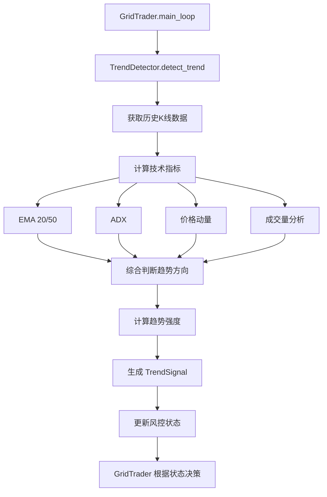

# 趋势识别模块设计文档

> **创建日期**: 2025-10-28
> **版本**: v1.0.0
> **优先级**: 🔴 P0 (阶段1关键功能)

---

## 📋 目录

1. [背景与动机](#背景与动机)
2. [功能需求](#功能需求)
3. [技术设计](#技术设计)
4. [实现细节](#实现细节)
5. [配置说明](#配置说明)
6. [测试计划](#测试计划)
7. [性能考虑](#性能考虑)

---

## 背景与动机

### 当前问题

网格交易策略在**震荡市**表现优秀，但在**单边市场**存在严重问题：

#### ❌ 牛市踏空（Bull Market Miss）

**场景**：价格持续上涨
```
初始状态: BNB 600 USDT, 持仓 10 BNB
Day 1: 620 (+3.3%) → 网格卖出 1 BNB
Day 2: 650 (+8.3%) → 网格卖出 1 BNB
Day 3: 700 (+16.7%) → 网格卖出 1 BNB
Day 10: 900 (+50%) → 仓位只剩 3 BNB

结果对比:
- 网格策略收益: +15% (频繁卖出，错失大部分涨幅)
- 持币不动收益: +50% (完全捕获趋势收益)
- 损失机会成本: 35%
```

#### ❌ 熊市接刀（Bear Market Trap）

**场景**：价格持续下跌
```
初始状态: BNB 600 USDT, 1000 USDT 可用
Day 1: 570 (-5%) → 网格买入，使用 200 USDT
Day 2: 540 (-10%) → 网格买入，使用 200 USDT
Day 3: 510 (-15%) → 网格买入，使用 200 USDT
Day 10: 420 (-30%) → 资金耗尽，深度套牢

结果:
- 持仓成本 ~500 USDT
- 当前价格 420 USDT
- 浮亏: -16%
- 剩余可用资金: 0 (无法应对继续下跌)
```

### 解决方案：趋势识别 + 策略调整

**核心思想**：让网格策略"敬畏"趋势

- **强上涨趋势**: 暂停或减少卖出，保持仓位享受趋势收益
- **强下跌趋势**: 暂停或减少买入，避免深度套牢
- **震荡市场**: 正常执行网格策略，高抛低吸

---

## 功能需求

### 核心功能

#### 1. 趋势方向识别

**定义**：判断市场当前的主要运动方向

**分类**:
- `STRONG_UP`: 强上涨趋势（持续上涨，突破关键阻力）
- `MODERATE_UP`: 温和上涨趋势
- `SIDEWAYS`: 震荡整理（无明确方向）
- `MODERATE_DOWN`: 温和下跌趋势
- `STRONG_DOWN`: 强下跌趋势（持续下跌，跌破关键支撑）

**技术指标**：
```python
# 综合多个指标判断
1. EMA 双线 (20/50):
   - EMA20 > EMA50 且距离扩大 → 上涨趋势
   - EMA20 < EMA50 且距离扩大 → 下跌趋势

2. ADX (平均趋向指数):
   - ADX > 25: 趋势明显
   - ADX > 40: 强趋势
   - ADX < 20: 无趋势（震荡市）

3. 价格动量:
   - 连续N根K线收涨/跌
   - 近期涨跌幅度
```

---

#### 2. 趋势强度评分

**定义**：量化趋势的强弱程度

**评分范围**: 0-100
- **0-20**: 极弱/无趋势（震荡市）
- **20-40**: 弱趋势
- **40-60**: 中等趋势
- **60-80**: 强趋势
- **80-100**: 极强趋势

**计算方法**：
```python
strength_score = (
    adx_score * 0.4 +          # ADX 权重 40%
    ema_divergence_score * 0.3 +  # EMA 分离度 权重 30%
    momentum_score * 0.2 +     # 动量 权重 20%
    volume_score * 0.1         # 成交量 权重 10%
)
```

---

#### 3. 风控状态调整

**定义**：根据趋势调整交易限制

**风控状态映射**:
```python
if trend == STRONG_UP and strength > 60:
    → RiskState.ALLOW_BUY_ONLY  # 暂停卖出

elif trend == STRONG_DOWN and strength > 60:
    → RiskState.ALLOW_SELL_ONLY  # 暂停买入

else:
    → RiskState.ALLOW_ALL  # 正常交易
```

**重要**: 趋势风控优先级**高于**仓位风控

---

## 技术设计

### 类结构

```python
from enum import Enum
from dataclasses import dataclass
from typing import Dict, List, Optional

class TrendDirection(Enum):
    """趋势方向"""
    STRONG_UP = "strong_up"
    MODERATE_UP = "moderate_up"
    SIDEWAYS = "sideways"
    MODERATE_DOWN = "moderate_down"
    STRONG_DOWN = "strong_down"

@dataclass
class TrendSignal:
    """趋势信号"""
    direction: TrendDirection
    strength: float  # 0-100
    confidence: float  # 0-1，置信度
    timestamp: float
    indicators: Dict[str, float]  # 各指标值
    reason: str  # 判断理由

class TrendDetector:
    """
    趋势识别器

    职责:
    1. 分析市场数据，识别趋势方向
    2. 计算趋势强度评分
    3. 提供交易建议（暂停买入/卖出）
    4. 缓存和更新趋势状态
    """

    def __init__(
        self,
        symbol: str,
        ema_short: int = 20,
        ema_long: int = 50,
        adx_period: int = 14,
        strong_trend_threshold: float = 60.0,
        cache_ttl: int = 300  # 5分钟缓存
    ):
        self.symbol = symbol
        self.ema_short = ema_short
        self.ema_long = ema_long
        self.adx_period = adx_period
        self.strong_trend_threshold = strong_trend_threshold

        # 缓存
        self.last_signal: Optional[TrendSignal] = None
        self.last_update: float = 0
        self.cache_ttl = cache_ttl

    async def detect_trend(
        self,
        exchange: IExchange
    ) -> TrendSignal:
        """
        检测当前趋势

        Args:
            exchange: 交易所客户端

        Returns:
            TrendSignal: 趋势信号对象
        """

    def should_pause_buy(self, signal: TrendSignal) -> bool:
        """判断是否应暂停买入"""

    def should_pause_sell(self, signal: TrendSignal) -> bool:
        """判断是否应暂停卖出"""

    def get_risk_state(self, signal: TrendSignal) -> RiskState:
        """获取建议的风控状态"""
```

### 数据流



### 状态机

```
SIDEWAYS (震荡市)
    ↓ (EMA金叉 + ADX上升)
MODERATE_UP (温和上涨)
    ↓ (动量加速 + 成交量放大)
STRONG_UP (强上涨) → [暂停卖出]
    ↓ (动量衰减)
MODERATE_UP (温和上涨)
    ↓ (EMA死叉)
SIDEWAYS (震荡市)
    ↓ (EMA死叉 + ADX上升)
MODERATE_DOWN (温和下跌)
    ↓ (动量加速 + 成交量放大)
STRONG_DOWN (强下跌) → [暂停买入]
```

---

## 实现细节

### 1. 核心方法实现

#### 1.1 趋势检测方法

```python
async def detect_trend(
    self,
    exchange: IExchange
) -> TrendSignal:
    """检测当前趋势"""

    # 1. 检查缓存
    if self._is_cache_valid():
        return self.last_signal

    # 2. 获取K线数据（4小时级别，最近100根）
    ohlcv = await exchange.fetch_ohlcv(
        self.symbol,
        timeframe='4h',
        limit=100
    )

    # 3. 计算技术指标
    indicators = await self._calculate_indicators(ohlcv)

    # 4. 判断趋势方向
    direction = self._determine_direction(indicators)

    # 5. 计算趋势强度
    strength = self._calculate_strength(indicators)

    # 6. 计算置信度
    confidence = self._calculate_confidence(indicators)

    # 7. 生成判断理由
    reason = self._generate_reason(direction, strength, indicators)

    # 8. 创建趋势信号
    signal = TrendSignal(
        direction=direction,
        strength=strength,
        confidence=confidence,
        timestamp=time.time(),
        indicators=indicators,
        reason=reason
    )

    # 9. 更新缓存
    self.last_signal = signal
    self.last_update = time.time()

    return signal
```

#### 1.2 技术指标计算

```python
async def _calculate_indicators(
    self,
    ohlcv: List[List[float]]
) -> Dict[str, float]:
    """计算技术指标"""

    closes = np.array([candle[4] for candle in ohlcv])
    highs = np.array([candle[2] for candle in ohlcv])
    lows = np.array([candle[3] for candle in ohlcv])
    volumes = np.array([candle[5] for candle in ohlcv])

    # 1. EMA 计算
    ema_short = self._calculate_ema(closes, self.ema_short)
    ema_long = self._calculate_ema(closes, self.ema_long)

    # EMA 分离度（标准化）
    ema_divergence = (ema_short[-1] - ema_long[-1]) / ema_long[-1]

    # 2. ADX 计算
    adx = self._calculate_adx(highs, lows, closes, self.adx_period)

    # 3. 动量计算
    momentum = self._calculate_momentum(closes, period=14)

    # 4. 成交量分析
    volume_ma = np.mean(volumes[-20:])
    current_volume = volumes[-1]
    volume_ratio = current_volume / volume_ma

    # 5. 连续涨跌计数
    consecutive_ups = self._count_consecutive(closes, direction='up')
    consecutive_downs = self._count_consecutive(closes, direction='down')

    return {
        'ema_short': ema_short[-1],
        'ema_long': ema_long[-1],
        'ema_divergence': ema_divergence,
        'adx': adx[-1],
        'momentum': momentum[-1],
        'volume_ratio': volume_ratio,
        'consecutive_ups': consecutive_ups,
        'consecutive_downs': consecutive_downs,
        'current_price': closes[-1]
    }
```

#### 1.3 趋势方向判断

```python
def _determine_direction(
    self,
    indicators: Dict[str, float]
) -> TrendDirection:
    """判断趋势方向"""

    ema_div = indicators['ema_divergence']
    adx = indicators['adx']
    momentum = indicators['momentum']
    consecutive_ups = indicators['consecutive_ups']
    consecutive_downs = indicators['consecutive_downs']

    # 强上涨趋势条件
    if (ema_div > 0.02 and  # EMA 上穿 2%以上
        adx > 40 and  # ADX 强趋势
        momentum > 5 and  # 动量强
        consecutive_ups >= 3):  # 连续3根上涨
        return TrendDirection.STRONG_UP

    # 温和上涨趋势
    elif ema_div > 0.005 and adx > 25:
        return TrendDirection.MODERATE_UP

    # 强下跌趋势
    elif (ema_div < -0.02 and
          adx > 40 and
          momentum < -5 and
          consecutive_downs >= 3):
        return TrendDirection.STRONG_DOWN

    # 温和下跌趋势
    elif ema_div < -0.005 and adx > 25:
        return TrendDirection.MODERATE_DOWN

    # 震荡市场
    else:
        return TrendDirection.SIDEWAYS
```

#### 1.4 趋势强度计算

```python
def _calculate_strength(
    self,
    indicators: Dict[str, float]
) -> float:
    """计算趋势强度（0-100）"""

    # 1. ADX 评分（0-50）
    adx = min(indicators['adx'], 100)
    adx_score = (adx / 100) * 50

    # 2. EMA 分离度评分（0-30）
    ema_div = abs(indicators['ema_divergence'])
    ema_score = min(ema_div * 500, 30)  # 6%分离度 = 满分30

    # 3. 动量评分（0-15）
    momentum = abs(indicators['momentum'])
    momentum_score = min(momentum / 10 * 15, 15)

    # 4. 成交量评分（0-5）
    volume_ratio = indicators['volume_ratio']
    volume_score = min((volume_ratio - 1) * 5, 5)

    # 总分
    total_score = adx_score + ema_score + momentum_score + volume_score

    return min(max(total_score, 0), 100)
```

#### 1.5 交易建议方法

```python
def should_pause_buy(self, signal: TrendSignal) -> bool:
    """判断是否应暂停买入"""
    return (
        signal.direction == TrendDirection.STRONG_DOWN and
        signal.strength > self.strong_trend_threshold and
        signal.confidence > 0.7
    )

def should_pause_sell(self, signal: TrendSignal) -> bool:
    """判断是否应暂停卖出"""
    return (
        signal.direction == TrendDirection.STRONG_UP and
        signal.strength > self.strong_trend_threshold and
        signal.confidence > 0.7
    )

def get_risk_state(self, signal: TrendSignal) -> RiskState:
    """获取建议的风控状态"""
    if self.should_pause_buy(signal):
        return RiskState.ALLOW_SELL_ONLY
    elif self.should_pause_sell(signal):
        return RiskState.ALLOW_BUY_ONLY
    else:
        return RiskState.ALLOW_ALL
```

### 2. 集成到 GridTrader

#### 2.1 初始化

```python
class GridTrader:
    def __init__(self, ...):
        # ... 现有代码 ...

        # 🆕 趋势识别器
        self.trend_detector = TrendDetector(
            symbol=self.symbol,
            ema_short=settings.TREND_EMA_SHORT,
            ema_long=settings.TREND_EMA_LONG,
            adx_period=settings.TREND_ADX_PERIOD,
            strong_trend_threshold=settings.TREND_STRONG_THRESHOLD
        )

        self.current_trend: Optional[TrendSignal] = None
```

#### 2.2 主循环集成

```python
async def main_loop(self):
    while True:
        try:
            # ... 现有的初始化和价格获取 ...

            # 🆕 趋势检测（每5分钟更新一次，有缓存）
            if settings.ENABLE_TREND_DETECTION:
                self.current_trend = await self.trend_detector.detect_trend(
                    self.exchange
                )

                # 根据趋势调整风控状态
                trend_risk_state = self.trend_detector.get_risk_state(
                    self.current_trend
                )

                # 趋势风控优先级高于仓位风控
                if trend_risk_state != RiskState.ALLOW_ALL:
                    self.risk_manager.override_risk_state(trend_risk_state)

                    self.logger.info(
                        "trend_override",
                        trend=self.current_trend.direction.value,
                        strength=self.current_trend.strength,
                        risk_state=trend_risk_state.value,
                        reason=self.current_trend.reason
                    )

            # ... 后续的交易信号检测和执行 ...

        except Exception as e:
            # ... 错误处理 ...
```

---

## 配置说明

### 环境变量（.env）

```bash
# ========== 趋势识别配置 (Trend Detection Settings) ==========
# 是否启用趋势识别（true/false）
# 启用后，系统会根据市场趋势自动调整交易策略
# 强上涨趋势时减少卖出，强下跌趋势时减少买入
ENABLE_TREND_DETECTION=true

# EMA 短周期（建议: 10-30）
# 用于快速捕捉价格变化
TREND_EMA_SHORT=20

# EMA 长周期（建议: 30-100）
# 用于判断长期趋势方向
TREND_EMA_LONG=50

# ADX 计算周期（建议: 14）
# ADX 是衡量趋势强度的标准指标
TREND_ADX_PERIOD=14

# 强趋势阈值（0-100，建议: 50-70）
# 超过此阈值才认为是强趋势，会触发交易限制
# 保守: 50，平衡: 60，激进: 70
TREND_STRONG_THRESHOLD=60.0

# 趋势检测间隔（秒，建议: 300-600）
# 趋势判断的缓存时间，避免过于频繁计算
TREND_DETECTION_INTERVAL=300
```

### Settings.py 配置

```python
class Settings(BaseSettings):
    # ... 现有配置 ...

    # 趋势识别配置
    ENABLE_TREND_DETECTION: bool = True  # 默认启用
    TREND_EMA_SHORT: int = 20
    TREND_EMA_LONG: int = 50
    TREND_ADX_PERIOD: int = 14
    TREND_STRONG_THRESHOLD: float = 60.0
    TREND_DETECTION_INTERVAL: int = 300  # 5分钟

    @field_validator('TREND_EMA_SHORT', 'TREND_EMA_LONG')
    @classmethod
    def validate_ema_periods(cls, v, info):
        field_name = info.field_name
        if v < 5 or v > 200:
            raise ValueError(f"{field_name} 必须在 5-200 之间")
        return v

    @field_validator('TREND_STRONG_THRESHOLD')
    @classmethod
    def validate_trend_threshold(cls, v):
        if v < 0 or v > 100:
            raise ValueError("TREND_STRONG_THRESHOLD 必须在 0-100 之间")
        if v < 40:
            logging.warning("TREND_STRONG_THRESHOLD 过低可能导致过度限制交易")
        return v
```

---

## 测试计划

### 单元测试

```python
# tests/unit/test_trend_detector.py

class TestTrendDetector:
    """趋势识别器单元测试"""

    def test_strong_uptrend_detection(self):
        """测试强上涨趋势识别"""

    def test_strong_downtrend_detection(self):
        """测试强下跌趋势识别"""

    def test_sideways_detection(self):
        """测试震荡市识别"""

    def test_ema_calculation(self):
        """测试EMA计算准确性"""

    def test_adx_calculation(self):
        """测试ADX计算准确性"""

    def test_strength_scoring(self):
        """测试趋势强度评分"""

    def test_should_pause_buy(self):
        """测试买入暂停判断"""

    def test_should_pause_sell(self):
        """测试卖出暂停判断"""

    def test_cache_mechanism(self):
        """测试缓存机制"""

    def test_risk_state_override(self):
        """测试风控状态覆盖"""
```

### 集成测试场景

#### 场景1：强上涨趋势

```python
# 模拟强牛市
价格序列: 600 → 620 → 650 → 680 → 720 → 780

预期行为:
1. 识别 STRONG_UP 趋势
2. 强度评分 > 60
3. 暂停卖出操作
4. 保持仓位不动
5. 记录日志

验证:
✅ TrendSignal.direction == STRONG_UP
✅ TrendSignal.strength > 60
✅ should_pause_sell() == True
✅ RiskState == ALLOW_BUY_ONLY
✅ 实际未执行卖出操作
```

#### 场景2：强下跌趋势

```python
# 模拟熊市
价格序列: 600 → 580 → 550 → 520 → 480 → 420

预期行为:
1. 识别 STRONG_DOWN 趋势
2. 强度评分 > 60
3. 暂停买入操作
4. 避免持续接刀
5. 记录日志

验证:
✅ TrendSignal.direction == STRONG_DOWN
✅ TrendSignal.strength > 60
✅ should_pause_buy() == True
✅ RiskState == ALLOW_SELL_ONLY
✅ 实际未执行买入操作
```

#### 场景3：震荡市场

```python
# 模拟震荡
价格序列: 600 → 610 → 595 → 605 → 590 → 600

预期行为:
1. 识别 SIDEWAYS 趋势
2. 强度评分 < 40
3. 正常执行网格策略
4. 高抛低吸

验证:
✅ TrendSignal.direction == SIDEWAYS
✅ TrendSignal.strength < 40
✅ RiskState == ALLOW_ALL
✅ 买卖操作正常执行
```

### 历史数据回测

**回测周期**: 2024年1月-2024年10月（覆盖牛市+熊市）

**回测交易对**: BNB/USDT, ETH/USDT, BTC/USDT

**对比组**:
1. 纯网格策略（无趋势识别）
2. 网格+趋势识别策略
3. 简单持币策略

**评估指标**:
- 总收益率
- 最大回撤
- 夏普比率
- 胜率
- 交易次数

---

## 性能考虑

### 计算性能

**优化措施**:

1. **缓存机制**: 5分钟缓存，避免频繁计算
2. **批量计算**: 使用 numpy 向量化运算
3. **异步非阻塞**: 所有I/O操作异步执行
4. **数据量控制**: 只获取必要的100根K线

**预期性能**:
- 单次趋势检测耗时: < 500ms
- 缓存命中率: > 95%
- 对主循环影响: < 1%

### 内存使用

**预估内存占用**:
- K线数据（100根 * 6字段 * 8字节）: ~5 KB
- 计算中间结果: ~2 KB
- 缓存对象: ~1 KB
- **总计**: ~8 KB per symbol

---

## 风险与注意事项

### ⚠️ 潜在风险

1. **趋势误判**
   - 风险: 震荡市误判为趋势，过度限制交易
   - 缓解: 提高强趋势阈值，增加置信度判断

2. **趋势转换延迟**
   - 风险: 趋势反转时，判断有延迟
   - 缓解: 使用多周期确认，降低缓存时间

3. **参数敏感性**
   - 风险: 不同市场/交易对最优参数不同
   - 缓解: 提供可配置参数，建议回测优化

4. **假突破**
   - 风险: 短期冲高回落被误判为趋势
   - 缓解: 增加确认条件（连续K线、成交量）

### ✅ 缓解措施

1. **多指标综合判断**: 不依赖单一指标
2. **置信度门槛**: 低置信度信号不执行限制
3. **渐进式调整**: 从温和趋势到强趋势，逐步限制
4. **人工监督**: 重要趋势转换时发送通知

---

## 实施检查清单

### 开发阶段

- [ ] 创建 `src/strategies/trend_detector.py`
- [ ] 实现 `TrendDetector` 类
- [ ] 实现 EMA 计算方法
- [ ] 实现 ADX 计算方法
- [ ] 实现趋势方向判断逻辑
- [ ] 实现趋势强度计算逻辑
- [ ] 实现缓存机制

### 集成阶段

- [ ] 集成到 `GridTrader.__init__()`
- [ ] 集成到 `GridTrader.main_loop()`
- [ ] 添加风控状态覆盖逻辑
- [ ] 添加日志记录
- [ ] 添加配置项到 `.env.example`
- [ ] 添加配置项到 `settings.py`
- [ ] 添加配置验证器

### 测试阶段

- [ ] 编写单元测试（至少10个）
- [ ] 编写集成测试（3个场景）
- [ ] 历史数据回测
- [ ] 参数调优
- [ ] 性能测试

### 文档阶段

- [ ] 完善代码注释
- [ ] 更新 ROADMAP.md
- [ ] 更新 CLAUDE.md
- [ ] 编写用户使用指南
- [ ] 编写参数调优指南

---

## 附录

### A. 技术指标公式

#### EMA (指数移动平均)

```python
EMA_t = α * Price_t + (1 - α) * EMA_{t-1}

其中 α = 2 / (period + 1)
```

#### ADX (平均趋向指数)

```python
# 1. 计算 +DI 和 -DI
+DM = max(High_t - High_{t-1}, 0)
-DM = max(Low_{t-1} - Low_t, 0)

TR = max(High_t - Low_t, |High_t - Close_{t-1}|, |Low_t - Close_{t-1}|)

+DI = EMA(+DM / TR) * 100
-DI = EMA(-DM / TR) * 100

# 2. 计算 DX
DX = |+DI - -DI| / (+DI + -DI) * 100

# 3. 计算 ADX
ADX = EMA(DX)
```

### B. 参考资料

1. **EMA 指标**: https://www.investopedia.com/terms/e/ema.asp
2. **ADX 指标**: https://www.investopedia.com/terms/a/adx.asp
3. **趋势交易策略**: Trading Systems and Methods (Perry Kaufman)
4. **技术分析基础**: Technical Analysis of the Financial Markets (John Murphy)

---

**文档版本**: v1.0.0
**最后更新**: 2025-10-28
**作者**: GridBNB-USDT Team
**审核状态**: 待审核
