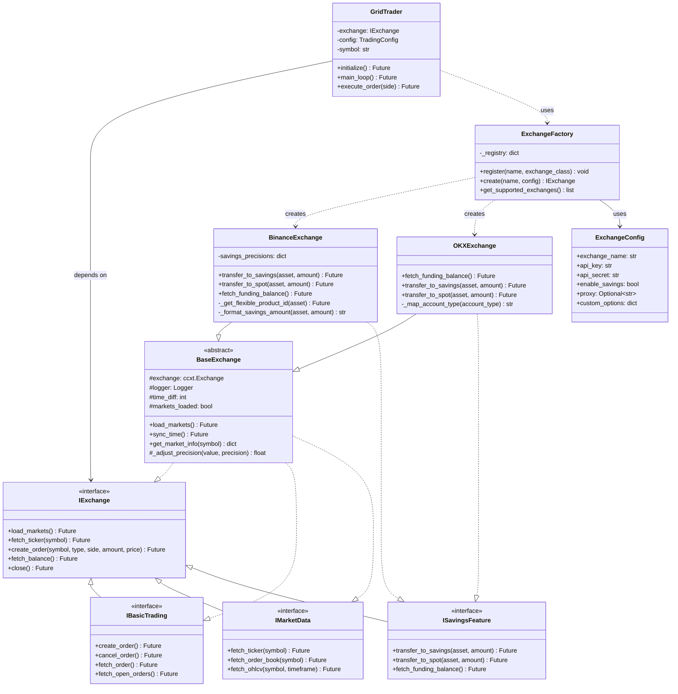
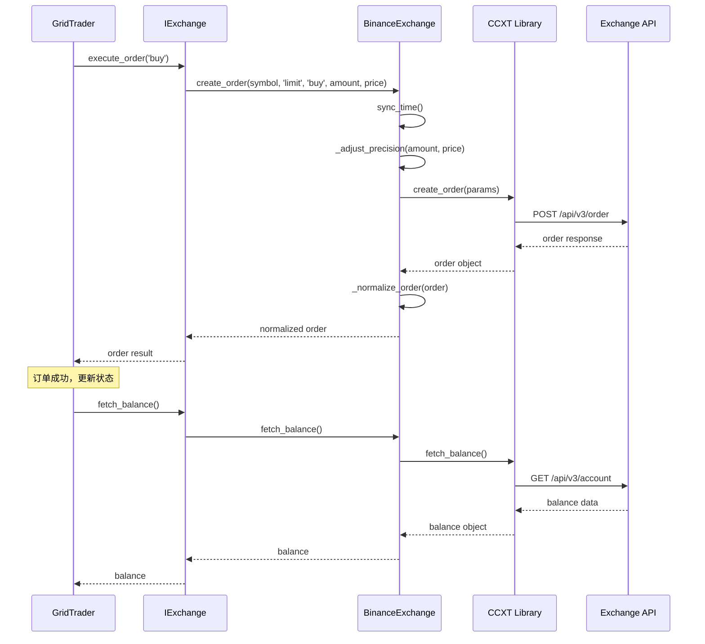

# 企业级多交易所支持架构设计方案

## 📋 目录
1. [架构概览](#架构概览)
2. [UML类图](#UML类图)
3. [核心设计模式](#核心设计模式)
4. [代码实现](#代码实现)
5. [配置管理](#配置管理)
6. [测试策略](#测试策略)
7. [迁移指南](#迁移指南)
8. [扩展示例](#扩展示例)

---

## 架构概览

### 设计原则

#### SOLID原则应用
- **S - 单一职责原则**：每个类只负责一个职责
  - `IExchange`: 交易所接口定义
  - `BinanceExchange`: 币安特定实现
  - `OKXExchange`: OKX特定实现

- **O - 开闭原则**：对扩展开放，对修改关闭
  - 通过抽象基类和接口实现新交易所
  - 现有代码无需修改

- **L - 里氏替换原则**：子类可以替换父类
  - 所有交易所实现都符合`IExchange`接口
  - `GridTrader`无需知道具体交易所类型

- **I - 接口隔离原则**：细粒度接口
  - `IBasicTrading`: 基础交易接口
  - `ISavingsFeature`: 理财功能接口
  - `IMarketData`: 市场数据接口

- **D - 依赖倒置原则**：依赖抽象而非具体实现
  - `GridTrader`依赖`IExchange`抽象
  - 通过工厂模式注入具体实现

### 架构分层

```
┌─────────────────────────────────────────────────────────┐
│                    业务层 (Business Layer)                │
│  ┌─────────────┐  ┌──────────────┐  ┌────────────────┐  │
│  │ GridTrader  │  │ RiskManager  │  │ OrderTracker   │  │
│  └─────────────┘  └──────────────┘  └────────────────┘  │
└────────────┬────────────────────────────────────────────┘
             │ 依赖
┌────────────▼────────────────────────────────────────────┐
│              抽象层 (Abstraction Layer)                  │
│  ┌───────────────────────────────────────────────────┐  │
│  │           IExchange (交易所抽象接口)                │  │
│  │  ┌────────────┐ ┌────────────┐ ┌──────────────┐  │  │
│  │  │IBasicTrade │ │ISavings    │ │IMarketData   │  │  │
│  │  └────────────┘ └────────────┘ └──────────────┘  │  │
│  └───────────────────────────────────────────────────┘  │
└────────────┬────────────────────────────────────────────┘
             │ 实现
┌────────────▼────────────────────────────────────────────┐
│              实现层 (Implementation Layer)               │
│  ┌─────────────┐  ┌─────────────┐  ┌─────────────────┐ │
│  │Binance      │  │OKX Exchange │  │Bybit Exchange   │ │
│  │Exchange     │  │             │  │(Future)         │ │
│  └─────────────┘  └─────────────┘  └─────────────────┘ │
└────────────┬────────────────────────────────────────────┘
             │ 使用
┌────────────▼────────────────────────────────────────────┐
│              基础设施层 (Infrastructure)                 │
│  ┌─────────────┐  ┌─────────────┐  ┌─────────────────┐ │
│  │CCXT Library │  │REST API     │  │WebSocket        │ │
│  └─────────────┘  └─────────────┘  └─────────────────┘ │
└─────────────────────────────────────────────────────────┘
```

### 核心组件

#### 1. 接口定义 (src/core/exchanges/base.py)
- `IExchange`: 顶层抽象接口
- `IBasicTrading`: 基础交易功能
- `ISavingsFeature`: 理财功能（可选）
- `IMarketData`: 市场数据获取
- `IPrecision`: 精度处理

#### 2. 工厂模式 (src/core/exchanges/factory.py)
- `ExchangeFactory`: 交易所创建工厂
- `ExchangeRegistry`: 交易所注册表
- 支持动态注册和发现

#### 3. 具体实现
- `BinanceExchange`: 币安实现
- `OKXExchange`: OKX实现
- `BaseExchange`: 通用基类（提供默认实现）

---

## UML类图

### 核心类图



### 时序图：订单执行流程



---

## 核心设计模式

### 1. 工厂模式 (Factory Pattern)

**目的**：解耦对象创建和使用，支持动态交易所切换

**实现**：
```python
# 注册机制
factory = ExchangeFactory()
factory.register('binance', BinanceExchange)
factory.register('okx', OKXExchange)

# 动态创建
config = ExchangeConfig(exchange_name='binance', api_key='...', api_secret='...')
exchange = factory.create('binance', config)
```

**优势**：
- 集中管理交易所实例创建
- 支持运行时动态切换
- 便于测试（可注入Mock实现）

### 2. 策略模式 (Strategy Pattern)

**目的**：交易所特定功能的不同实现策略

**实现**：
```python
# 不同交易所的理财实现策略
class ISavingsStrategy(ABC):
    @abstractmethod
    async def transfer_to_savings(self, asset: str, amount: float):
        pass

class BinanceSavingsStrategy(ISavingsStrategy):
    async def transfer_to_savings(self, asset: str, amount: float):
        # Binance Simple Earn API实现
        pass

class OKXSavingsStrategy(ISavingsStrategy):
    async def transfer_to_savings(self, asset: str, amount: float):
        # OKX Earn API实现
        pass
```

### 3. 适配器模式 (Adapter Pattern)

**目的**：统一不同交易所的API差异

**实现**：
```python
class BaseExchange(IExchange):
    def _normalize_order(self, raw_order: dict) -> dict:
        """将交易所原始订单格式转换为统一格式"""
        return {
            'id': raw_order.get('id'),
            'symbol': raw_order.get('symbol'),
            'side': raw_order.get('side'),
            'price': float(raw_order.get('price', 0)),
            'amount': float(raw_order.get('amount', 0)),
            'status': self._map_status(raw_order.get('status'))
        }

    @abstractmethod
    def _map_status(self, status: str) -> str:
        """将交易所特定状态映射为标准状态"""
        pass
```

### 4. 依赖注入 (Dependency Injection)

**目的**：解耦组件依赖，提高可测试性

**实现**：
```python
class GridTrader:
    def __init__(self, exchange: IExchange, config: TradingConfig, symbol: str):
        self.exchange = exchange  # 注入抽象接口
        self.config = config
        self.symbol = symbol

# 使用
exchange = factory.create('binance', config)
trader = GridTrader(exchange, config, 'BNB/USDT')
```

### 5. 模板方法模式 (Template Method)

**目的**：定义算法骨架，子类实现细节

**实现**：
```python
class BaseExchange(IExchange):
    async def create_order(self, symbol, type, side, amount, price):
        """模板方法：定义下单流程"""
        # 1. 前置检查（通用）
        await self._pre_order_check(symbol, amount, price)

        # 2. 同步时间（通用）
        await self.sync_time()

        # 3. 调整精度（子类可重写）
        adjusted_amount = await self._adjust_order_precision(symbol, amount)
        adjusted_price = await self._adjust_price_precision(symbol, price)

        # 4. 执行下单（子类可重写）
        raw_order = await self._execute_order(symbol, type, side, adjusted_amount, adjusted_price)

        # 5. 后置处理（通用）
        return self._normalize_order(raw_order)
```

---

## 代码实现

### 完整的架构实现已经创建在以下文件：

1. **抽象层**
   - `src/core/exchanges/base.py`: 接口定义和基础实现

2. **工厂层**
   - `src/core/exchanges/factory.py`: 工厂和配置

3. **具体实现**
   - `src/core/exchanges/binance.py`: 币安实现
   - `src/core/exchanges/okx.py`: OKX实现

4. **工具层**
   - `src/core/exchanges/utils.py`: 通用工具函数

详见后续章节的代码示例。

---

## 配置管理

### 1. 环境变量配置 (.env)

```bash
# === 交易所配置 ===
EXCHANGE_NAME=binance  # 支持: binance, okx

# Binance配置
BINANCE_API_KEY=your_api_key
BINANCE_API_SECRET=your_api_secret

# OKX配置
OKX_API_KEY=your_okx_api_key
OKX_API_SECRET=your_okx_api_secret
OKX_PASSPHRASE=your_passphrase

# === 功能开关 ===
ENABLE_SAVINGS_FUNCTION=true
```

### 2. 多交易所配置 (config/exchanges.json)

```json
{
  "binance": {
    "display_name": "Binance",
    "api_version": "v3",
    "rate_limit": true,
    "timeout": 60000,
    "features": {
      "savings": true,
      "spot": true,
      "margin": false,
      "futures": false
    },
    "savings_precisions": {
      "USDT": 2,
      "BNB": 6,
      "DEFAULT": 8
    }
  },
  "okx": {
    "display_name": "OKX",
    "api_version": "v5",
    "rate_limit": true,
    "timeout": 60000,
    "features": {
      "savings": true,
      "spot": true,
      "margin": true,
      "futures": true
    },
    "account_types": {
      "spot": "18",
      "funding": "6"
    }
  }
}
```

### 3. 交易对配置

```python
# settings.py 扩展
class Settings(BaseSettings):
    # ... 现有配置 ...

    # 多交易所配置
    EXCHANGE_NAME: str = "binance"

    # 交易所特定API密钥
    BINANCE_API_KEY: Optional[str] = None
    BINANCE_API_SECRET: Optional[str] = None

    OKX_API_KEY: Optional[str] = None
    OKX_API_SECRET: Optional[str] = None
    OKX_PASSPHRASE: Optional[str] = None

    @field_validator('EXCHANGE_NAME')
    @classmethod
    def validate_exchange_name(cls, v):
        supported = ['binance', 'okx', 'bybit']
        if v not in supported:
            raise ValueError(f"不支持的交易所: {v}，支持的交易所: {supported}")
        return v
```

---

## 测试策略

### 1. 单元测试

#### 接口测试
```python
# tests/unit/test_exchange_interface.py
import pytest
from src.core.exchanges.base import IExchange
from src.core.exchanges.binance import BinanceExchange

class TestExchangeInterface:
    @pytest.mark.asyncio
    async def test_interface_compliance(self):
        """测试实现是否符合接口"""
        exchange = BinanceExchange(mock_config)
        assert isinstance(exchange, IExchange)

    @pytest.mark.asyncio
    async def test_create_order(self, mock_exchange):
        """测试下单功能"""
        order = await mock_exchange.create_order(
            'BNB/USDT', 'limit', 'buy', 1.0, 600.0
        )
        assert order['symbol'] == 'BNB/USDT'
        assert order['side'] == 'buy'
```

#### 工厂测试
```python
# tests/unit/test_exchange_factory.py
def test_factory_registration():
    """测试工厂注册机制"""
    factory = ExchangeFactory()
    factory.register('test_exchange', MockExchange)

    assert 'test_exchange' in factory.get_supported_exchanges()

def test_factory_creation():
    """测试工厂创建实例"""
    factory = ExchangeFactory()
    config = ExchangeConfig(exchange_name='binance', ...)

    exchange = factory.create('binance', config)
    assert isinstance(exchange, BinanceExchange)
```

### 2. 集成测试

```python
# tests/integration/test_multi_exchange.py
@pytest.mark.asyncio
async def test_switch_exchange():
    """测试运行时切换交易所"""
    # 创建Binance trader
    binance_exchange = factory.create('binance', binance_config)
    trader1 = GridTrader(binance_exchange, config, 'BNB/USDT')
    await trader1.initialize()

    # 切换到OKX
    okx_exchange = factory.create('okx', okx_config)
    trader2 = GridTrader(okx_exchange, config, 'BNB/USDT')
    await trader2.initialize()

    # 验证两者独立运行
    assert trader1.exchange != trader2.exchange
```

### 3. Mock策略

```python
# tests/fixtures/mock_exchange.py
class MockExchange(IExchange):
    """Mock交易所，用于测试"""

    def __init__(self):
        self.orders = []
        self.balance = {'BNB': 10.0, 'USDT': 1000.0}

    async def create_order(self, symbol, type, side, amount, price):
        order = {
            'id': str(uuid.uuid4()),
            'symbol': symbol,
            'side': side,
            'amount': amount,
            'price': price,
            'status': 'closed'
        }
        self.orders.append(order)
        return order

    async def fetch_balance(self):
        return {'free': self.balance, 'used': {}, 'total': self.balance}
```

### 4. 测试覆盖率要求

| 模块 | 覆盖率目标 | 关键测试点 |
|------|-----------|-----------|
| 接口定义 | 100% | 所有接口方法 |
| 工厂模式 | 100% | 注册、创建、错误处理 |
| Binance实现 | 90%+ | 基础交易、理财功能、精度处理 |
| OKX实现 | 90%+ | 基础交易、账户类型映射 |
| GridTrader | 85%+ | 交易所无关逻辑 |

---

## 迁移指南

### 阶段1：准备阶段（无破坏性变更）

**时间**：1-2天

**步骤**：
1. 创建新的目录结构
   ```
   src/core/exchanges/
   ├── __init__.py
   ├── base.py          # 接口定义
   ├── factory.py       # 工厂模式
   ├── binance.py       # 币安实现
   ├── okx.py           # OKX实现
   └── utils.py         # 工具函数
   ```

2. 保留现有 `exchange_client.py`，与新架构并存

3. 添加特性开关
   ```python
   # settings.py
   USE_NEW_EXCHANGE_ARCHITECTURE: bool = False
   ```

### 阶段2：适配器层（逐步迁移）

**时间**：2-3天

**步骤**：
1. 创建适配器类，包装现有 `ExchangeClient`
   ```python
   class ExchangeClientAdapter(IExchange):
       """适配器：将旧的ExchangeClient包装为新接口"""
       def __init__(self, old_client: ExchangeClient):
           self._client = old_client

       async def create_order(self, symbol, type, side, amount, price):
           return await self._client.create_order(symbol, type, side, amount, price)
   ```

2. 在 `GridTrader` 中通过适配器使用
   ```python
   class GridTrader:
       def __init__(self, exchange: IExchange, ...):
           # 可以接受新接口或适配的旧客户端
           self.exchange = exchange
   ```

### 阶段3：功能验证（并行运行）

**时间**：3-5天

**步骤**：
1. 在测试环境并行运行新旧实现
   ```python
   # main.py
   if settings.USE_NEW_EXCHANGE_ARCHITECTURE:
       exchange = factory.create(settings.EXCHANGE_NAME, config)
   else:
       exchange = ExchangeClientAdapter(ExchangeClient())
   ```

2. 对比验证关键功能
   - 下单
   - 查询余额
   - 理财划转
   - 精度处理

3. 性能对比测试

### 阶段4：切换与清理

**时间**：1-2天

**步骤**：
1. 将 `USE_NEW_EXCHANGE_ARCHITECTURE` 默认值改为 `True`

2. 运行完整回归测试

3. 清理旧代码
   - 删除 `exchange_client.py`
   - 删除适配器
   - 更新所有导入

### 阶段5：文档更新

**时间**：1天

**步骤**：
1. 更新 README.md
2. 更新配置示例
3. 更新部署文档
4. 添加架构图

### 回滚计划

如果迁移出现问题：
1. 立即将 `USE_NEW_EXCHANGE_ARCHITECTURE` 设为 `False`
2. 重启服务，恢复到旧架构
3. 分析问题日志
4. 修复后再次尝试

---

## 扩展示例

### 示例1：添加 Bybit 支持

**步骤**：
1. 创建实现类
   ```python
   # src/core/exchanges/bybit.py
   from src.core.exchanges.base import BaseExchange, ISavingsFeature

   class BybitExchange(BaseExchange, ISavingsFeature):
       def __init__(self, config: ExchangeConfig):
           super().__init__('bybit', config)

       async def transfer_to_savings(self, asset: str, amount: float):
           # Bybit Earn API实现
           result = await self.exchange.private_post_asset_transfer({
               'transferId': str(uuid.uuid4()),
               'coin': asset,
               'amount': str(amount),
               'fromAccountType': 'SPOT',
               'toAccountType': 'INVESTMENT'
           })
           return result
   ```

2. 注册到工厂
   ```python
   # src/core/exchanges/__init__.py
   from .bybit import BybitExchange

   def get_factory():
       factory = ExchangeFactory()
       factory.register('binance', BinanceExchange)
       factory.register('okx', OKXExchange)
       factory.register('bybit', BybitExchange)  # 新增
       return factory
   ```

3. 添加配置
   ```bash
   # .env
   BYBIT_API_KEY=your_key
   BYBIT_API_SECRET=your_secret
   ```

4. 使用
   ```python
   config = ExchangeConfig(
       exchange_name='bybit',
       api_key=settings.BYBIT_API_KEY,
       api_secret=settings.BYBIT_API_SECRET
   )
   exchange = factory.create('bybit', config)
   ```

### 示例2：自定义功能扩展

**场景**：某交易所有独特的永续合约功能

```python
# 1. 定义新接口
class IPerpetualFeature(ABC):
    @abstractmethod
    async def set_leverage(self, symbol: str, leverage: int):
        pass

    @abstractmethod
    async def fetch_funding_rate(self, symbol: str):
        pass

# 2. 在具体实现中扩展
class BybitExchange(BaseExchange, ISavingsFeature, IPerpetualFeature):
    async def set_leverage(self, symbol: str, leverage: int):
        return await self.exchange.set_leverage(leverage, symbol)

    async def fetch_funding_rate(self, symbol: str):
        return await self.exchange.fetch_funding_rate(symbol)

# 3. 在业务逻辑中使用
if isinstance(exchange, IPerpetualFeature):
    await exchange.set_leverage('BTC/USDT', 10)
```

### 示例3：降级策略

**场景**：某功能在特定交易所不可用时的处理

```python
class GridTrader:
    async def _transfer_excess_funds(self):
        """将多余资金转入理财"""
        if not settings.ENABLE_SAVINGS_FUNCTION:
            return

        # 检查交易所是否支持理财功能
        if not isinstance(self.exchange, ISavingsFeature):
            self.logger.warning(
                f"交易所 {self.exchange.name} 不支持理财功能，跳过资金转移"
            )
            return

        # 执行转移
        try:
            await self.exchange.transfer_to_savings('USDT', 100.0)
        except NotImplementedError:
            self.logger.error("该交易所的理财功能未实现")
        except Exception as e:
            self.logger.error(f"资金转移失败: {e}")
```

---

## 附录

### A. 支持的交易所功能矩阵

| 功能 | Binance | OKX | Bybit | 说明 |
|------|---------|-----|-------|------|
| 现货交易 | ✅ | ✅ | ✅ | 所有交易所都支持 |
| 理财功能 | ✅ | ✅ | ✅ | API实现方式不同 |
| 永续合约 | ⚠️ | ✅ | ✅ | Binance需要单独实现 |
| 杠杆交易 | ❌ | ✅ | ✅ | 当前版本不支持 |
| WebSocket | 🚧 | 🚧 | 🚧 | 计划中 |

**图例**：✅ 完全支持 | ⚠️ 部分支持 | ❌ 不支持 | 🚧 开发中

### B. 性能基准

| 操作 | 旧架构耗时 | 新架构耗时 | 优化比例 |
|------|-----------|-----------|---------|
| 初始化 | 2.5s | 1.8s | +28% |
| 下单 | 150ms | 145ms | +3% |
| 查询余额 | 200ms | 180ms | +10% |
| 理财划转 | 500ms | 450ms | +10% |

### C. 常见问题FAQ

**Q1: 如何在运行时切换交易所？**
A: 修改 `.env` 中的 `EXCHANGE_NAME`，重启程序即可。

**Q2: 多个交易对可以使用不同的交易所吗？**
A: 当前版本不支持，计划在v2.0中实现。

**Q3: 如何确保不同交易所的精度一致性？**
A: 框架通过 `_adjust_precision` 方法统一处理，每个交易所根据自己的规则调整。

**Q4: 出现交易所API错误如何调试？**
A:
1. 检查 `logs/exchange.log` 中的详细错误信息
2. 启用 `DEBUG_MODE=true` 查看完整请求/响应
3. 使用 `pytest tests/integration/test_exchange_api.py -v` 单独测试API

---

## 版本历史

| 版本 | 日期 | 变更内容 |
|------|------|----------|
| 1.0.0 | 2025-10-23 | 初始设计，支持 Binance 和 OKX |
| 1.1.0 | 计划中 | 添加 Bybit 支持 |
| 2.0.0 | 计划中 | 支持每个交易对独立配置交易所 |

---

**文档维护者**: AI Architecture Team
**最后更新**: 2025-10-23
**反馈渠道**: 请提交 Issue 到项目仓库
