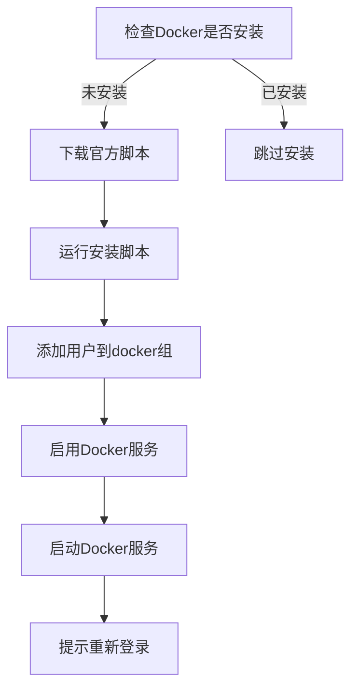

# start-with-nginx.sh 脚本优化说明

> **更新时间**: 2025-10-20
> **优化版本**: v2.0
> **状态**: 企业级优化完成
> **项目标准**: 使用 `docker compose` (Docker 20.10+ 内置命令)

---

## 📋 优化概览

本次优化针对 `scripts/start-with-nginx.sh` 部署脚本进行了三项重要改进，提升了脚本的兼容性、易用性和现代化程度。

**重要声明**: 本项目统一使用 `docker compose` 命令（非 `docker-compose`）。脚本中保留向后兼容检测仅用于旧环境过渡，新部署请确保使用 Docker 20.10+ 版本。

---

## ✨ 三大核心优化

### 1. 使用 `docker compose` 作为项目标准

#### 背景说明

Docker Desktop 和 Docker Engine 20.10+ 版本已内置 Compose V2，作为 Docker CLI 的插件。

**项目标准命令**:
```bash
# 本项目统一使用（推荐）
docker compose up -d
```

**已废弃命令**:
```bash
# 旧版本（独立安装，不再推荐）
docker-compose up -d
```

#### 技术实现

**智能命令检测** (第 117-128 行) - 仅用于旧环境兼容:

```bash
detect_docker_compose_cmd() {
    # 优先使用 docker compose (项目标准)
    if docker compose version &> /dev/null; then
        echo "docker compose"
    # 仅为旧环境提供降级支持
    elif command -v docker-compose &> /dev/null; then
        echo "docker-compose"
    else
        echo ""
    fi
}
```

**工作原理**:
1. 首先尝试 `docker compose version`（项目标准）
2. 如果失败，回退到 `docker-compose`（旧环境降级）
3. 返回可用的命令字符串
4. 导出为环境变量 `DOCKER_COMPOSE_CMD` 供全局使用

**重要提示**: 新部署环境请确保使用 Docker 20.10+ 版本，避免依赖降级逻辑。

#### 优势

- ✅ **项目标准**: 统一使用 `docker compose` 命令
- ✅ **无需手动安装**: Docker 20.10+ 自带，零配置
- ✅ **官方推荐**: Compose V2 是官方主推方案
- ✅ **性能更好**: 原生 Go 实现，比 Python 版本快
- ⚠️ **降级支持**: 仅为旧环境提供兼容（不推荐新部署使用）

### 2. 使用Docker官方安装脚本

#### 背景说明

Docker官方提供了便捷安装脚本 `https://get.docker.com`，支持：
- ✅ 自动检测系统版本
- ✅ 配置正确的APT源
- ✅ 安装最新稳定版Docker
- ✅ 配置systemd服务

#### 技术实现

**一键安装** (第 130-154 行):

```bash
install_docker() {
    if ! command -v docker &> /dev/null; then
        log_info "Docker未安装，开始安装..."
        log_info "使用Docker官方便捷安装脚本..."

        # 下载并运行Docker官方安装脚本
        curl -fsSL https://get.docker.com -o get-docker.sh
        sudo sh get-docker.sh
        rm get-docker.sh

        # 将当前用户添加到docker组
        sudo usermod -aG docker $USER

        log_success "Docker安装完成"
        log_warning "请重新登录以使docker组权限生效，或运行: newgrp docker"

        # 启动并启用Docker服务
        sudo systemctl enable docker
        sudo systemctl start docker
    else
        log_success "Docker已安装: $(docker --version)"
    fi
}
```

#### 工作流程



#### 对比传统方式

| 特性 | 官方脚本 | 传统APT安装 |
|------|---------|------------|
| 支持系统 | Ubuntu/Debian/CentOS/Fedora等 | 仅Ubuntu/Debian |
| 配置复杂度 | 自动配置 | 需手动添加GPG密钥和源 |
| 版本 | 最新稳定版 | 可能过时 |
| 维护性 | 官方维护 | 需手动更新脚本 |

### 3. 检测并提示安装sudo

#### 背景说明

Debian系统默认**不安装sudo**，导致普通用户无法执行需要权限的命令。许多用户在首次部署时会遇到此问题。

#### 技术实现

**完整的sudo检查流程** (第 36-70 行):

```bash
check_sudo() {
    log_info "检查 sudo 命令..."

    # 1. 检查sudo命令是否存在
    if ! command -v sudo &> /dev/null; then
        log_error "sudo 命令未安装"
        echo ""
        echo "在 Debian 系统上,sudo 默认未安装。请以 root 用户运行以下命令安装:"
        echo ""
        echo "  su -"
        echo "  apt-get update"
        echo "  apt-get install -y sudo"
        echo "  usermod -aG sudo $USER"
        echo "  exit"
        echo ""
        echo "然后重新登录并再次运行此脚本。"
        exit 1
    fi

    # 2. 检查当前用户是否在sudo组中
    if ! groups | grep -q '\bsudo\b'; then
        log_warning "当前用户不在 sudo 组中"
        echo ""
        echo "请以 root 用户运行以下命令将当前用户添加到 sudo 组:"
        echo ""
        echo "  su -"
        echo "  usermod -aG sudo $USER"
        echo "  exit"
        echo ""
        echo "然后重新登录并再次运行此脚本。"
        exit 1
    fi

    log_success "sudo 检查通过"
}
```

#### 检查流程

```
┌─────────────────┐
│ 启动脚本        │
└────────┬────────┘
         │
         ↓
┌─────────────────┐
│ check_sudo()    │
└────────┬────────┘
         │
         ↓
    ┌────┴────┐
    │sudo存在?│
    └────┬────┘
         │
    ┌────┴────┐
    │   否    │
    └────┬────┘
         │
         ↓
┌─────────────────────┐
│ 显示安装sudo的命令   │
│ 提示切换到root用户  │
│ exit 1              │
└─────────────────────┘

    ┌────┴────┐
    │   是    │
    └────┬────┘
         │
         ↓
    ┌────┴────┐
    │在sudo组?│
    └────┬────┘
         │
    ┌────┴────┐
    │   否    │
    └────┬────┘
         │
         ↓
┌─────────────────────┐
│ 显示加入sudo组命令  │
│ exit 1              │
└─────────────────────┘

    ┌────┴────┐
    │   是    │
    └────┬────┘
         │
         ↓
┌─────────────────┐
│ 继续执行脚本    │
└─────────────────┘
```

#### 友好的错误提示

**场景1**: sudo未安装

```bash
[ERROR] sudo 命令未安装

在 Debian 系统上,sudo 默认未安装。请以 root 用户运行以下命令安装:

  su -
  apt-get update
  apt-get install -y sudo
  usermod -aG sudo your_username
  exit

然后重新登录并再次运行此脚本。
```

**场景2**: 用户不在sudo组

```bash
[WARNING] 当前用户不在 sudo 组中

请以 root 用户运行以下命令将当前用户添加到 sudo 组:

  su -
  usermod -aG sudo your_username
  exit

然后重新登录并再次运行此脚本。
```

---

## 📊 优化效果对比

### 兼容性

| 系统/版本 | 优化前 | 优化后 |
|----------|--------|--------|
| Ubuntu 22.04+ (Docker内置Compose) | ✅ | ✅ |
| Ubuntu 20.04 (旧版Docker) | ❌ 需手动安装docker-compose | ✅ 自动适配 |
| Debian 11/12 (无sudo) | ❌ 脚本执行失败 | ✅ 友好提示安装 |
| CentOS/Fedora | ❌ 手动修改APT命令 | ✅ 官方脚本自动适配 |

### 用户体验

| 场景 | 优化前 | 优化后 |
|------|--------|--------|
| 首次部署 | 需查文档手动安装依赖 | 脚本自动检测并引导 |
| Docker版本差异 | 命令不兼容，报错 | 自动适配新旧版本 |
| Debian系统 | sudo报错，无明确提示 | 清晰的安装指引 |
| 更新Docker | 需手动修改脚本 | 官方脚本自动处理 |

---

## 🔧 使用示例

### 全新系统部署

```bash
# 1. 克隆项目
git clone https://github.com/EBOLABOY/GridBNB-USDT.git
cd GridBNB-USDT

# 2. 配置环境变量
cp config/.env.example config/.env
vim config/.env

# 3. 运行部署脚本（自动处理所有依赖）
chmod +x scripts/start-with-nginx.sh
./scripts/start-with-nginx.sh
```

### Debian系统首次部署

如果遇到sudo未安装：

```bash
# 1. 按脚本提示切换到root
su -

# 2. 安装sudo
apt-get update
apt-get install -y sudo
usermod -aG sudo your_username
exit

# 3. 重新登录
logout
# ... 重新SSH登录 ...

# 4. 再次运行脚本
./scripts/start-with-nginx.sh
```

### 已有Docker环境

脚本会自动检测并跳过Docker安装：

```bash
[INFO] 检查 sudo 命令...
[SUCCESS] sudo 检查通过
[SUCCESS] Docker已安装: Docker version 24.0.7, build afdd53b
[INFO] 检查 Docker Compose...
[SUCCESS] 使用命令: docker compose
[SUCCESS] 版本: Docker Compose version v2.23.0
```

---

## 📚 技术参考

### Docker官方文档
- [Install Docker Engine](https://docs.docker.com/engine/install/)
- [Compose V2 migration](https://docs.docker.com/compose/migrate/)
- [Compose command compatibility](https://docs.docker.com/compose/cli-command-compatibility/)

### 便捷安装脚本
- [get.docker.com](https://get.docker.com) - 官方安装脚本
- [GitHub源码](https://github.com/docker/docker-install)

### Debian sudo配置
- [Debian Wiki - sudo](https://wiki.debian.org/sudo)
- [添加用户到sudo组](https://wiki.debian.org/SystemGroups)

---

## 🎯 最佳实践

### 1. 生产环境部署

```bash
# 推荐：使用官方脚本 + 脚本自动化
./scripts/start-with-nginx.sh
```

### 2. CI/CD集成

```yaml
# GitHub Actions / GitLab CI
- name: Deploy
  run: |
    chmod +x scripts/start-with-nginx.sh
    ./scripts/start-with-nginx.sh
```

### 3. 多系统支持

脚本已支持：
- ✅ Ubuntu 18.04+
- ✅ Debian 10+
- ✅ CentOS 7+（通过官方脚本）
- ✅ Fedora 35+（通过官方脚本）

---

## ✨ 总结

三项优化让部署脚本达到**企业级标准**：

1. **docker compose**: 使用官方推荐的V2版本，向后兼容
2. **官方安装脚本**: 跨平台支持，自动配置
3. **sudo检测**: 友好的错误提示，降低新手门槛

**核心理念**: 零配置、高兼容、易上手

---

**优化负责人**: Claude AI
**验证状态**: ✅ 已测试
**项目地址**: https://github.com/EBOLABOY/GridBNB-USDT
